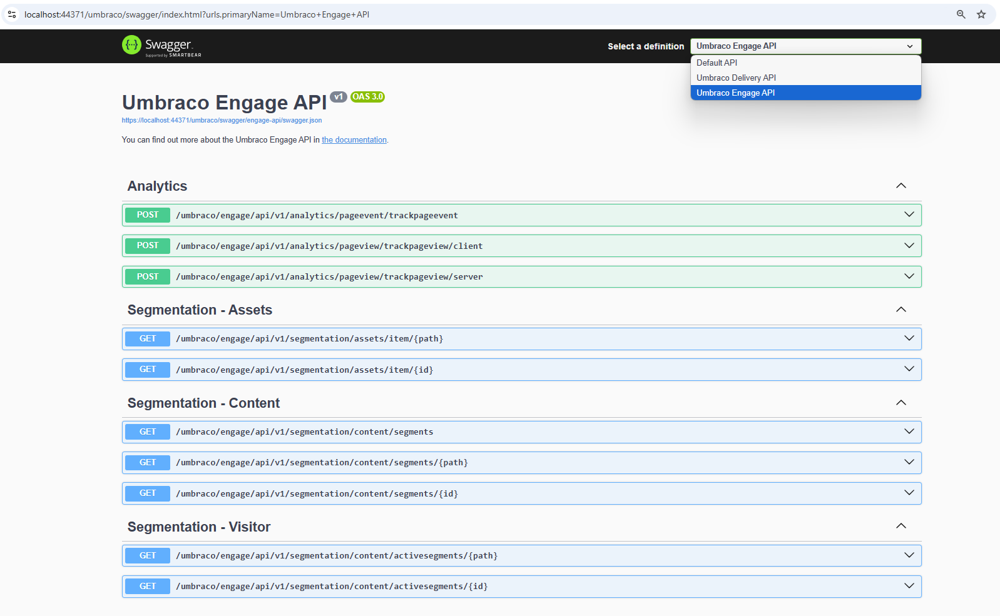

# Headless

Umbraco Engage offers the **Umbraco.Engage.Headless** package for seamless integration with Umbraco 12.0 and later. This package enables access to the Headless Content Delivery API, enabling personalized content, A/B tests, and segmentation.

## Requirements

To install Umbraco.Engage.Headless, ensure the following prerequisites:

* Umbraco v12 or higher is required to integrate with the [Content Delivery API](https://docs.umbraco.com/umbraco-cms/reference/content-delivery-api).
* Enable the [Umbraco Content Delivery API](https://docs.umbraco.com/umbraco-cms/reference/content-delivery-api#enable-the-content-delivery-api) by adding the following configuration setting in the `appsettings.json` file:

```json
{
"Umbraco": {
    "CMS": {
        "DeliveryApi": {
            "Enabled": true
        }
    }
}
}
```

## Installing the Umbraco Engage Headless API

To install the Umbraco Engage Headless API, follow these steps:

1. Install the `Umbraco.Engage.Headless` package:

* **Using an IDE:** Install the `Umbraco.Engage.Headless` package from NuGet in Visual Studio or JetBrains Rider.
* **Using the command line:**
  * Navigate to your Umbraco website root folder in your terminal.
  * Run the following command:

```cs
dotnet add package Umbraco.Engage.Headless
```

## Updating Program.cs

To update the Program.cs file, follow these steps:

1. Open your `Program.cs` file.
2. Add the line `.AddEngageApiDocumentation()` after `.AddDeliveryApi()`. Your `CreateUmbracoBuilder` method should look like this:

```cs
builder.CreateUmbracoBuilder()
    .AddBackOffice()
    .AddWebsite()
    .AddDeliveryApi()
    .AddEngageApiDocumentation()
    .AddComposers()
    .Build();

```

3. Rebuild and run your site.
4. Navigate to **/umbraco/swagger** in your browser.
5. From the top right definition dropdown, check for the **Umbraco Engage API**


