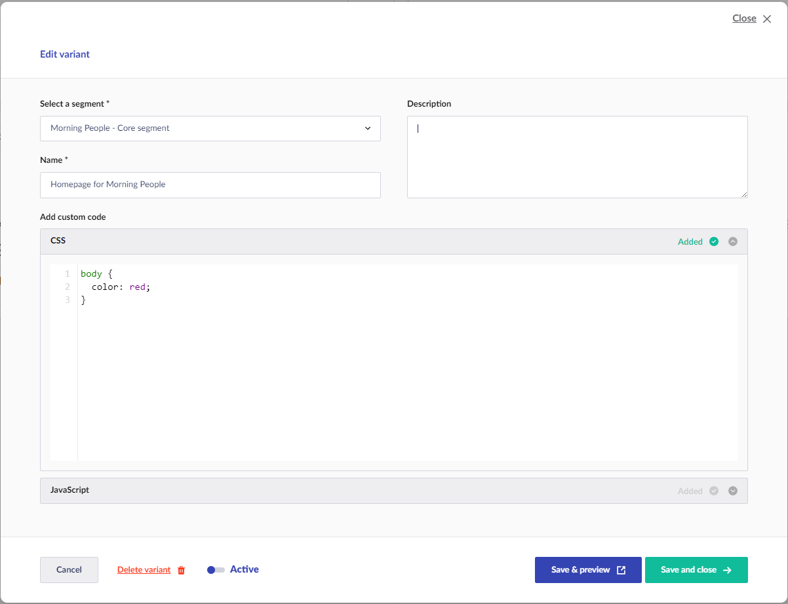

# Using the Marketing API

After setting up the Umbraco Engage Headless API, let us learn how to use it.

## Summary

Umbraco Engage segmented content and A/B tests work with Umbraco's Content Delivery API, delivering the correct content. For more details on how to use and query content from Umbraco, see the [Umbraco Documentation](https://docs.umbraco.com/umbraco-cms/reference/content-delivery-api#enable-the-content-delivery-api).

To track user activity and assign segments or personas, make an HTTP POST request to:

**/umbraco/engage/api/v1/analytics/pageview/trackpageview/client** endpoint

with the following JSON body to indicate what page the user has visited.

```json
{    "url": "https://localhost:44374"}
```

This determines if the user meets criteria for segmenting, A/B testing, or applying personalization. Subsequent requests to the Umbraco content API then deliver personalized content.

Umbraco Engage needs to be explicitly notified because a single request to Umbraco's Content Delivery API represents one page visit.

## Configuration

Umbraco Engage Headless package settings can be configured through .NET options, including AppSettings JSON file, Environment Variables, or other configuration sources.

An example of configuration in AppSettings.json file:

```json
"Engage": {
  "DeliveryApi": {
    "Segmentation": {
      "ContentById": true,
      "ContentByIds": true,
      "ContentByPath": true,
      "ContentByQuery": true
    }
  }
}
```

The settings can be changed at runtime without restarting the website for these changes to take effect.

| **Key**        | **Description**                                                                                                                                     | **Default Value** |
| -------------- | --------------------------------------------------------------------------------------------------------------------------------------------------- | ----------------- |
| ContentById    | <p>Enable Umbraco content delivery API endpoint by <strong>ID</strong><br><em>/umbraco/delivery/api/v1/content/item/{id}</em></p>                   | true              |
| ContentByIds   | <p>Enable Umbraco content delivery API endpoint<br>that uses an array of <strong>IDs</strong><br><em>/umbraco/delivery/api/v1/content/item</em></p> | true              |
| ContentByPath  | <p>Enable Umbraco content delivery API endpoint by <strong>Path</strong><br><em>/umbraco/delivery/api/v1/content/item/{path}</em></p>               | true              |
| ContentByQuery | <p>Enable Umbraco content delivery API endpoint by <strong>Query</strong><br><em>/umbraco/delivery/api/v1/content</em></p>                          | true              |

### Analytics

To track a page view, send a POST request to:

`/umbraco/engage/api/v1/analytics/pageview/trackpageview/client`

* Required: `url` property of the page that a user has visited in the site
* Optional: `reffererUrl` can be set to inform Umbraco Engage where the user came from.

`/umbraco/engage/api/v1/analytics/pageview/trackpageview/server`

* Useful when a frontend JAMStack Server such as a NuxtJS server or similar is being used.
* Can notify Umbraco Engage when a page view has taken place and provide extra information.
* Requests extra metadata like `headers`, `browserUserAgent`, `remoteClientAddress`, and `userIdentifier`.

**Client and Server**

Umbraco Engage gathers information about visitors based on their requests, extracting details from your request like HTTPContext.

* **Client-side**: This version applies when you make an API call directly to Umbraco from your browser. In this case, all the request metadata, such as IP address, cookies, request headers, and so on, comes directly from your browser.
* **Server-side**: If there is a server between the browser and Umbraco, like a NuxtJS server, the requests tracked are from the server rather than the browser. In this scenario, Umbraco Engage does not receive metadata from the end-client's requests. Instead, you can use the server version to add this additional metadata (headers, IP addresses, and so on) to your pageview tracking between the NuxtJS server and Umbraco.

### Page Events

To track events, send a POST request to:

`/umbraco/engage/api/v1/analytics/pageevent/trackpageevent`

* After tracking a pageview using the Analytics TrackPageview API as mentioned above, you will receive both an externalVisitorId and `pageviewId`.
* Requires a supplied pageview-Id header and a request body containing a `category`, `action` _(optional)_, `label` _(optional)_, and `timestamp` _(optional)_.

Optionally, provide an External-Visitor-Id header in order to automatically update the in-memory visitor. This helps to automatically reflect segments involving events for said visitors. Without this parameter, the pageview must be flushed to the database (according to the configuration) before any segment-related information is updated. For example: personalization variants based on events.

### Segmentation - Assets

`/umbraco/engage/api/v1/segmentation/assets/item/{path}` `/umbraco/engage/api/v1/segmentation/assets/item/{id}`

These requests let you verify if a content page, by ID or Path, has a **JavaScript** or **CSS** variant available for page injection.



### Segmentation - Content

`/umbraco/engage/api/v1/segmentation/content/segments` `/umbraco/engage/api/v1/segmentation/content/segments/{path}` `/umbraco/engage/api/v1/segmentation/content/segments/{id}`

These requests return details about segments (personalization and A/B testing) configured for a page. This helps determine if content can be changed by Umbraco Engage or cached more aggressively.

### Segmentation - Visitor

`/umbraco/engage/api/v1/segmentation/content/activesegments/{path}` `/umbraco/engage/api/v1/segmentation/content/activesegments/{id}`

These requests return the segment (personalization and A/B testing) that the current visitor ID of that specific page belongs to based on its cookie.
