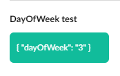
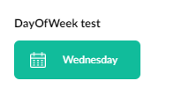

# Implement your own segment parameters

You may want to build segments with custom rules not included in Umbraco Engage by default. You can add your custom segment parameters to Umbraco Engage.

In the following guide, we will show how this is done. There are three steps:

1. [C# Definition](implement-your-own-segment-parameters.md#id-1.-c-definition)
2. [AngularJS Definition](implement-your-own-segment-parameters.md#id-2.-angularjs-definition)
3. [\[Optional\] Cockpit Visualization](implement-your-own-segment-parameters.md#id-3.-optional-cockpit-visualization)

This guide will use code samples to add a "**Day of week**" segment parameter where you can select a single day of the week. If a pageview happens on that day the segment parameter will be satisfied.

You can download the following code files to your project to add the parameter directly to your solution.



## 1. C# Definition

Your custom segment parameter must be defined in C# for the Umbraco Engage to use it.\
In code, we refer to a segment parameter as a **segment rule**.

A segment rule is:

* A unique rule identifier, e.g. `DayOfWeek`.
* A configuration object, e.g. `{ dayOfWeek: 3 }`.
  * This is optional, but most rules will have some sort of configuration that the user can alter in the Segment Builder. In our example, the user can configure the specific day of the week.
* A method that specifies whether the rule is satisfied by the current page view.

You will have to implement the following interfaces for a new custom parameter:

* `Umbraco.Engage.Business.Personalization.Segments.Rules.ISegmentRule`
  * You can extend the existing `BaseSegmentRule` to simplify the implementation.
  * It is important to implement the `bool IsSatisfied(IPersonalizationProfile context)` method.
* `Umbraco.Engage.Business.Personalization.Segments.Rules.ISegmentRuleFactory`
  * Register your implementation of the segment rule factory with `Lifetime.Transient` in a composer.

For the "**Day of week**" example, the code looks like this:

```csharp
// Define the segment rule
public class DayOfWeekSegmentRule : BaseSegmentRule
{
    public DayOfWeekSegmentRuleConfig TypedConfig { get; }
    
    public override SegmentRuleValidationMode ValidationMode => SegmentRuleValidationMode.Once;

    public DayOfWeekSegmentRule(long id, long segmentId, string type, string config, 
    bool isNegation, DateTime created, DateTime? updated, DayOfWeekSegmentRuleConfig typedConfig)
        : base(id, segmentId, type, config, isNegation, created, updated)
        => TypedConfig = typedConfig;
    
    public override bool IsSatisfied(IPersonalizationProfile context)
        => context.Pageview.Timestamp.DayOfWeek == TypedConfig.DayOfWeek;
}
```

And the factory which is used to create an instance of this rule:

```csharp
public class DayOfWeekSegmentRuleFactory : ISegmentRuleFactory
{
    public string RuleType { get; } = "DayOfWeek";
    public ISegmentRule CreateRule(string config, bool isNegation, long id, 
    long segmentId, DateTime created, DateTime? updated)
    {
        var typedConfig = JsonConvert.DeserializeObject<DayOfWeekSegmentRuleConfig>(config);
        return new DayOfWeekSegmentRule(id, segmentId, RuleType, config, isNegation, 
        created, updated, typedConfig);
    }
}
```

We are using the class `DayOfWeekSegmentRuleConfig` as a representation of the configuration of the rule, which is not strictly necessary but makes it easier. The configuration is stored as a string in the database but in code, we like to have IntelliSense so we parse the stored configuration to this class:


```csharp
public class DayOfWeekSegmentRuleConfig
{
    public DayOfWeek DayOfWeek { get; set; }
}
```


The segment rule factory needs to be registered so Umbraco Engage can use it.\
The code below registers the factory in a new composer, you can use an existing composer for this if you like:

```csharp
public class DayOfWeekSegmentRuleComposer : IUserComposer
{
    public void Compose(Composition composition)
    {
        composition.Register<ISegmentRuleFactory, DayOfWeekSegmentRuleFactory>(Lifetime.Transient);     
    }
}
```

In the above example, we have shown how you can define custom segment parameters using C#. Next we look into enabling and configuring our segment in the Umbraco Engage segment builder.

## 2. AngularJS Definition

We implemented the business logic for the segment parameter in the previous step, however, the parameter cannot be added to your backoffice segments yet. In this step, we will add some JavaScript and HTML to enable you to add and configure your segments in the Umbraco Engage segment builder.

This step will show concrete code samples that belong to our demo parameter "**Day of week**".

You need to create a folder in the _App\_Plugins_ folder of your project that will hold the new files.

For this example name it "`day-of-week`". The folder and content look like this:

* `App_Plugins\day-of-week`
  * `package.manifest`
    * Instructs Umbraco to load your JavaScript files
  * `segment-rule-day-of-week-display.html`
    * View for displaying the configuration of your segment parameter
  * `segment-rule-day-of-week-display.js`
    * AngularJS component for displaying your segment parameter
  * `segment-rule-day-of-week-editor.html`
    * View for editing the configuration of your segment parameter
  * `segment-rule-day-of-week-editor.js`
    * AngularJS component for editing the configuration of your segment parameter
  * `segment-rule-day-of-week.js`
    * Define your segment parameter and register it in the segment rule repository of Umbraco Engage

You can name the files, however, make sure to reference the JS files in your `package.manifest` properly.

The contents for each of the files are below:

* `segment-rule-day-of-week.js`

In this file, you define the segment parameter and register it in the repository of Umbraco Engage.

```javascript
// If you have your own custom module, use this:
// angular.module("myCustomModule", ["Engage"]);
// angular.module("umbraco").requires.push("myCustomModule");
// angular.module("myCustomModule").run([ ... ]) 

angular.module("umbraco").run([
    "umsSegmentRuleRepository",
    function (ruleRepo) {
        var rule = {
            name: "Day of week", // Friendly name
            type: "DayOfWeek",   // Rule type / identifier
            
            iconUrl: "/path/to/icon.png",
            // You can also reuse existing Engage icons by specifying 
            //the "icon" property rather than the "iconUrl" property.
            // Use either one or the other, not both.
            // icon: "icon-browser", 

            order: 4, // Position in segment builder            
            
            // Default config is passed in to your editor when a user adds
            // the rule to the segment
            defaultConfig: {
                dayOfWeek: null
            },

            // If you need any data in your editor, specify it here
            data: {
                days: {
                    0: "Sunday",
                    1: "Monday",
                    2: "Tuesday",
                    3: "Wednesday",
                    4: "Thursday",
                    5: "Friday",
                    6: "Saturday",
                }
            },

            // Specify the names of the display and editor components here.
            // These will be dynamically rendered in our segment builder and in
            // some other places. 
            components: {
                display: "segment-rule-day-of-week-display",
                editor: "segment-rule-day-of-week-editor",
            },

            init: function() { 
                // Optional. Use this in case you need to fetch some data
                // for your segment parameter.
                // For example, the built-in "Browser" segment parameter will fetch
                // the list of possible browsers here and will update 
                // the "data" property. The "thisArg" of this function is set to 
                // the rule definition object, i.e. if you use "this.data" in
                // this callback you can manipulate the data object of this rule.
            }
        };

        ruleRepo.addRule(rule);
    }
]);
```

* `segment-rule-day-of-week-editor.html`

This file contains the view of your parameter editor. Our example editor is a `<select>` filled with the 7 days of the week.

We write the picked value to the `config.dayOfWeek` property of our rule. You can make the editor as complex as you want, use multiple fields, etc.

For more inspiration, you can look at the built-in rule editors of Umbraco Engage in `App_Plugins\Umbraco.Engage\dashboard\segments\builder\rules`.

We use the `data.days` property of our rule definition in the editor. The editor gets passed in the rule definition as well as a `config` object which we should update according to the user input.

```html
<ums-segment-rule-editor name="$ctrl.rule.name" type="$ctrl.rule.type" save="$ctrl.save()">
  <select ng-options="value as day for (value, day) in $ctrl.rule.data.days" 
  ng-model="$ctrl.config.dayOfWeek">
    <option value="">- Select -</option>
  </select>
</ums-segment-rule-editor>
```

* `segment-rule-day-of-week-editor.js`

This registers the editor component in the Umbraco Engage module so we can use it.\
It should not be necessary to update this file other than update the component name and `templateUrl`.

```javascript
// If you have your own custom module, use that name instead of "umbraco" here.
angular.module("umbraco").component("segmentRuleDayOfWeekEditor", {
    templateUrl: "/App_Plugins/day-of-week/segment-rule-day-of-week-editor.html",
    bindings: {
        rule: "<",
        config: "<",
        save: "&",
    },
});
```

* `segment-rule-day-of-week-display.html`

This is the view file used for the visual representation of the segment parameter.\
We want to display the picked day to the user:

```html
<span class="umbEngage-segmentrule__wrapper umbEngage-segmentrule__wrapper--thin"> 
   <span class="umbEngage-segmentrule__rulecontent"      
       ng-bind="$ctrl.rule.data.days[$ctrl.config.dayOfWeek]"></span>
  </span>
```

We store the chosen day of the week as an integer 0-6 ($ctrl.config.dayOfWeek) but in the display component, we want to show the actual day (e.g. `Monday`). Our rule definition defines the mapping in its `data.days` property so we convert it using that and display the name of the day.

* `segment-rule-day-of-week-display.js`

In this file, we register the display component.

```csharp
// If you have a custom module, use that name instead of "umbraco" 
here.angular.module("umbraco").component("segmentRuleDayOfWeekDisplay", 
{    
    templateUrl: "/App_Plugins/day-of-week/segment-rule-day-of-week-display.html",    
    bindings: {       
     config: "<",     
        rule: "<",  
          },});
```

* `package.manifest`

To make sure Umbraco loads your JS files we specify them here:

```javascript
{    
"javascript": [   
     "~/App_Plugins/day-of-week/segment-rule-day-of-week.js",    
     "~/App_Plugins/day-of-week/segment-rule-day-of-week-display.js",   
     "~/App_Plugins/day-of-week/segment-rule-day-of-week-editor.js"   
]}
```

If all goes well you will see your custom parameter editor show up in the segment builder:


## 3. \[Optional] Cockpit Visualization

The new segment parameter will show up automatically in the [Cockpit](../../../../personalization/cockpit-insights/) that is part of our package. The cockpit is a live view of Umbraco Engage data for the current visitor.

This includes active segments of the current visitor, and therefore your new segment parameter can also show up in the cockpit. By default, it will display the **raw configuration of the parameter** as stored in the database ("`{ dayOfWeek: 3 }`" in our example).

If you hover over it you will see the rule identifier `DayOfWeek` rather than a friendly name.



If you want to change this to be more readable you can implement the `Umbraco.Engage.Web.Cockpit.Segments.ICockpitSegmentRuleFactory` interface.

For the `DayOfWeek` demo parameter, this is the implementation:

```csharp
public class DayOfWeekCockpitSegmentRuleFactory : ICockpitSegmentRuleFactory
{
    public bool TryCreate(ISegmentRule segmentRule, bool isSatisfied, out CockpitSegmentRule cockpitSegmentRule)
    {
        cockpitSegmentRule = null;
        if (segmentRule is DayOfWeekSegmentRule dayOfWeekRule)
        {
            cockpitSegmentRule = new CockpitSegmentRule
            {
                Name = "Day of week",
                Icon = "/path/to/icon.png",
                Config = dayOfWeekRule.TypedConfig.DayOfWeek.ToString(),
                IsNegation = segmentRule.IsNegation,
                IsSatisfied = isSatisfied,
                Type = segmentRule.Type,
            };
            return true;
        }
        return false;
    }
}
```

So we transform the JSON into a human-readable representation and we configure an icon to show up in the cockpit. Make sure to register this class in a composer (you can reuse the composer from the first step):

```csharp
composition.Register<ICockpitSegmentRuleFactory, DayOfWeekCockpitSegmentRuleFactory>(Lifetime.Transient);
```

After it has been registered, Umbraco Engage will use the additional information to properly render your segment parameter in the cockpit as well.


The "**DayOfWeek** test" string is the name of the segment. This segment happens to have only 1 parameter which is the DayOfWeek parameter.



