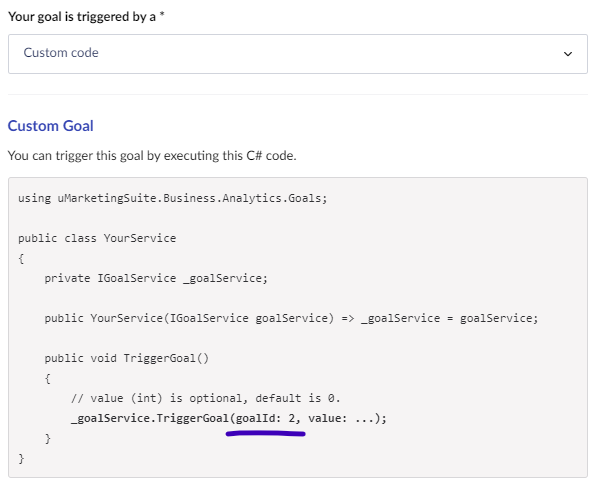

# Custom goals scoring

## Setting up custom goals

To set custom goals:

1. Navigate to **Settings** > **Goals** in the Umbraco Engage section.
2. Set the goal type to **Custom**.
3. Execute C# code to trigger the goal.

Creating the goal is similar to creating a page view or page event goal. The **goal ID** displayed in the code snippet after saving, as it's needed to trigger the goal from the code.



## Trigger goal in C\#

To trigger the goal, execute C# code during the visitor's pageview. Inject `Umbraco.Engage.Business.Analytics.Goals.IGoalService`, which has a `TriggerGoal(long goalId, int value)` method. An implementation looks like:

```cs
using Umbraco.Engage.Business.Analytics.Goals;

public class YourService
{
    private IGoalService _goalService;

    public YourService(IGoalService goalService) => _goalService = goalService;

    public void TriggerGoal()
    {
        // Use the goalId from the code snippet above
        _goalService.TriggerGoal(goalId: 37, value: 42);
    }
}
```

### Triggering Outside of HttpContext

The method automatically determines the current page view, linking the goal to a session and visitor. This means the **HttpContext** should be available.

To trigger a goal outside of an HTTP request, use the overload of **TriggerGoal** that takes the GUID of the pageview.

Retrieve this pageview GUID during the original request using the **Umbraco.Engage.Business.Analytics.Common.IPageviewGuidManager**. You will need to store this pageview GUID for later use when invoking:

```cs
_goalService.TriggerGoal(pageviewGuid, goalId, value);
```

This custom goal can now be used like other goals and will show up in any statistics related to goals.
