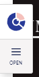

# Cockpit

Umbraco Engage includes a cockpit feature to help verify the tracking of analytics and understand personalization behavior. The cockpit adds a button to the front end, giving real-time insights.

## Adding the Cockpit to Your Website

To add the cockpit to your website:

1. Render the HTML partial provided by Umbraco Engage.
2. The partial view is located at `/Views/Partials/Umbraco.Engage/Cockpit.cshtml`.
3.  Insert the following code before the closing `</body>` tag:

    ```cs
    @Html.Partial("Umbraco.Engage/Cockpit")
    ```

Once the code is added, reload the page to see the Umbraco Engage Cockpit on the left or right side of the screen. The cockpit will only be rendered if the user is logged into Umbraco.



Clicking the Open button provides detailed information:


If you do not see the Cockpit while the Umbraco backoffice runs on a different domain please refer to the [load balancing / CM / CD environments](loadbalancing-and-cm-cd-environments.md) section.
