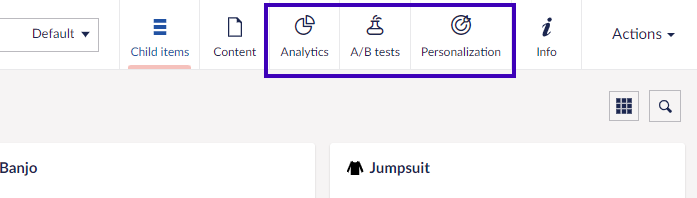
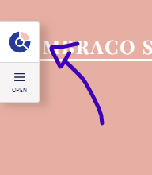
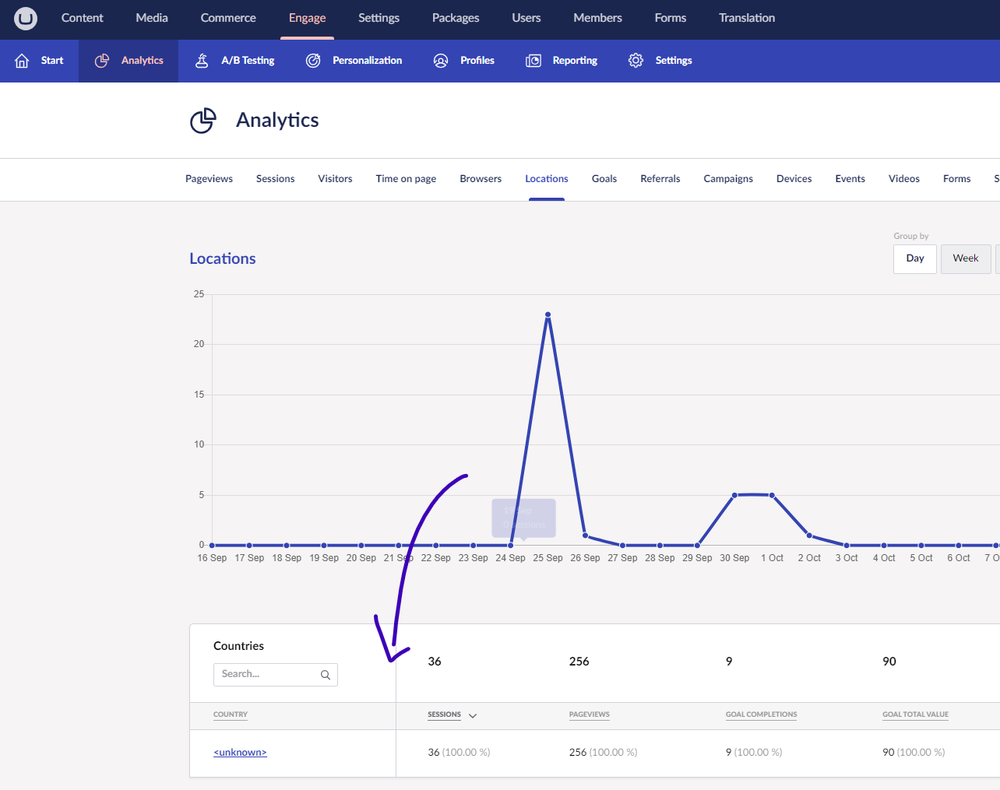

# Troubleshooting Installs

## The Umbraco Engage Checklist

If you have problems with Umbraco Engage setup or configuration, this checklist is for you. Verify you installed the Nuget package **Umbraco.Engage** into your Umbraco website

### 1. The Marketing section

After logging in to Umbraco you can see the Marketing section next to the other main sections in the Umbraco backoffice.

If you cannot see this, please check if your Umbraco user or user group has access to the Marketing section.

### 2. Marketing Content Apps

When editing a page within Umbraco you should be able to see the following Content App on the top right of the page:

If you cannot see this, please check if your Umbraco user or user group has access to the Marketing section.

### 3. Cockpit

Is the **Umbraco Engage Cockpit tool** visible on the front end of your site **after logging into Umbraco**?

No? Ensure you added the [Cockpit Partial view](../getting-started/for-developers/cockpit.md) in your main template.

### 4. Cockpit Client Side Data

Can you see client-side data such as **scroll depth** & **total time** on pages in analytics or the cockpit?

No? Ensure you have [added the client-side tracking script](../developers/analytics/client-side-events-and-additional-javascript-files/additional-measurements-with-the-analytics-scripts.md) in your main template.

<figure><figcaption></figcaption></figure>

### 5. Umbraco Forms

Go to a form and add a new question. Do you see this option?

Go to Marketing -> Settings -> Create a new goal. Do you see the following option called **Umbraco Forms Submission**?

If you see both options, this has been configured correctly. If not, ensure that your development team has installed the additional Umbraco Engage [UmbracoForms NuGet package](https://www.nuget.org/packages/Umbraco.Engage.Forms).

### 6. Analytics

Edit a page and go to the Content App marked **Analytics** or **Marketing** -> **Analytics** from the top navigation.

Are you able to see analytical data? If not then you **need to wait 24 hours for today's analytics** to be collected and reported.

### 7. Locations for Analytics

Do you only see \<unknown> in the Location tab of Analytics?

This means that additional configuration is required. Get in touch with a developer, as they need to [work to set up and track visitor locations by country and city](../developers/analytics/extending-analytics/getting-the-correct-ip-address.md).

Once set up, you will see analytics for countries like this below:

### 8. Setup IP Filters

Confirm that the IP of your company/office building has been set to be excluded from Umbraco Engage. This is done to ensure it is excluded from tracking and reporting, along with anyone else who is a content editor of the website.

You can check your IP by [Googling for What is My IP](https://www.google.com/search?q=what+is+my+IP). Ensure it is in the list of IPs by navigating to **Engage** -> **Settings** -> **IP Filters**.

### 9. Reload after Cookie consent

To ensure that Umbraco Engage can interact with the visitor from the first page, reload the page as soon as the Cookie consent is approved. This enables showing personalized variants on the landing page which requires consent. More info on how to do this can be found at the bottom of the [tracking a visitors initial pageview](../security-and-privacy/gdpr/how-to-become-gdpr-compliant-using-cookiebot.md) article.

### Still missing analytical data?

If you have performed all the steps and do not see Analytics data within Umbraco Engage there are a handful of additional steps to take. Please work with a developer to check the following technical steps.

* Open your website in a browser with the browser developer tools open.
* Refresh the page while the developer tools are open.
* Look for a POST request being made to `umbraco/engage/pagedata/ping` in the Network Tab of requests

<figure><figcaption></figcaption></figure>

Only '**real**' visitors will be tracked and any information we determine to be from a bot is discarded. The following steps are taken to report a page view:

* DeviceDetector.NET will assess if the visitor is a bot or a '**real**' visitor.
* If it is a '**real**' visitor the page will send a POST request to `umbraco/engage/pagedata/ping` and record a visit.
* If they are deemed a bot, they will not make this request and no page view will be tracked

If the POST request still does not happen, [reach out via support](../developers/support.md).
