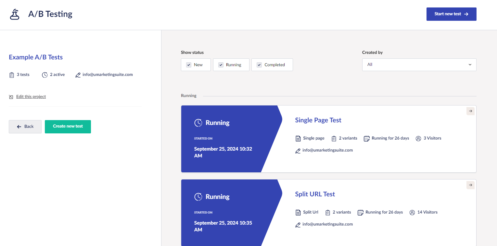

# Monitor the A/B Test

When the A/B test is running it is advised to check the progress regularly. This can be done on the specific page or via the Engage Section.

If you go to the overview you can see all running tests. The overview includes the following information:

* For how long a test has been running?
* How many visitors are included in the test?
* For how long should the test run to produce relevant results?

<figure><figcaption>
Monitoring the A/B tests.
</figcaption></figure>

You can see all test variants when you access the details on a test. You can preview the variants, or disable them. If for example, the conversion rate has decreased in a variant, it could be smart to disable that variant.

The algorithm also signals the leading variant based on the Minimal Detectable Effect (MDE) which uses the 95% confidence level.

<figure><figcaption>
Algorithm signaling the leading variants.
</figcaption></figure>
