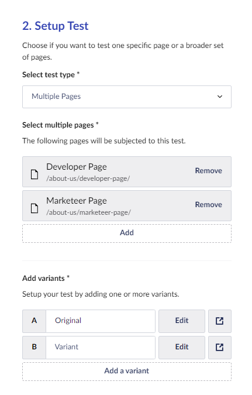
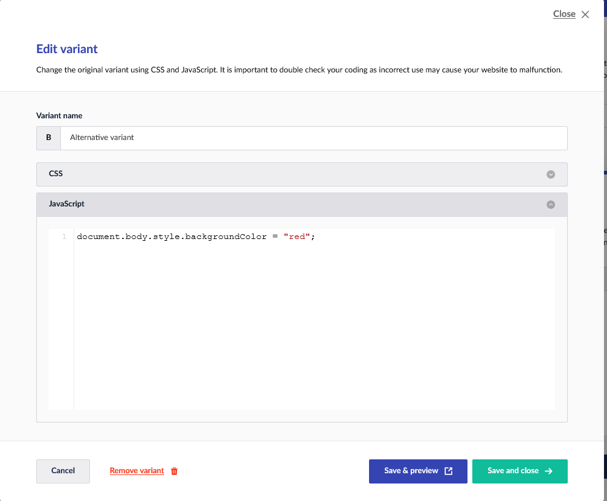

# Multiple Pages Test

The Multiple Pages test allows you to across multiple pages at once. In Umbraco, you can select the pages you want to test. For all these pages you can specify which type of CSS or JavaScript will be added to the specific variant. The multiple pages test requires you to write (or copy in) some CSS and JavaScript code.

The test type **Multiple pages** can be started in the [Engage section](../../introduction/the-umbraco-engage-section.md) and in the [Content App](../../introduction/content-apps.md). The type is selected in step 2 of the setup.

The test allows you to select one or more pages within Umbraco. On all these pages the A/B Test will render the additional CSS and JavaScript you enter. The CSS and JavaScript must not create any side effects on these pages. This is a manual job that cannot be automated with Umbraco Engage.

Once you have selected the pages you want to test, you can specify one or more variants. For each variant, it is possible to click the Edit button. This will bring up a popup that allows you to write JavaScript or CSS:

In this example, some JavaScript is added to change the page's background color.

You can save and preview whether your code works by clicking **Save & preview**.

After you have created all variants start your A/B testing as described in the [Setting up the A/B test](../setting-up-the-ab-test.md) article.
