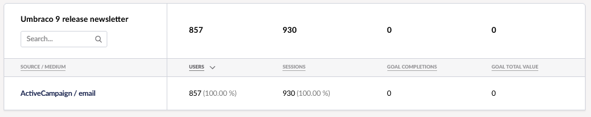

# Campaigns

In the **Campaigns** tab of the Umbraco Engage, you can view all analytics data related to your campaigns. These campaigns are tracked automatically using Urchin Tracking Module (UTM) parameters, which you may already be using to monitor your marketing efforts.

You can add five different parameters to your URLs:

* `utm_source`: Identify the advertiser, site, publication that is sending traffic to your property. For example: google, newsletter4, billboard.
* `utm_medium`: The advertising or marketing medium. For example: cpc, banner, email newsletter.
* `utm_campaign`: The individual campaign name, slogan, promo code for a product.
* `utm_term`: Identify paid search keywords. If you are manually tagging paid keyword campaigns, you should also use _utm_term_ to specify the keyword.
* `utm_content`: Used to differentiate similar content or links within the same ad. For example: if you have two call-to-action links within the same email message, you can use _utm_content_ and set different values for each so you can tell which version is more effective.

Each parameter must be paired with a value that you assign. Each parameter-value pair then contains campaign-related information.

For example, if you want to link from a newsletter to the pricing page of umbraco.com, you can use the following parameters:

* **utm_source** = newsletter-july-2024 to identify that this visitor came from this specific newsletter
* **utm_medium** = newsletter to show that the medium was a newsletter
* **utm_campaign** = more_signups because that newsletter was part of a larger campaign
* **utm_content** = bottom_button to identify a specific link in the newsletter

If you want to use these parameters, you will need to set up the URL like:



```cs
https://www.umbraco.com/pricing/?utm_source=newsletter-july-2024&utm_medium=newsletter&utm_campaign=more_signups&utm_content=bottom_button
```



## Campaign Report

The report shows all campaigns set up with the `utm_campaign` parameter.


You can see:

* How many visitors came to the website via the campaign URL?
* How many sessions were created?
* How often was a goal triggered by visitors from this campaign?

You can also drill down to view the source and medium for each campaign.


