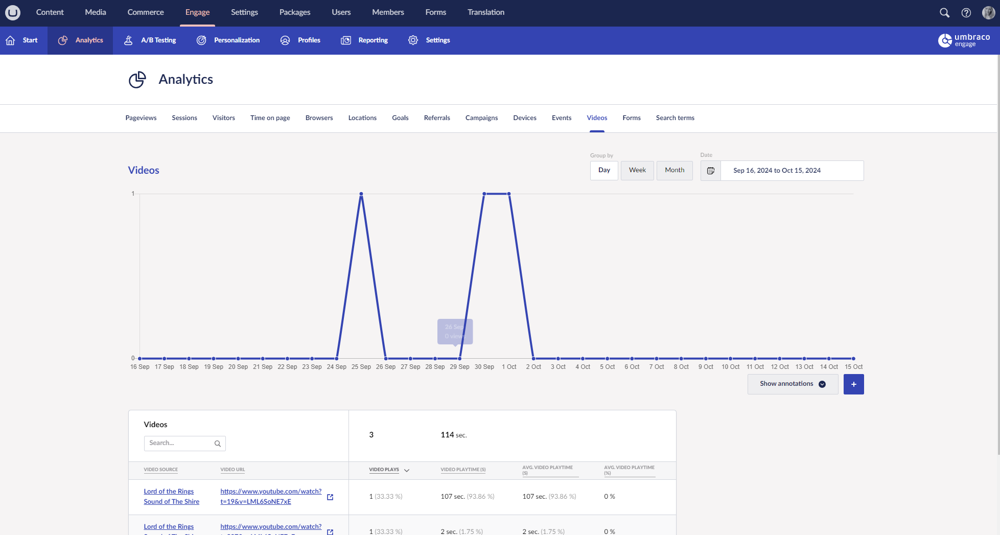

# Videos

Umbraco Engage gathers video statistics for the following types of videos:

* HTML5 videos (videos provided via the `<video>` element)
* Embedded YouTube videos


Make sure the embed URL contains `?enablejsapi=1` as part of the full URL to enable tracking. The `src` property of the iframe should be something like: `https://www.youtube.com/embed/&lt;CODE&gt;?enablejsapi=1`.

The [https://www.youtube.com/iframe\_api](https://www.youtube.com/iframe\_api) is loaded for this purpose.


* Embedded Vimeo videos


The [https://player.vimeo.com/api/player.js](https://player.vimeo.com/api/player.js) is loaded for this purpose.


## The data

For the videos, the following information is gathered:

* Video URL
* Video name
  * For YouTube and Vimeo the name can be retrieved.
  * For HTML5 we record the file name.
* Total Time Watched (seconds)
* Total Percentage Watched
* In Viewport
  * True if the video was in the user's viewport.
* Watched
  * True if the video played for at least 1 second.

Apart from the metadata above we also track actions performed on the video player. These actions are:

<table><thead><tr><th width="193">Action</th><th>Description</th></tr></thead><tbody><tr><td>Autoplay</td><td>If the video was started automatically.</td></tr><tr><td>Play</td><td>When the video starts playing.</td></tr><tr><td>Pause</td><td>When the video is paused.</td></tr><tr><td>Resume</td><td>When the video is resumed from a Paused state.</td></tr><tr><td>Ended</td><td>When the video is ended.</td></tr><tr><td>Seek</td><td>When a seek operation is performed.</td></tr></tbody></table>

## The report

By collecting this data you can visualize different reports about the videos. You will find these reports in the Analytics subsection and the tab Videos.

Here you find all the videos that are displayed on the website. For each video you can see the following:

* How often was the video played?
* The total playtime of the video.
* The average video playtime of the video.

From here you can also drill down on a specific video to see more details about that video. You can do that by clicking on the video itself.

You see how often the video was started and paused, how often it was resumed, and how often visitors sought within the video.
