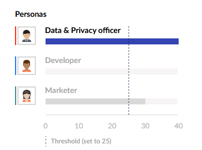

# Implicit Personalization scoring explained


Ensure that you have set up at least one [persona](setting-up-personas.md) or [customer journey step](setting-up-the-customer-journey.md).


Implicit personalization is based on gaining confidence that a visitor shows behavior that can be mapped to a persona or a customer journey step. To gain this confidence it is possible to assign points to specific actions within your website. If a certain threshold of points is reached Umbraco Engage assumes the visitor is this persona or in a specific customer journey step. As soon as that point is reached, you can use that information to personalize the website experience of your visitor.

There are four ways to score the behavior of your visitors:

1. [Score the content that a visitor is viewing](content-scoring.md). This can be done per node.
2. [Score from which (external) website or (external) webpage a visitor was coming](referral-scoring.md).
3. [Score the campaigns](campaign-scoring.md) that a visitor is part of.
4. [Implement your own scoring](../../../developers/personalization/custom-scoring.md). In this way, the sky is the limit, because you can hook into any external data source you have or behavior that you want to score.

## Collecting Points

The points of all these different sources are added and this reaches a certain amount of points per persona. Once a persona or journey step reaches the set threshold, the algorithm assigns you to that persona or step.

In the example, the visitor collected 40 points for the **Data & Privacy officer**, 30 points for the **Marketer**, and 0 points for the developer persona:

The threshold in this specific case was set to 25 points. As soon as the **Data & Privacy officer** reached 25 points Umbraco Engage assumed that this visitor was a **Data & Privacy officer**.

In this example the **Think** customer journey step is assumed based on the collected amount of points:

## Tweaking the Scoring

The threshold value and the expected difference between two personas or journey steps can be set in the [customer journey group](setting-up-the-customer-journey.md) and [persona group](setting-up-personas.md).

Setting up a deviation of at least 35 points between two personas the cockpit will show a different visualization in the previous example:

You can see that the "**Data and privacy officer**" still has 40 points and the marketer 30 points. Both have also reached the threshold of 25 points, but there is not a minimal deviation of 35 points. The Umbraco Engage algorithm waits for the deviation to reach the set threshold before assuming a persona. For example: the **Data & privacy officer** reaches 65 points (30 points of the marketer + a minimal deviation of 35 points).
