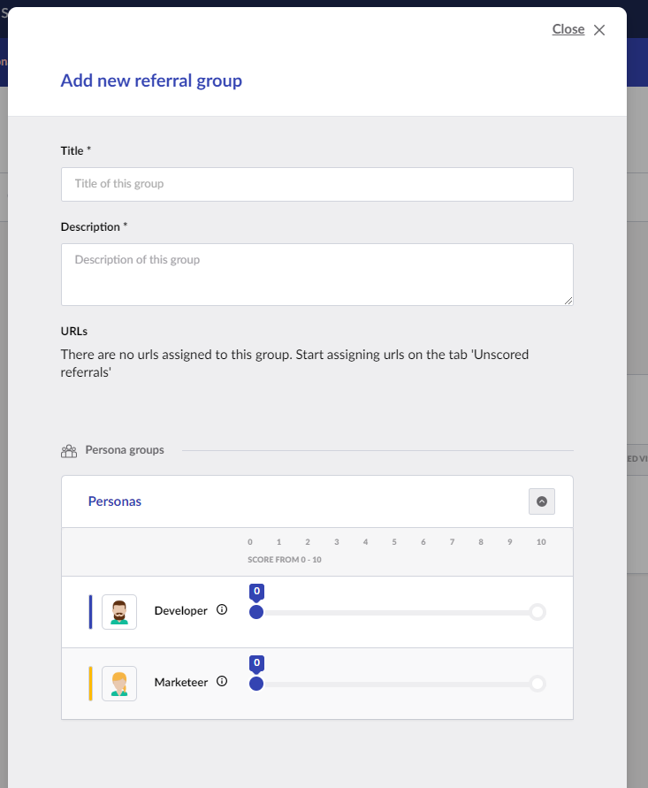

# Referral Scoring

1. Create a **Referral group**:

<figure><figcaption>
Create referral group.
</figcaption></figure>

2. Assign a score to your **Personas** and/or **Journey**.

<figure><figcaption>
Assign score.
</figcaption></figure>

3. Save your **Referral Group**
4. Go to the **Unscored referral** tab
5. Assign a referrer to your newly created group.

<figure><figcaption>
Assign referrer.
</figcaption></figure>

By default, the score will be assigned when the referrer matches the whole URL (in this case **facebook.com/mycompany/products**). It is also possible to assign the score on the entire domain (That is **facebook.com**).

6. Tick the '**Score on domain only**' checkbox.

<figure><figcaption>
Tick the '<strong>Score on domain only</strong>' checkbox.
</figcaption></figure>

You have now created Referral groups and score referrers in your groups.
