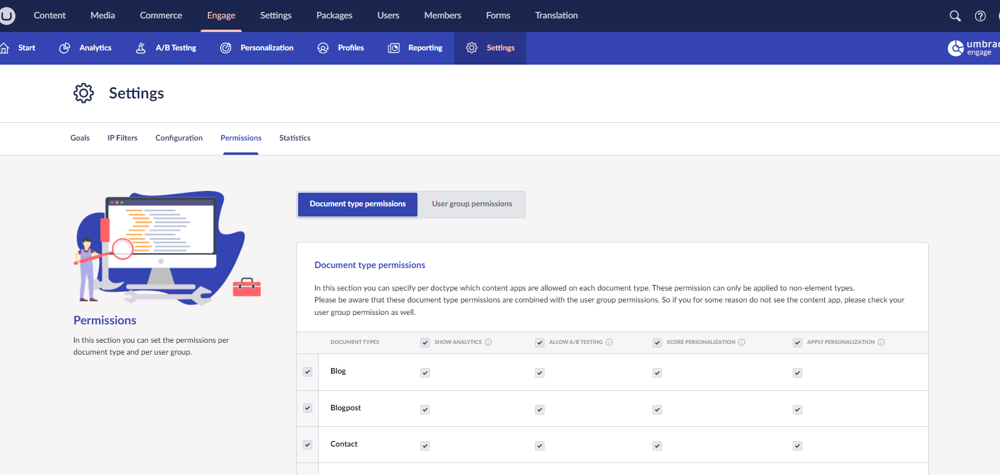

# Permissions

You can manage which document types the content apps are shown, and which Umbraco user groups have access to in the Marketing section settings. They can be managed per Document Type and user group

