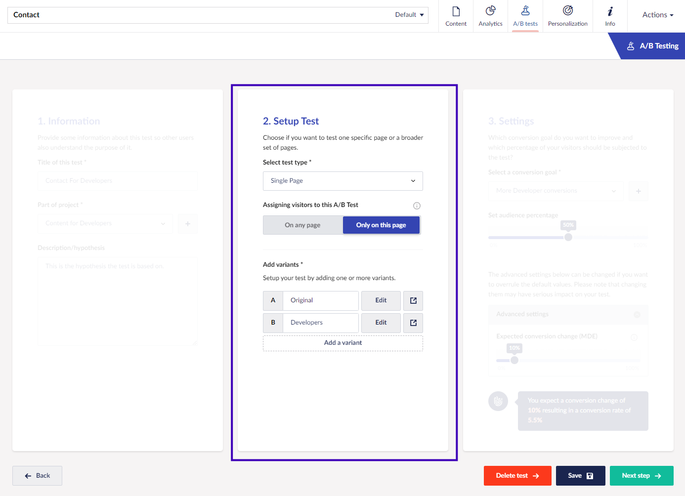
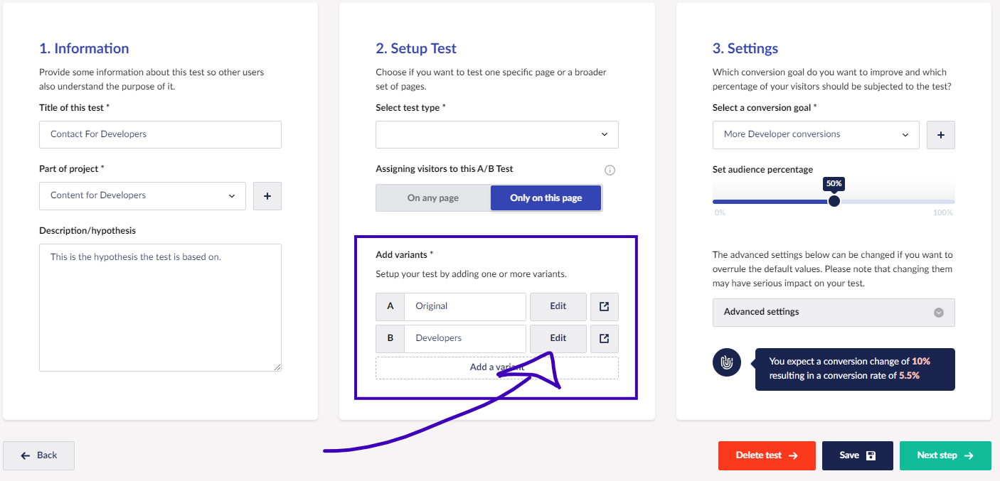

# How to set up an A/B Test

In this tutorial, you will go through the necessary steps for setting up and configuring an A/B test on your Umbraco website.

Before you start, it is recommended to read the [What is A/B Testing article](../marketers-and-editors/ab-testing/what-is-ab-testing.md) to get familiar with the concept.

## Tutorial Content

1. [Make a Plan](set-up-your-first-ab-test.md#make-a-plan)
2. [Choose test type](set-up-your-first-ab-test.md#choose-test-type)
3. [Create the test](set-up-your-first-ab-test.md#create-the-test)
4. [Configure the test](set-up-your-first-ab-test.md#configure-the-test)
5. [Edit the test variants](set-up-your-first-ab-test.md#edit-the-test-variants)
6. [Start the test](set-up-your-first-ab-test.md#start-the-test)
7. [Next steps](set-up-your-first-ab-test.md#next-steps)

## Make a plan

The first step to setting up an A/B test on your website is to define a solid plan. It is also important to ensure that your website receives enough traffic to make the tests valid.

This tutorial does not cover defining a plan or what makes a project valid for testing. However, find some general recommendations below.

* **Set a Clear Objective:** Start by defining a specific goal for your A/B test. Knowing what you aim to improve or measure allows you to design the test accordingly. For example, do you want more clicks on a button, a higher conversion rate, or something else?
* **Ensure a valid amount of data:** A significant amount of traffic and conversions is important to produce reliable results from A/B tests. Use a tool like the Risk, Optimization, Automation, Re-think (ROAR) model to determine whether your website is eligible.
* **Develop a Hypothesis:** Based on your objective, create a clear hypothesis. This should include what change you expect and why. The stronger your hypothesis, the more valuable your test results will be.

Once you have confirmed your website is eligible for testing and defined a clear hypothesis and objective, you are ready to set up the test.

## Choose test type

Umbraco Engage enables you to run different types of tests depending on your objective and goal for running the test.

* [Single Page Test](../marketers-and-editors/ab-testing/types-of-ab-tests/single-page-ab-test.md)
* [Multi-page Test](../marketers-and-editors/ab-testing/types-of-ab-tests/multiple-pages-test.md)
* [Document Type Test](../marketers-and-editors/ab-testing/types-of-ab-tests/document-type-test.md)
* [Split URL Test](../marketers-and-editors/ab-testing/types-of-ab-tests/split-url-test.md)

The steps for setting up each test are more or less the same. You can set up the tests on content items in the Content section or from the A/B Testing dashboard in the Engage section. In the table below, you can see which tests can be initialed from which section.

| Content section    | Engage section     |
| ------------------ | ------------------ |
| Single Page Test   | Multi-page Test    |
| Multi-page Test    | Document Type Test |
| Document Type Test | Split URL Test     |

### Allow segmentation on your Document Types

Only content that uses Document Types configured for segmentation can be used for the tests. See the **For Developers** box below for more details.

For Developers: Configure Document Types for segmentation

To set up A/B testing on your content, segmentation must be configured on the Document Types and properties used. Follow the steps below to allow segmentation.

1. Open the Document Type that needs to allow segmentation.
2. Access the **Permissions** view.
3. Check the **Allow segmentation** option.
4. **Save** the Document Types.
5. Access the **Design** view for the same Document Type.
6. Click on ⚙️ next to the property where segmentation should be allowed.
7. Check the **Allow segmentation** option.
8. **Submit** the changes.
9. Repeat steps 6-8 for each property that should allow segmentation.
10. **Save** the Document Type.

## Create the test

The following steps will take you through the initial setup of the test. Use the table above to determine from which backoffice section the test should be created.

### Set up a test from the Content section

1. Navigate to the content item where you want to set up an A/B test.
2. Open the **A/B Tests** view.
3. Click on **Start a test**.

### Set up a test from the Engage section

* Navigate to the **A/B Testing** dashboard in the Engage section.
* Click on **Start new test**.

## Configure the test

The following steps guide you through configuring the different parts of the test.

### Step 1: Information

1. Give the test a **Title**.
2. Select which **Project** the test is a part of or create a new project.
3. Give the test a **Description** ideally focused on the hypothesis the test is based on.

<figure><figcaption></figcaption></figure>

### Step 2: Setup Test

1. Select which **Test Type** should be used.
   1. Single Page: No more configuration required.
   2. Multiple Pages: Select the pages to be used in the test.
   3. Document Type: Select the Document Type for the test.
   4. Split URL: Select the pages to be used for the test.
2. Decide if visitors are assigned to the test when visiting the specific test page or any page on the website.
3. Give the new variant a name.
   * You can edit the variants at a later point.

<figure><figcaption></figcaption></figure>

### Step 3: Settings

1. Select or create a **conversion goal** for the test.
2. Set the **Audience percentage**.
3. Change the Expected conversion rate under **Advanced settings** if relevant.
4. **Save** the test.

<figure><figcaption></figcaption></figure>

4. Select **Next step** to get an overview of the test.

With all the configurations in place, editing the variants added to the test is next.

## Edit the test variants

When you have configured and set up the test, it will be in _draft mode_ until you decide to start the actual test.

It is now time to start building the variant(s). This is primarily done by adding custom code to each variant. If you are running a Single Page Test you can edit the content on the page using the split-view functionality.

### Add variations to content (Single Page Test only)

1. Navigate to the content item in the Content section.
2. Open the **A/B Tests** view.
3. Select the test.
4. Click on **Edit** next to the variant you want to make changes to.

<figure><figcaption></figcaption></figure>

You can now edit the content item in split view. Only fields that have been configured for segmentation can be edited. If you leave a field blank, it will use the values from the original version.

<figure><figcaption></figcaption></figure>

1. **Preview** the changes before publishing.
2. **Save and publish** the content variant.

### Add custom code



1. Navigate to the content item in the Content section.
2. Open the **A/B Tests** view.
3. Select the test.
4. Click on **Edit** next to the variant you want to make changes to.
5. Click on the **Edit variant** button below the Page Title.

<figure><figcaption></figcaption></figure>

6. Add an optional description to the variant.
7. Add custom CSS and JavaScript.

<figure><figcaption></figcaption></figure>

8. **Preview** the changes.
9. **Save** the changes.



1. Access the test from the **A/B Testing** dashboard in the Engage section.
2. Click on **Edit** next to the variant you want to make changes to.

<figure><figcaption></figcaption></figure>

3. Add an optional description to the variant.
4. Add custom CSS and JavaScript.

<figure><figcaption></figcaption></figure>

5. **Preview** the changes.
6. **Save** the changes.



## Start the test

You have now set up all the variants and the test is ready to be started.

1. Open the test in the Engage section.
2. **Schedule** a date for the test to start or **Start the test** right away.

## Next steps

The A/B test has been set up on your website and will start gathering data and results. This concludes the tutorial.

Find resources for the next steps in the articles listed below.

### [Monitor the test](../marketers-and-editors/ab-testing/monitor-the-ab-test.md)

Monitor and keep an eye on your A/B test while it is running. You can track the results throughout the process, but it is encouraged not to make changes until the test is complete.

### [Finish the test](../marketers-and-editors/ab-testing/finish-an-ab-test.md)

Learn how to wrap up an A/B test once a result has been found.
