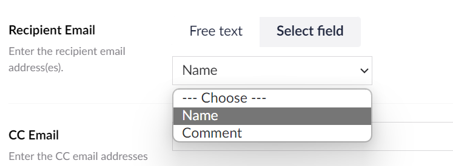
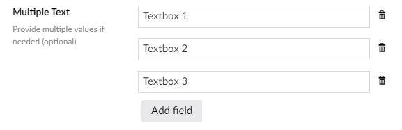

# Setting Types

Umbraco Forms field, prevalue source and workflow types are defined in C# and include one or more setting values.

These settings are completed by the editor when using the type on their form.

Each setting type can have it's own user interface. So a string can use a text box but a more complicated JSON structure can use a more appropriate user interface.

The user interface used for a particular setting is defined by the `View` property:

```csharp
[Umbraco.Forms.Core.Attributes.Setting("Message", View = "TextField")]
public string Message { get; set; }
```

## Built-in setting types

The following setting types are available and are used for the field, prevalue source and workflow types that ship with the package.

| Name                      | Description                                                       | Used in                                         |
|---------------------------|-------------------------------------------------------------------|-------------------------------------------------|
| Checkbox                  | Uses a single checkbox for entry                                  |                                                 |
| DocumentMapper            | Used for selection of a documenttype                              | The "Save as Umbraco node" workflow             |
| Dropdownlist              | Used for selection from a list of options                         |                                                 |
| EmailTemplatePicker       | Used for selection of an email template                           | The "Send email with Razor template" workflow   |
| FieldMapper               | Used to map fields from a form to required aliases                | The "Send to URL" workflow                      |
| File                      | Used for selection of a file                                      | The "Send email with XSLT template" workflow    |
| MultipleTextString        | Used multiple textboxes for multiple entries                      | Not used in core types                          |
| NumericField              | Uses numerical text box for entry                                 |                                                 |
| Password                  | Uses password text box for entry                                  |                                                 |
| PasswordNoAutocomplete    | Uses password text box for entry (with autocomplete disabled)     |                                                 |
| Pickers.ContentWithXPath  | Uses a content picker with the option for XPath entry             | The "Save as Umbraco node" workflow             |
| Pickers.Datatype          | Uses a datatype picker                                            | The "Umbraco prevalues" prevalue source         |
| Pickers.DocumentType      | Uses a document picker                                            | The "Umbraco nodes" prevalue source             |
| Range                     | Uses a slider for range input                                     | The "reCAPTCHAv3" field type                    |
| RichText                  | Uses a rich text editor for input                                 | The "Send email" workflows                      |
| StandardFieldMapper       | Used to map system fields from a form to required aliases         | The "Send to URL" workflow                      |
| Textarea                  | Used a multiline textbox for entry                                |                                                 |
| Textfield                 | Used a single-line textbox for entry                              |                                                 |
| TextfieldNoAutocomplete   | Used a single-line textbox for entry (with autocomplete disabled) |                                                 |
| TextWithFieldPicker       | Used a single-line textbox/form field list for entry              | Not used in core types                          |

All of the above setting types are used in one or more field, prevalue source and workflow types available with Umbraco Forms. For the less common ones, a usage has been indicated in the table.

The two exceptions are "TextWithFieldPicker" and "MultipleTextString". These two we don't use within the package, but we make it available for developers to use when creating their own types.

"TextWithFieldPicker" offers the option of text field entry or the selection of a field from the form. This can be useful in workflows where you need to reference the value of a specific field.



"MultipleTextString" offers the option of creating multiple text field entries. This can be useful in workflows where you need to provide multiple text values.



## Creating a setting type

To create a custom setting type you will need an AngularJS view and controller in the following location: `/App_Plugins/MyPlugin/`.


Your plugin folder path must be outside of the `/App_Plugins/UmbracoForms/` folder if you use a custom Angular controller and Package.manifest.


You then add the name of the view as the `View` property on the `Setting` attribute defined on the type.
