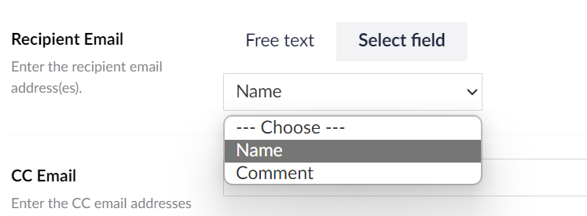
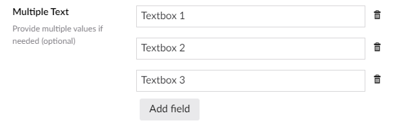

# Setting Types

Umbraco Forms field, prevalue source and workflow types are defined in C# and include one or more setting values.

These settings are completed by the editor when using the type on their form.

Each setting type can have it's own user interface. So a string can use a text box but a more complicated JSON structure can use a more appropriate user interface.

The user interface used for a particular setting is defined by the `View` property:

```csharp
[Umbraco.Forms.Core.Attributes.Setting("Message", View = "TextField")]
public string Message { get; set; }
```

## Built-in setting types

The following setting types are available and are used for the field, prevalue source and workflow types that ship with the package.

| Name                      | Description                                                       | Used in                                         |
|---------------------------|-------------------------------------------------------------------|-------------------------------------------------|
| Checkbox                  | Uses a single checkbox for entry                                  |                                                 |
| DocumentMapper            | Used for selection of a documenttype                              | The "Save as Umbraco node" workflow             |
| Dropdownlist              | Used for selection from a list of options                         |                                                 |
| EmailTemplatePicker       | Used for selection of an email template                           | The "Send email with Razor template" workflow   |
| FieldMapper               | Used to map fields from a form to required aliases                | The "Send to URL" workflow                      |
| File                      | Used for selection of a file                                      | The "Send email with XSLT template" workflow    |
| MultipleTextString        | Uses multiple text boxes for entry                       | Not used in core types                          |
| NumericField              | Uses numerical text box for entry                                 |                                                 |
| Password                  | Uses password text box for entry                                  |                                                 |
| PasswordNoAutocomplete    | Uses password text box for entry (with autocomplete disabled)     |                                                 |
| Pickers.ContentWithXPath  | Uses a content picker with the option for XPath entry             | The "Save as Umbraco node" workflow             |
| Pickers.Datatype          | Uses a datatype picker                                            | The "Umbraco prevalues" prevalue source         |
| Pickers.DocumentType      | Uses a document picker                                            | The "Umbraco nodes" prevalue source             |
| Range                     | Uses a slider for range input                                     | The "reCAPTCHAv3" field type                    |
| RichText                  | Uses a rich text editor for input                                 | The "Send email" workflows                      |
| StandardFieldMapper       | Used to map system fields from a form to required aliases         | The "Send to URL" workflow                      |
| Textarea                  | Used a multiline textbox for entry                                |                                                 |
| Textfield                 | Used a single-line textbox for entry                              |                                                 |
| TextfieldNoAutocomplete   | Used a single-line textbox for entry (with autocomplete disabled) |                                                 |
| TextWithFieldPicker       | Used a single-line textbox/form field list for entry              | Not used in core types                          |

All of the above setting types are used in one or more field, prevalue source and workflow types available with Umbraco Forms. For the less common ones, a usage has been indicated in the table.

The two exceptions are "TextWithFieldPicker" and "MultipleTextString". We do not use these two within the package, but we make them available for developers to use when creating their own types.

"TextWithFieldPicker" offers the option of text field entry or selection of a field from the form. This can be useful in workflows where you need to reference the value of a specific field.



"MultipleTextString" offers the option of creating multiple text field entries. This can be useful in workflows where you need to provide multiple text values.



## Setting properties

Beyond `Name`, `Description`, and `View`, the `Setting` attribute supports other properties.

```csharp
[Setting("My Setting", Description = "Help text for the setting", View = "TextField", SupportsPlaceholders = "true", DisplayOrder = 10)]
public virtual string MySetting { get; set; }
```

- `SupportsPlaceholders` is a flag indicating whether the setting can contain ["magic string" placeholders](../magic-strings.md) and controls whether they are parsed on rendering.

- `HtmlEncodeReplacedPlaceholderValues` takes effect only if `SupportsPlaceholders` is `true`. It controls whether the replaced placeholder values should be HTML encoded (as is necessary for rendering within content from a rich text editor).

- `SupportsHtml` is a flag indicating whether the setting can contain HTML content. When set to `true` it will be treated as HTML content when the value is read from the Forms delivery API.

- `IsMandatory` if set to `true` will provide client-side validation in the backoffice to ensure the value is completed.

- `DisplayOrder` - controls the order settings appear in relative to each other in the backoffice.

## Translations

Both the `Name` and `Description` of a setting are translatable by providing a [user or package language file](https://docs.umbraco.com/umbraco-cms/extend-your-project/server-side-extensions/language-files) containing appropriate keys:

```xml
<area alias="formProviderFieldTypes">
    <key alias="mySettingName">My Setting</key>
    <key alias="mySettingDescription">Help text for the setting</key>
</area>
```

The area alias to use depends on the provider type the setting belongs to:

- Data sources - `formProviderDataSources`
- Export types - `formProviderExportTypes`
- Field types - `formProviderFieldTypes`
- Prevalue sources - `formProviderPrevalueSources`
- Recordset actions - `formRecordSetActions`
- Workflows - `formProviderWorkflows`

## Default values

Default values for settings can be defined in code using one of two approaches:

### Approach 1: Using a property initializer

```csharp
[Setting("Minimum")]
public virtual string Min { get; set; } = "1";
```

### Approach 2: Using the `DefaultValue` attribute property

```csharp
[Setting("Minimum", DefaultValue = "1")]
public virtual string Min { get; set; }
```

If both are provided, the `DefaultValue` attribute property takes precedence over the property initializer.

These code-based defaults provide an alternative to [configuring default values via `appsettings.json`](../configuration/README.md#settingscustomization). If a value is configured in `appsettings.json`, it takes precedence over any code-based default.

## Settings when inheriting

When creating a field or other provider type, you might choose to inherit from an existing class. This could be if one of the types provided with Umbraco Forms almost meets your needs but you want to make some changes.

All setting properties for the Forms provider types are marked as `virtual`, so you can override them and change the setting values:

```csharp
[Setting("My Setting", Description = "My custom help text for the setting", View = "TextField", SupportsPlaceholders = "true", DisplayOrder = 10)]
public override string MySetting { get; set; }
```

If you want to hide a setting in your derived class you can use the `IsHidden` property:

```csharp
[Setting("My Setting", IsHidden = true)]
public override string MySetting { get; set; }
```

## Creating a setting type

To create a custom setting type you will need an AngularJS view and controller in the following location: `/App_Plugins/MyPlugin/`.


Your plugin folder path must be outside of the `/App_Plugins/UmbracoForms/` folder if you use a custom Angular controller and Package.manifest.


You then add the name of the view as the `View` property on the `Setting` attribute defined on the type.

Umbraco Forms ships with a number of built-in setting views, found in a virtual path of `App_Plugins\UmbracoForms\backoffice\Common\SettingTypes\`. If you want to reference a custom view stored elsewhere, configure the `View` property with a full path to the view, for example,

```csharp
[Setting("My Setting",
    Description = "Help text for the setting",
    View = "~/App_Plugins/UmbracoFormsCustomFields/backoffice/Common/SettingTypes/mycustomsettingfield.html",
    SupportsPlaceholders = true,
    DisplayOrder = 10)]
public virtual string MySetting { get; set; }
```
