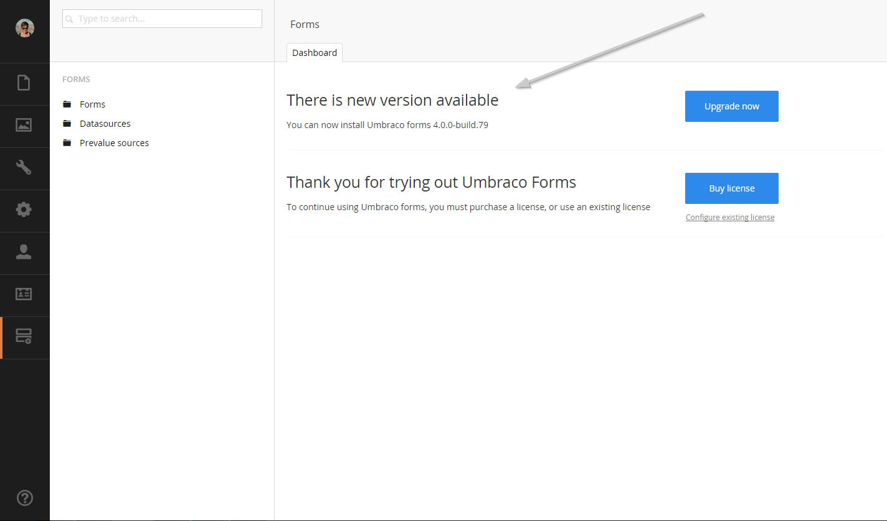
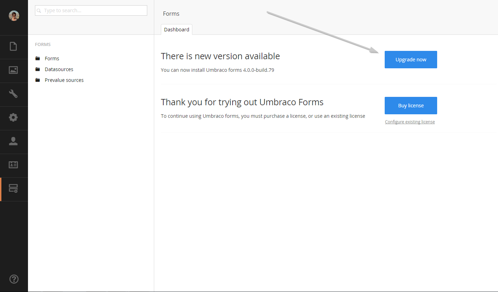
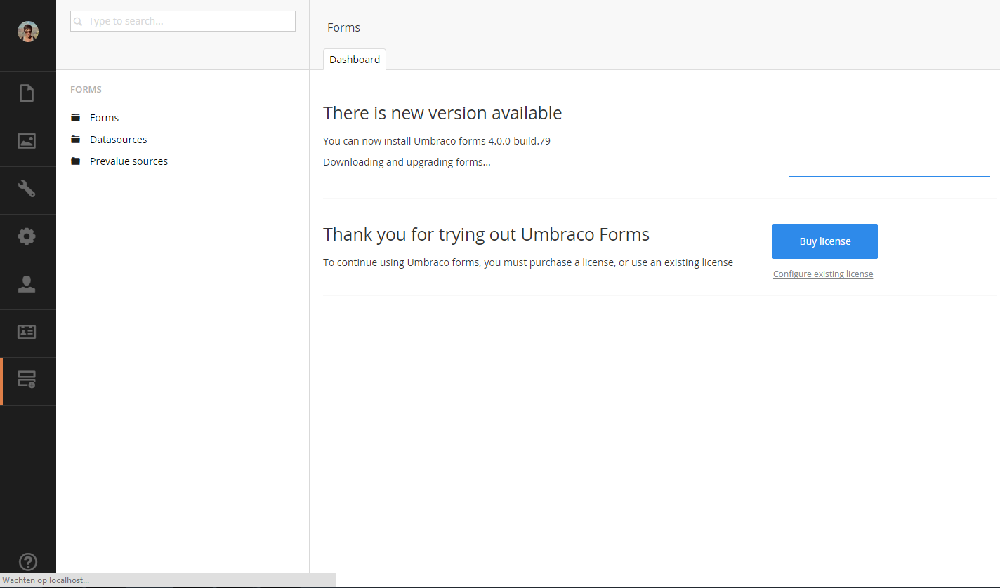

# Version Specific Upgrade Notes

This page covers specific upgrade documentation for specific versions.


If you are upgrading to a new minor or patch version, you can find information about the breaking changes in the [Release Notes](../release-notes.md) article.


Version 13

Version 13 of Umbraco Forms has a minimum dependency on Umbraco CMS core of `13.0.0`. It runs on .NET 8.

**Breaking changes**

Version 13 contains a number of breaking changes. If you do run into any, they should be straightforward to adjust and recompile.

For reference, the full details are listed here:

**Behavior**

* The configuration option `UseSemanticFieldsetRendering` was removed and considered as `true`. This means the improved, semantic fieldset rendering is now used in the default theme for all installations.
* The `ExecuteWorkflowAsync` configuration option was removed.

**Dependencies**

* Umbraco CMS dependency was updated to `13.0.0`.

**Code**

The following updates describe the more significant changes to the codebase and public API:

* Amended `IWorkflowExecutionService`, `IRecordService`, `IRecordSetActionType` and `IWorkflowType` methods related to workflow execution to be asynchronous. These methods now have an `Async` suffix and will return a awaitable `Task`.
* An overload for the HTML helper `RenderUmbracoFormDependencies` that internally required service location was removed. It should now be called providing the parameter for an `IUrlHelper`, with `@Html.RenderUmbracoFormDependencies(Url)`.

These updates are more minor. We don't expect many projects to be affected by them as they are in areas that are not typical extension points:

* `DataSourceCacheRefresher` was made internal.
* `HideField` was removed from `FieldType` and `IFieldType`.  `RenderInputType` with a value of `RenderInputType.Hidden` can be used here instead.
* The default implementation for the `Exists` method previously added to `IBaseService` was removed.
* The obsolete overload for method `AddDataConsentField` on `FieldsetContainerExtensions` was removed.
* The method `CanUserViewEntries` was added to the `IFormsSecurity` interface.
* The static methods `TryCreateAttachment`, `TrackAttachmentFileStream` and `DisposeAttachmentFileStreams` on `BaseEmailWorkflowType` were removed (instance methods are available to use instead).
* The obsolete constructor on the `SaveAsFile` workflow type was removed.
* The obsolete overload for method `TransformXML` on `XsltHelper` was removed.
* The obsolete overloads for method `ValidateField` on `FieldType` were removed.
* The obsolete overload for method `GetFormSecurityByUserId` on `FormSecurityControllerBase` was removed.
* The `PopulatePageElements` method was added to the `IFormRenderingService` interface.
* The `Setting` class was renamed to `SettingAttribute`.
* `PreValueFileController` has a changed constructor.
* `FileUpload` has a changed constructor.
* `ExecuteWorkflowsWithResult` on `IWorkflowExecutionService` was renamed to `ExecuteWorkflows` and the void method with that name was removed.
* The string constants used to define GUIDs for each provider type were made consistently upper-case.
* `FileUpload` and `PreValueFileController` have changed constructors to add support for server-side file validation.
* HTML helpers such as `RenderFormsScripts` now return `IHtmlContent`.
* The constructor for workflow notifications was amended to add a parameter for the current `Record`.
* The `IType` interface now defines a `Created` property.

Version 12

Version 12 of Umbraco Forms has a minimum dependency on Umbraco CMS core of `12.0.0`. It runs on .NET 7.

**Breaking changes**

Version 12 contains a number of breaking changes. If you do run into any, they should be straightforward to adjust and recompile.

For reference, the full details are listed here:

**Behavior**

* The default value for configuration of request IP tracking has been changed to `None` from `RemoteIpAddress`.
* The session variable `ContourMemberKey` is no longer set.
* Exception handling in the Forms API has been aligned with the CMS Delivery API. This leads to subtle differences in the population of the `ProblemDetails` exposed.
* Use of the Forms API has to be enabled in configuration, via setting the `Umbraco:Forms:Options:EnableFormsApi` key to `true`.
* The Swagger document for the Forms API has been removed and is now combined with that for the CMS Delivery API, at `umbraco/swagger/index.html`.
* The Forms API paths have had the `/v1.0/` segment renamed to `/v1/`, to align with the CMS Delivery API.

**Dependencies**

* Umbraco CMS dependency was updated to `12.0.0`.
* The dependency on `Hellang.Middleware.ProblemDetails` was removed.
* The dependency on `NSwag.AspNetCore` was removed and replaced with `Swashbuckle.AspNetCore`.

**Code**

The following updates describe the more significant changes to the codebase and public API:

* The interfaces that previously defined entity model classes have been removed. These were `IFormEntity`, `IFolderEntity`, `IWorkflowEntity`, `IDataSourceEntity` and `IPrevalueSourceEntity`. All code now refers to the concrete classes.
* The interfaces that previously defined application model classes have been removed. These were `IFieldPreValueSource`, `IFormDataSource`, `IFormDataSourceField`, `IWorkflow`, `IRecordField` and `IRecord`.
* These changes affect service, repository and other interfaces and classes that previously used these interfaces. All methods have been updated to use the concrete classes as parameters and return values.
* The now unused class `InterfaceJsonConverter` was removed.

These updates are more minor. We don't expect many projects to be affected by them as they are in areas that are not typical extension points:

* The obsolete constant `FormsConfigPath` was removed.
* Obsolete constructor was removed on `DictionaryHelper`.
* Obsolete overloads of `StringExtensions.ParsePlaceHolders` was removed.
* Unused parameter in the constructors of `DatabaseIntegrityHealthCheck` and `MsSqlAnalyzer` were removed.
* Default interface implementations were removed from the `MessageOnSubmitIsHtml`, `DisplayDefaultFields` and `SelectedDisplayFields` properties defined on `IFormEntity`.
* The `SearchForms` method, previously defined in the implementation of `IFormService`, has been added to the interface.
* An obsolete method on `IPlaceholderParsingService` were removed.
* An obsolete method on `IWorkflowService` were removed.
* Obsolete methods on `UmbracoBuilderExtensions` were removed.
* The obsolete constructors on `BaseEmailWorkflowType`, `SendEmail`, `SendRazorEmail` and `SendXsltEmail` workflows were removed.
* The obsolete constructors on `FormsApiControllerBase`, `DefinitionsController` and `EntriesController` API controllers were removed.
* The obsolete constructors on `UmbracoFormsController` were removed.
* The obsolete constructors on `FieldController` and `RecordController` were removed.
* The obsolete overload on the `ViewHelper.RenderPartialViewToString` method was removed and the `FakeController` class used in this method was made private.
* The obsolete `Build` method overload was removed in `FormViewModel`.
* The obsolete constructor on `FormRenderingService` was removed.
* The Forms API model classes and serialization customizations were moved from `Umbraco.Forms.Web` into `Umbraco.Forms.Core`.
* The `ISupportFileUploads` interface was moved to `Umbraco.Forms.Core.Interfaces`.
* Additional parameters were added to the constructors of `FormPickerPropertyValueConverter` and `FormDtoFactory`.
* The setting properties available on all field, workflow and other provider types have been made virtual.

Version 11

Version 11 of Umbraco Forms has a minimum dependency on Umbraco CMS core of `11.0.0`. It runs on .NET 7.

**Breaking changes**

Version 11 contains a number of breaking changes. We don't expect many projects to be affected by them as they are in areas that are not typical extension points. For reference though, the full details are listed here:

**Presentation**

* A CSS class for each field is rendered out matching the caption of the form field. This has been changed to use the alias of the form field, as this is considered less likely to change and potentially break custom styles.

**Code**

* The int `DeleteFormRecords(Form form, FormState formState, DateTime deleteRecordsCreatedEarlierThan)` method was added to `IRecordStorage`.
* Name of `FormsUmbracoBuiderExtensions` was corrected to `FormsUmbracoBuilderExtensions`.
* The method `RegenerateFormStructureIds` on Form was amended to return a response.
* The method void `ExecuteWorkflows(List<IWorkflow> workflows, Record record, Form form, FormState state)` was added to `IWorkflowExecutionService`.
* Obsolete constructor on `PlaceholderParsingService` removed.
* Obsolete constructor on `ServerVariablesParsingHandler` removed.
* `IsMandatory` and `Condition` properties were added to the `IWorkflow` and `IWorkflowEntity` interface.
* `DaysToRetainSubmittedRecordsFor` and `DaysToRetainApprovedRecordsForproperties` were added to the `IFormEntity` interface.
* Obsolete constructor on the export type `ExportToExcel` removed.
* Obsolete constructor on the workflow type `SendRazorEmail` removed.
* Obsolete constructor on the controllers `UmbracoFormsController`, `ExportController`, `FieldController`, `FormController`, `RecordController`, and `EmailTemplateTreeController` removed.
* Duplicate method `GetAllDocumentTypesWithAlias` in `PickerController` was removed.
* Obsolete overloads to the `Build` method on `FormViewModel` were removed.
* Obsolete constructor on `FormRenderingService` was removed.
* Legacy storage of prevalues with captions using a single string with a separator was updated to store them as an object with a value and caption.
  * A `JsonConverter` was added to `FormsJsonSerializerSettings` that will convert forms saved in older versions with the string storage into the new structure.
  * The public field `Field.PrevalueCaptionSeparator` was removed.
  * `Field.Prevalues` now returns `IEnumerable<FieldPrevalue>` instead of `IEnumerable<string>`, and the property `Field.ParsedPreValues` was removed.
* The obsolete overload of the methods `Test` and `TestRule` in `FieldConditionEvaluation` was removed and the existing method made private.
* The obsolete overload of the method `IsVisible` in `FieldConditionEvaluation` was removed.
* The property `ConditionCheckFunctions` was added to the `IFieldType` interface.
* The property `Alias` was added to the interfaces for all provider types inheriting from `ProviderBase`.
* The additional method `GetRecordsFromFormForMember` was added to the interface `IRecordReaderService`.

Version 10.1

**Breaking changes**

* The default theme has been updated to render captions for field types that support prevalues. If you have created any custom themes, please review the default theme and ensure you make similar changes to make use of the new feature.
* The method `PreValues` on the `FieldViewModel` type has been changed from a collection of strings to a collection of a `PrevalueViewModel` object that has a Value and Caption property.
* In order to fix an issue with display and editing of values, we've found a need to ensure the property representing the fields a record entry used in the backoffice is changed from a list of values to a structure containing the field Ids and values. Specifically, `EntrySearchResult.Fields` has changed type `IEnumerable<object?>` to `IEnumerable<EntrySearchResult.FieldData>`. The only scenarios affected by this would be anyone handling the `EntrySearchResultFetchingNotification` notification or developing custom export types.

Version 10

Version 10 of Umbraco Forms has a minimum dependency on Umbraco CMS core of `10.0.0`. It runs on .NET 6.

To migrate to version 10, you should first update to the latest minor release of version 9. If you are upgrading from Umbraco 8, update Forms to the latest minor version of Forms 8. Ensure you have the configuration in place for storing form definitions in the database. For more information, see the [Umbraco Forms in the Database (legacy)](https://our.umbraco.com/documentation/Add-ons/UmbracoForms/Developer/Forms-in-the-Database/) article.

Either way will ensure you have all the database schema changes in place.

**Views and client-side files**

Umbraco 10 distributes the views and client-side files as part of a Razor class library, distributed in the Umbraco.Forms.StaticAssets package. This means these assets are no longer individual files available on disk. The advantage of this approach is that that avoids changes made to them by solution developers being inadvertently lost when the project is rebuilt.

When upgrading from Forms 9, you should either first run a `dotnet clean`, or, after installing Forms 10, delete the `App_Plugins/UmbracoForms` folder. This will ensure there aren't two copies of the `package.manifest` file, which would cause issues by registering duplicate property editors.

For views you should also remove the following folders and files (again, either via a `dotnet clean` before upgrading, or manually afterward):

* `/Views/MacroPartials/InsertUmbracoFormWithTheme.cshtml`
* `/Views/MacroPartials/RenderUmbracoFormScripts.cshtml`
* `/Views/Partials/Forms/`

If you have custom themes or other changes to the files in the `Views/Partials/Forms` folder, you should ensure those files remain.

For example, with a custom email template, remove the file `Example-Template.cshtml` from the `/Views/Forms/Emails` folder but keep any custom templates.

Similarly, if you have a custom theme, remove the `default` and `bootstrap3-horizontal` folders from the `/Views/Partials/Forms/Themes/` folder but keep any custom theme folders.

**Breaking changes**

Version 10 contains a number of breaking changes. We do not expect many projects to be affected by them as they are in areas that are not typical extension points. For reference though, the full details are listed here.

**Configuration**

* Renamed the configuration option to allow editable form submissions on the front-end to `AllowEditableFormSubmissions` (fixing the typo in the previous value of `AllowEditableFormSubmissions`).

**Code**

* `DatabaseIntegrityHealthCheck` has an altered constructor taking an additional parameter.
* The `EventExtensions` class is no longer used since V9 and has been removed.
* Static events from `BaseFileStorage` removed and replaced with notifications.
* `IFormTemplateStorage` along with its implementation in `FormTemplateStorage` and base classes have been simplified, as templates are the only file based storage now in use, and there are no methods necessary for this other than reading.
* The method `GetScaffold` has been removed from `FormController`, as it's not called from the UI.
* The following classes have altered constructors taking additional parameters, with obsolete versions removed.
  * `RecordController`
  * `FormSecurityController`
  * `FormSecurityTreeController`
  * `PostToUrl`
  * `WorkflowEmailService`
* The public fields on the `Setting` class have been converted to properties.
* The methods `GetMemberCacheKey` and `GetMemberValuesCacheKey` on `CacheKeys` taking an integer parameter have been removed.
* The method `GetUserSecurity` on `IUserSecurityStorage` has been amended to take an integer parameter rather than an object.
* The method `StringExtensions.DetectIsJson` has been removed (the equivalent exists in CMS).
* Obsoleted methods in `FieldConditionEvaluation` have been removed.
* The following unused classes have been removed:
  * `FormEventArgs`
  * `FolderEventArgs`
  * `FieldPreValueSourceEventArgs`
  * `FormDataSourceEventArgs`
  * `WorkflowEventArgs`
  * `BaseStorageEventArgs` Additional methods have been added to the following interfaces:
  * `IRecordStorage`
  * `IRecordFieldValueStorage`
  * `IUserSecurityStorage`
  * `IUserFormSecurityStorage`
  * `IFormsSecurity`
* Additional properties of `SupportsMandatory` and `EditType` have been added to the `IFieldType` interface.
* The obsoleted method `RegenerateFieldSetAndFieldIds` on `Form` has been removed.
* The constructor of `FolderNotificationHandler` had an unused parameter removed.
* The obsolete and unused methods `CanCurrentUserEdit`, `CanCurrentUserAddInEditor`, `CanCurrentUserManageWorkflows`, `EnsureUserExist`s and `CanCurrentUserExport` were removed from the `IFormSecurity` interface.
* The type parameter `TEventArgs` defined on `IBaseService` (and derived interfaces) has been removed.
* Database migration classes inheriting from `FormsMigrationBase` now use the non-obsolete base constructor defined on `PackageMigrationBase`.
* The methods on `IPlaceholderParsingService` have been combined into a single one with optional parameters.
* The method `PostSave` on `FormSecurityController` has been renamed to `PostSaveForUser`.
* The backoffice model class `FormSecurity` has been renamed to `FormSecurityForUser`.
* The unused class `NonSerialiazableTypeSurrogateSelector` was removed.
* The unused method `ImportXmlNodeFromText` on `XmlHelper` was removed.
* `IFormService.FormExist` was renamed to `IFormService.FormExists`.
* `EntrySearchResultCollection.schema` was capitalized.
* Base class `ExportType` has a constructor taking `IHostEnvironment` instead of `IHostingEnvironment`.
* Typo was fixed in the class name of `TempDataDictionraryExtensions`.
* The `SetFormThemeCssFile` extension method had an unused variable removed.
* Some method signatures have had appropriate modifications for nullable reference type support.
* Removed `BaseFileStorage`, `BaseFileSystemStorage` and `FormsFileSystemForPackageData` as they are no longer needed following changes to support distribution of assets in a razor class library.

Version 9

Version 9 of Umbraco Forms has a minimum dependency on Umbraco CMS core of `9.0.1` and runs on .NET 5.

Version 9.5

See notes under 10.1.

Version 8.13

See notes under 10.1.

Version 8

Version 8 of Umbraco Forms has a minimum dependency on Umbraco CMS core of `8.0.0` and runs on .NET Framework 7.2.

In order to upgrade from Umbraco Forms 7 to Umbraco Forms 8, you can use any of these options:

#### Download

In order to upgrade you will want to [download the version of Forms you wish to upgrade to](https://our.umbraco.com/projects/developer-tools/umbraco-forms/). Instead of downloading the actual package, however, you want to download the `Umbraco.Forms.Files.x.y.z.zip` file (where x.y.z) is the version.

The filename ends with `.Files.x.y.z.zip` and contains only the files that get installed when you install Umbraco Forms.

#### Copy

The easiest way to proceed is to unzip the file you downloaded and copy and overwrite (almost) everything into your website. Almost, because you might not want to overwrite `~/App_Plugins/UmbracoForms/UmbracoForms.config` because you might have updated it in the past. Make sure to compare your current version to the version in the zip file you downloaded. If there's any new configuration options in there then copy those into your website's `UmbracoForms.config` file.

Version 7

You can upgrade to the latest version of Umbraco Forms through:

* [Automatic Upgrades](version-specific.md#automatic-upgrade), or
* [Download and upgrade manually.](version-specific.md#download-and-upgrade-manually)

#### Automatic Upgrade

Forms allows you to stay in sync with the latest releases, so you can take advantage of the new features and bug fixes.

**Checking for updates**

You won't have to check for updates manually. Umbraco Forms will inform you when a new update is available. Navigate to the Forms dashboard and if you see the following then a new version is already available.

**Installing update**

To upgrade your installation hit the _upgrade now_ button.

Umbraco will now fetch and install the upgrade.

Once it's completed the upgrade notification should be gone and you can continue using a newly updated Umbraco Forms.

#### Download and upgrade manually

In order to upgrade you will want to [download the version of Forms you wish to upgrade to](https://our.umbraco.com/projects/developer-tools/umbraco-forms/). Instead of downloading the actual package, however, you want to download the `UmbracoForms.Files.x.y.z.zip` file (where x.y.z) is the version.

The filename ends with `.Files.x.y.z.zip` and contains only the files that get installed when you install Umbraco Forms.

**Copy**

Unzip the file you downloaded and copy and overwrite (almost) everything into your website. Almost, because you might not want to overwrite `~/App_Plugins/UmbracoForms/UmbracoForms.config` because you might have updated it in the past. Make sure to compare your current version to the version in the zip file you downloaded. If there's any new configuration options in there then copy those into your website's `UmbracoForms.config` file.

**Upgrade marker**

Finally, you'll need to tell Umbraco Forms to update itself when you start the website next. In order to do that you need to have a `formsupdate` file (an empty text file without extension) in `~/App_Data/TEMP/`. The easiest way to create this file is by going into the root folder of your website and start a command line there. You can then type the following command: `echo > /App_Data/TEMP/formsupdate`.

This command creates the file and you should see it disappear the next time the website recycles. You may want to recycle the website manually after creating this file. If the file isn't automatically removed, it is safe to remove it manually.

That's it! You're all set.

Version 4 to Version 6

Upgrading to Version 6 of Umbraco Forms, has a higher minimum dependency on Umbraco CMS core of `7.6.0` & higher. The reasoning behind this is due to some underlying changes to ensure Forms works with Umbraco Cloud & Deploy.

With Umbraco you have many options to upgrade Umbraco Forms.

* You can install the Forms package via the community package search from within the Developer Tab in the CMS.
* Umbraco Forms can be downloaded directly from [our.umbraco.com](https://our.umbraco.com/packages/developer-tools/umbraco-forms/).
* You can download a `.zip` file containing the updated files which you can unzip & apply over the top of your existing install.
* You can upgrade Forms using NuGet. Doing this will require a few more steps, which you can find in the next section.

**Upgrading with NuGet**

Using NuGet to perform an the Forms major upgrade, you will see that the legacy MacroPartial view is removed from the site. This causes any existing Umbraco Forms rendered on the site to stop functioning.

Before running the site after the NuGet upgrade again; consider this may need to be done on each environment depending on your deployment process/setup. You will need to copy/restore the following file `Views/MacroPartials/InsertUmbracoForm.cshtml` from your source control solution.

The file needs to be here before the site is restarted - due to the migration/upgrade tasks listed below.

**Upgrade tasks**

The following outlines for `version 6.0.0` what upgrade/migration tasks that are being performed:

* Rename legacy macro to make it easier to identify in the backoffice.
* Adds new form macro to insert a form with a theme.
* Moves JSON Form Storage files from `App_Plugins/UmbracoForms/Data` to `App_Data/UmbracoForms/Data` by default unless a custom Forms IFileSystem is configured such as Azure blob storage.
* Moves any Form PreValue sources that uses text files that were uploaded to the media section & now stores in the Umbraco Forms IFileSystem.

**Recommendation**

We recommend you make the switch away from the legacy macro and swap over to the newer macro that supports Themes. The legacy macro is there to ease the transition over and to avoid entire sites forms to stop working.

