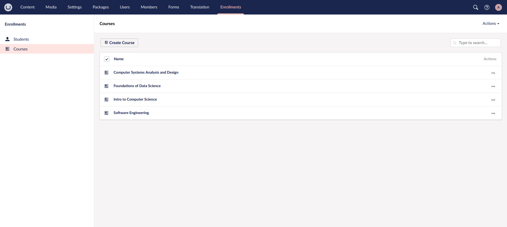
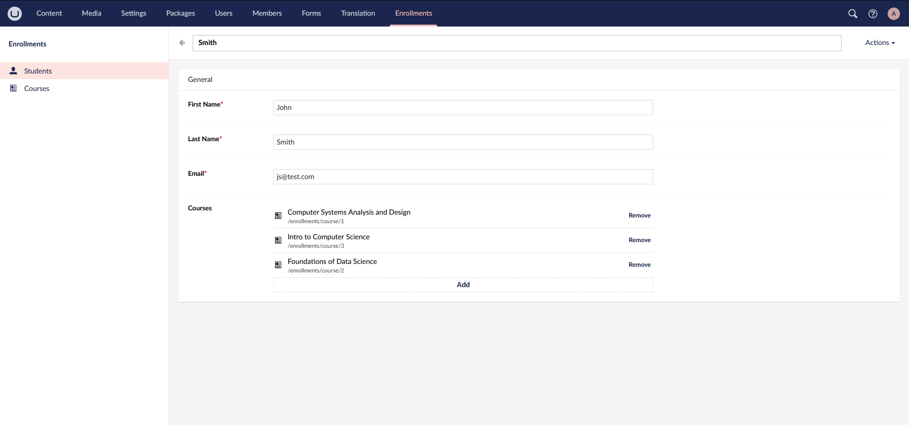
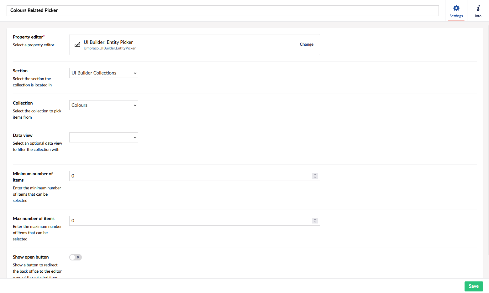
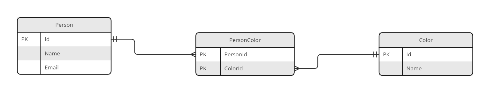

# Related Collections

Related collections add support for editing **many-to-many** relationships with UI Builder. These are foundw hen multiple entities from one collection are associated with multiple entities from a another. They are modelled in a database via two tables related via a junction table.

An classic example is with `Students` and `Courses`.  Each course has many students, and each student takes many courses.







## Collections Representation

A representation of your collections would look like this:



And the entities would be represented using the following Poco models:

```csharp
[TableName("Person")]
[PrimaryKey("Id")]
public class Person
{
    [PrimaryKeyColumn]
    public int Id { get; set; }

    public string Name { get; set; }

    public string Email { get; set; }
}
```

```csharp
[TableName("Color")]
[PrimaryKey("Id")]
public class Color
{
    [PrimaryKeyColumn]
    public int Id { get; set; }

    public string Name { get; set; }
}
```

```csharp
[TableName("PersonColor")]
[PrimaryKey(new[] { "PersonId", "ColorId" })]
public class PersonColor
{
    [PrimaryKeyColumn]
    public int PersonId { get; set; }

    [PrimaryKeyColumn]
    public int ColorId { get; set; }
}
```

## Defining a related collection

You define a related collection by calling the `AddRelatedCollection` method on a given collection config builder instance.

### **AddRelatedCollection&lt;TEntityType, TRelatedEntityType, TJunctionEntityType&gt;(Expression&lt;Func&lt;TRelatedEntityType, object&gt;&gt; idPropertyExpression, string nameSingular, string namePlural, Action&lt;RelationConfigBuilder&lt;TBuilder, TEntity, TRelatedEntityType, TJunctionEntityType&gt;&gt; relationConfig)**

Adds a related collection to the current collection with the given names and description and default icons. A property accessor expression is required for the entity ID field of the entity. The relation configuration will define the junction entity by specifying the references to parent and child entities.

```csharp
// Example
collectionConfig.AddRelatedCollection<Person, Color, PersonColor>(x => x.Id, "Favorite Color", "Favorite Colours", relationConfig =>
  {
      relationConfig
           .SetAlias("favoriteColours")
           .SetJunction<PersonColor>(x => x.PersonId, y => y.ColorId);
  });
```

## Configuring a related collection entity picker

You define the child collection entity picker by calling the `AddRelatedCollectionPickerField` method on the parent collection fieldset config.

### **AddRelatedCollectionPickerField&lt;TValueType&gt;(string alias, string dataTypeName, string label)**

Adds an entity picker with the specified data type name to the editor of the parent collection.

```csharp
// Example
collectionConfig.Editor(editorConfig =>
{
    editorConfig.AddTab("General", tabConfig =>
         tabConfig.AddFieldset("General", fieldsetConfig =>
            {
                fieldsetConfig.AddField(p => p.Name);
                fieldsetConfig.AddRelatedCollectionPickerField<Color>("favoriteColours", "Colours Related Picker", "Favorite Colors");
            }));
});
```
