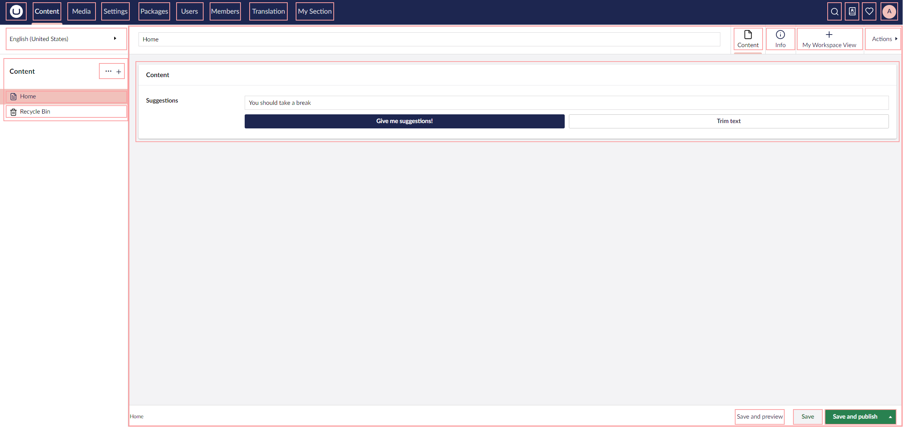

# Extension Overview

The Backoffice architecture is based on Extensions, making different UI parts extendable. Enabling you to append, replace, or remove parts.

You are not limited to any specific tech stack. UI Elements are based on Web Components and the Backoffice APIs are based on native code.

<figure><figcaption></figcaption></figure>

In this section you can find the common terms, concepts and guides used to extend the Umbraco backoffice.


This page is a work in progress and may undergo further revisions, updates, or amendments. The information contained herein is subject to change without notice.


## [Extension Registry](extension-registry/)

An overview of concepts on how to work with extension registration when extending the backoffice.

## [Extension Types](extension-types/)

An overview of concepts on how to work with extension types when extending the backoffice.
