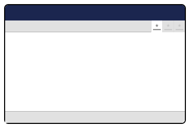

# Section View


This page is a work in progress and may undergo further revisions, updates, or amendments. The information contained herein is subject to change without notice.


<figure><figcaption><p>Section View</p></figcaption></figure>

## Creating a custom Section View

In this section, you can learn how to register and create a custom Section View for the Umbraco backoffice.

### Manifest

The manifest file can be created using either JSON or TypeScript. Both methods are shown below.



 

We can create the manifest using json in the `umbraco-package.json`.

```json
{
	"type": "sectionView",
	"alias": "My.SectionView",
	"name": "My Section View",
	"element": "./my-section.element.js",
	"meta": {
		"label": "My View",
		"icon": "icon-add",
		"pathname": "my-view"
	},
	"conditions": [
		{
			"alias": "Umb.Condition.SectionAlias",
			"match": "My.Section",
		}
	]
}
```



 


The manifest can also be written in TypeScript.

For this TypeScript example we used a [Backoffice Entry Point](../../extending-overview/extension-types/backoffice-entry-point) extension to register the manifests.

```typescript
import { ManifestSectionView } from "@umbraco-cms/backoffice/extension-registry";

const sectionViews: Array<ManifestSectionView> = [
    {
        type: "sectionView",
        alias: "My.SectionView",
        name: "My Section View",
        element: () => import('./my-section.element.ts'),
        meta: {
            label: "My View",
            icon: "icon-add",
			pathname: "my-view",
        },
        conditions: [
            {
                alias: 'Umb.Condition.SectionAlias',
				match: 'My.Section',
            }
        ]
    }
]
```

 




### Lit Element

Creating the Section View Element using a Lit Element.


**my-section.element.ts:**
```typescript
import { UmbLitElement } from "@umbraco-cms/backoffice/lit-element";
import { css, html, customElement, property } from '@umbraco-cms/backoffice/external/lit';

@customElement('my-sectionview-element')
export class MySectionViewElement extends UmbLitElement {

    render() {
        return html`
            <uui-box headline="Sectionview Title goes here">
                Sectionview content goes here
            </uui-box>
        `
    }

    static override styles = [
        css`
			:host {
				display: block;
                padding: 20px;
			}
		`,
    ];

}

export default MySectionViewElement;

declare global {
    interface HTMLElementTagNameMap {
        'my-sectionview-element': MySectionViewElement;
    }
}

```
