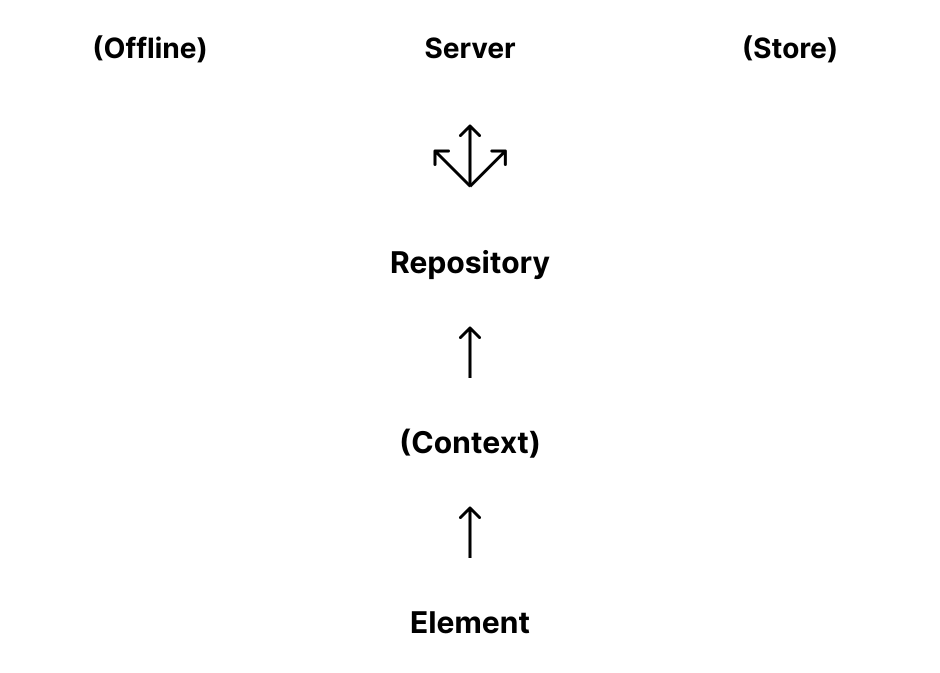

# Repositories


This page is a work in progress and may undergo further revisions, updates, or amendments. The information contained herein is subject to change without notice.


A repository is the Backoffices entry point to request data and get notified about updates. Each domain should register their own repository in the Backoffice.

### Register a Repository <a href="#register-a-repository" id="register-a-repository"></a>

```typescript
import { umbExtensionsRegistry } from '@umbraco-cms/backoffice/extension-registry';
import { MyRepository } from './MyRepository';

const repositoryManifest = {
 type: 'repository',
 alias: 'My.Repository',
 name: 'My Repository',
 api: MyRepository,
};
```

With a repository we can have different data sources depending on the state of the app. The data sources can come from places like a server, an offline database, a store, or a Signal-R connection. That means that the consumer will not have to be concerned how to access the data, add or remove items from a collection, etc. This means we get a loose connection between the consumer and the data-storing procedures hiding all complex implementation.

### Data flow with a repository <a href="#data-flow-with-a-repository" id="data-flow-with-a-repository"></a>

<figure><figcaption><p>Data flow</p></figcaption></figure>

A repository has to be instanced in the context where it is used. It should take a host element as part of the constructor. This ensures that any contexts consumed in the repository, like notifications or modals, are rendered in the correct DOM context.

A repository can be called directly from an element, but will often be instantiated in a context, like the Workspace Context.
