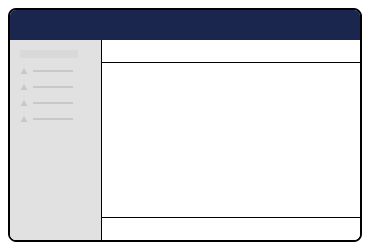

# Workspaces


This page is a work in progress and may undergo further revisions, updates, or amendments. The information contained herein is subject to change without notice.


A Workspace is an editor interface designed for managing specific entity types, such as content, media, or members. Workspaces allow users to interact with and modify data in a structured way, whether through a single view or multiple interconnected views. Workspaces are where you interact with and manage specific content or settings.

For example: If you want to edit a page or create new content, you would go into the "Content" workspace. This workspace will provide you with a tree view, a content editor, media browser, and other specific tools to help you manage content.

## Key Concepts

* **Entity Type:** Each workspace is based on an entity type (for example content, media, member, and so on).
* **Unique Key:** Workspaces are identified by a unique string key.
* **Draft State:** Most workspaces maintain a draft state, allowing changes to be made before saving to the server.
* **Workspace Context:** This context enables communication between different components within the workspace.
* **Workspace Views:** A workspace can consist of a single or multiple views.
* **Workspace Actions:** Actions that can be performed within a workspace, such as saving or publishing.

<figure><figcaption><p>Workspace</p></figcaption></figure>

## Setting Up a Custom Workspace

To configure a custom workspace, implement the `UmbWorkspaceElement` interface:

```ts
interface UmbWorkspaceElement {
    entityKey: string;
    entityType: string;
    views: WorkspaceView[];
},
```

## Related Links

* [Workspace Context](extending-overview/extension-types/workspace-context.md)
* [Workspace Views](extending-overview/extension-types/workspace-views.md)
* [Workspace Actions](extending-overview/extension-types/workspace-editor-actions.md)
