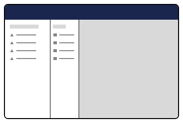
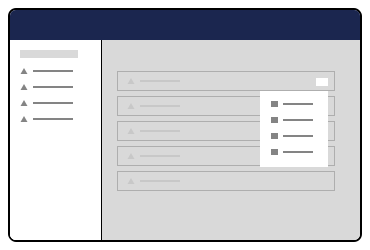
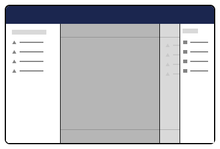
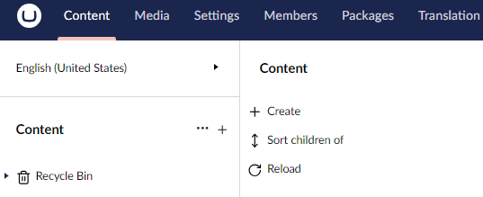

# Entity Actions


This page is a work in progress. It will be updated as the software evolves.


Previously known as Property Actions, Entity Actions is a feature that provides a generic place for secondary or additional functionality for an entity type. An entity type can be a media, document and so on. &#x20;

## Entity Actions in the UI <a href="#entity-actions-in-the-ui" id="entity-actions-in-the-ui"></a>

<div>

<figure><figcaption><p><strong>Sidebar Context Menu</strong></p></figcaption></figure>

 

<figure><figcaption><p><strong>Workspace Entity Action Menu</strong></p></figcaption></figure>

</div>

<div>

<figure><figcaption><p><strong>Collection</strong></p></figcaption></figure>

 

<figure><figcaption><p><strong>Pickers</strong></p></figcaption></figure>

</div>

### Sidebar Context Menu <a href="#registering-an-entity-action" id="registering-an-entity-action"></a>

Sidebar Context Menu is an entity action that can be performed on a menu item. For example in the content section you can perform some extra actions on the content such as sorting, moving, etc.

<figure><figcaption><p>Default Entity Action in the Content Section</p></figcaption></figure>

## Registering an Entity Action <a href="#registering-an-entity-action" id="registering-an-entity-action"></a>

TODO: can we show the typescript interface for the manifest?

```typescript
import { extensionRegistry } from '@umbraco-cms/extension-registry';
import { MyEntityAction } from './entity-action';

const manifest = {
	type: 'entityAction',
	alias: 'My.EntityAction',
	name: 'My Entity Action',
	weight: 10,
	api: MyEntityAction,
	forEntityTypes: ['my-entity'],
	meta: {
		icon: 'icon-add',
		label: 'My Entity Action',
		repositoryAlias: 'My.Repository',
	},
};

extensionRegistry.register(manifest);
```

**Default Element**

```typescript
// TODO: get interface
interface UmbEntityActionElement {}
```

### The Entity Action Class <a href="#the-entity-action-class" id="the-entity-action-class"></a>

As part of the Extension Manifest you can attach a class that will be instanciated as part of the action. It will have access to the host element, a repository with the given alias and the unique (key etc) of the entity.

The class either provides a getHref method, or an execute method. If the getHref method is provided, the action will use the link. Otherwise the `execute` method will be used. When the action is clicked the `execute` method on the api class will be run. When the action is completed, an event on the host element will be dispatched to notify any surrounding elements.

Example of providing a `getHref` method:

```typescript
import { UmbEntityActionBase } from '@umbraco-cms/entity-action';
import { UmbControllerHostElement } from '@umbraco-cms/controller';
import type { MyRepository } from './my-repository';

export class MyEntityAction extends UmbEntityActionBase<MyRepository> {
	constructor(host: UmbControllerHostElement, repositoryAlias: string, unique: string) {
		super(host, repositoryAlias, unique);
	}

	async getHref() {
		return 'my-link/path-to-something';
	}
}
```

Example of providing a `execute` method:

```typescript
import { UmbEntityActionBase } from '@umbraco-cms/entity-action';
import { UmbControllerHostElement } from '@umbraco-cms/controller';
import type { MyRepository } from './my-repository';

export class MyEntityAction extends UmbEntityActionBase<MyRepository> {
	constructor(host: UmbControllerHostElement, repositoryAlias: string, unique: string) {
		super(host, repositoryAlias, unique);
	}

	async execute() {
		await this.repository.myAction(this.unique);
	}
}
```

If any additional contexts are needed, these can be consumed from the host element:

```typescript
import { UmbEntityActionBase } from '@umbraco-cms/entity-action';
import { UmbContextConsumerController } from '@umbraco-cms/controller';
import { UMB_MODAL_SERVICE_CONTEXT } from '@umbraco-cms/modal';
import { MyRepository } from './my-repository';

export class MyEntityAction extends UmbEntityActionBase<MyRepository> {
	constructor(host: UmbControllerHostElement, repositoryAlias: string, unique: string) {
		super(host, repositoryAlias, unique);

		new UmbContextConsumerController(this.host, UMB_MODAL_SERVICE_CONTEXT, (instance) => {
			this.#modalService = instance;
		});
	}
  ...
}
```

We currently have a couple of generic actions that can be used across silos, so we don't have to write the same logic again: copy, move, trash, delete, etc. We can add more as we discover the needs.
