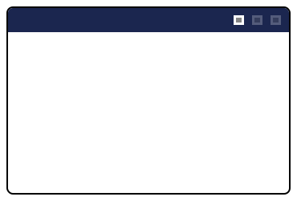
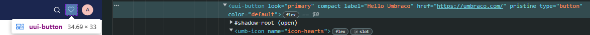

# Header Apps


This page is a work in progress. It will be updated as the software evolves.


In this article, you can find an example of an extension registry. This example goes through the creation of a Header App. A header app appears next to the user profile and global search icon on the top-right corner of Umbraco's backoffice.&#x20;

<figure><figcaption><p>Header Apps</p></figcaption></figure>

## **Button Header App**

1. Follow the [Vite Package Setup](../development-flow/vite-package-setup.md) by creating a new project folder called "`header-app`" in `App_Plugins`.
2. Create a manifest file named `umbraco-package.json` at the root of the `welcome-dashboard` folder. Here we define and configure our dashboard.
3. Add the following code to `umbraco-package.json`:


```typescript
{
  "$schema": "../../umbraco-package-schema.json",
  "name": "My Header App",
  "version": "0.1.0",
  "extensions": [
    {
      "type": "headerApp",
      "alias": "My.HeaderApp",
      "name": "My Header App",
      "kind": "button",

      "meta": {
        "label": "Hello Umbraco",
        "icon": "icon-hearts",
        "href": "https://umbraco.com/"
      }
    }
  ]
}
```


* First we define the type which is a `headerApp`. Then we add a unique alias and a name to define the extension UI.&#x20;
* Then we can define what kind of extension it is, where in this case we can use a pre-defined element called button.&#x20;
* The button requires some metdata: an icon, label of the button (name of the button) and a link which opens once clicked.&#x20;

4. In the `header-app` folder run `npm run build` and then run the project. Then in the content section of the Backoffice you will see our new Header App extension:

<figure><figcaption><p>Header App in the Backoffice</p></figcaption></figure>
