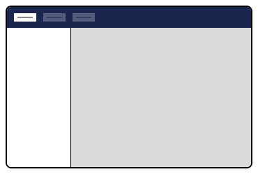
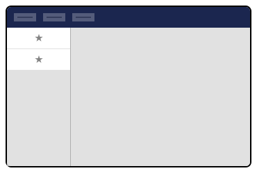
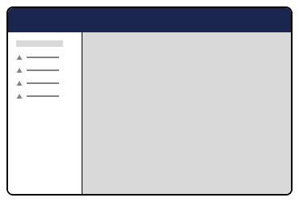
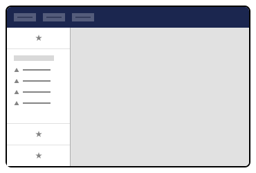

# Section Sidebar


This page is a work in progress. It will be updated as the software evolves.


<figure><figcaption><p>Section Sidebar</p></figcaption></figure>

## Section Sidebar Apps <a href="#section-sidebar-apps" id="section-sidebar-apps"></a>

TODO: Introduction to Section Sidebar Apps

<figure><figcaption><p> Section Sidebar Apps</p></figcaption></figure>

**Manifest**

```typescript
// TODO: add interface
{
	"type": "sectionSidebarApp",
	"alias": "My.SectionSidebarApp",
	"name": "My Section Sidebar App",
	"meta": {
		"sections": ["My.Section"]
	}
}
```

**Default Element**

```typescript
// TODO: get interface
interface UmbSectionSidebarAppElement {}
```

## **Menu Sidebar App**

TODO: Introduction to the sidebar menu

* The Backoffice comes with a menu sidebar app that can be used to create a menu in the sidebar.
* To register a new menu sidebar app, add the following to your manifest
* The menu sidebar app will reference a menu that you have registered in the menu with a menu manifest

<figure><figcaption><p>Menu Sidebar App</p></figcaption></figure>

**Manifest**

```typescript
{
	"type": "menuSectionSidebarApp",
	"alias": "My.SectionSidebarApp.MyMenu",
	"name": "My Menu Section Sidebar App",
	"meta": {
		"label": "My Sidebar Menu",
		"sections": ["My.Section"],
		"menu": "My.Menu"
	}
}
```

**Default Element**

```typescript
// TODO: get interface
interface UmbMenuSectionSidebarAppElement {}
```

**Adding Items to an existing menu**

This will make it possible to compose a sidebar menu from multiple Apps:

<figure><figcaption><p>Composed sidebar menu</p></figcaption></figure>

You can read more about this in the [Menu ](../menu.md)article.
