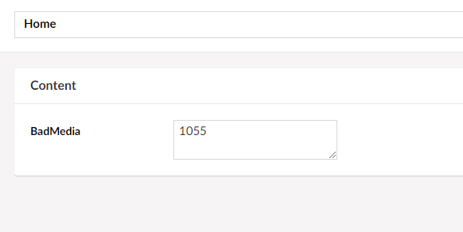
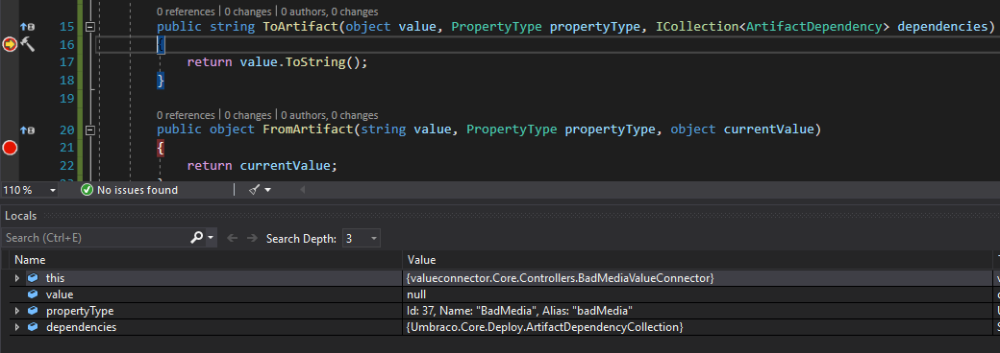
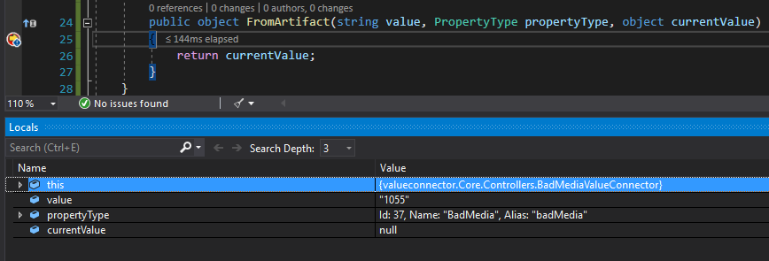
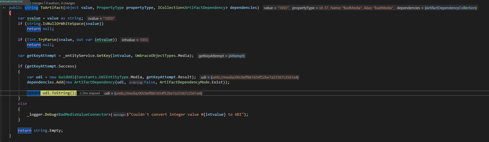
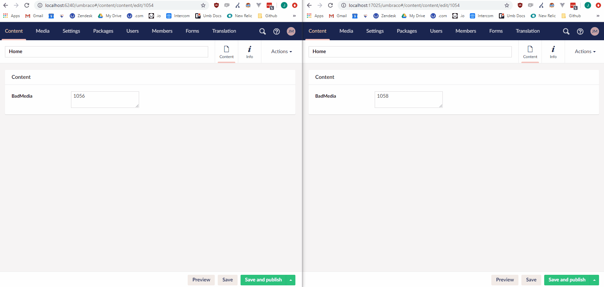

# Packages on Umbraco Cloud

If you want to use or develop packages for Umbraco Cloud there are a few things to consider and be aware of. The two most important things to know about are

* [How you should store data on Cloud](packages-on-umbraco-cloud.md#storing-data)
* [Using custom property editors with Deploy](packages-on-umbraco-cloud.md#valueconnectors)

## Storing data

When developing a package you will sometimes store data, this can be data in many forms - Umbraco schema / content, package settings, etc.

When you develop a package for Umbraco Cloud there are a few things to be aware of when storing data, mainly whether you want that data to be specific to 1 environment or more.

Let's take a look at the most common ways of storing data in packages - and what to watch out for on Cloud.

### Migrations

A [migration](../database.md) is some code that you run as part of a migration plan. That migration plan has an ID that is stored in the database (in the KeyValue table). This means that when you add new migrations Umbraco will only execute the ones that came after the one with the stored ID. The most important difference between a migration and a package action is when they are initialized. A package action runs on package install and uninstall, whereas a migration will run whenever you want it to run, see below for common examples.

As migration runs are stored in the database of the site it also means that they will run on each environment you trigger them on. The most common way to trigger a migration is to include them in a [composer](../../implementation/composing.md), which will ensure they run on site startup. This means any commands you have in your migration will automatically run when the site starts up. When your package code is pushed to a new environment it will run them from the beginning on that environment as no ID is saved in the database.

This is normally a good thing. However if you generate any Umbraco schema then Umbraco Deploy will automatically create [UDA files](https://docs.umbraco.com/umbraco-cloud/set-up/power-tools/generating-uda-files) based on that schema, and commit them to source control. This means that when you deploy all your files to the next environment the migration will run again, create duplicates and generate duplicate UDA files, which could end up causing a lot of issues.

You could consider creating Umbraco schema only during a package action, and then running things like creating database tables in migrations. Another good workaround could be to not run the migrations in a composer, but rather create a dashboard for the package where the user can choose which migrations to run themselves. The [Articulate package](https://github.com/Shazwazza/Articulate/blob/master/build/packageManifest.xml#L613) has an example of this.

### Creating files

You may sometimes choose to save data in a file. Could be a separate config file for your package or a [config transform file](https://docs.umbraco.com/umbraco-cloud/set-up/config-transforms) to add an app setting to the web.config. If you do this be aware of two things:

1. If these files are generated on a Cloud environment they will not be stored in source control, and will be overwritten on next deployment. They need to be installed locally, committed to source control and then pushed up to the Cloud environments. We have an [existing feature request](../../reference/mapping.md) on allowing package creators to commit their files directly on Cloud, and it is possible to do so currently but not in a supported way, and it may change suddenly.
2. If you need the content of the files to be different on the different environments you will need to use environment specific [config transforms](https://docs.umbraco.com/umbraco-cloud/set-up/config-transforms).

## ValueConnectors

A ValueConnector is an extension to Deploy that allows you to transform data when you deploy content of any kind between environments. It is mostly used to transfer ID based content between environments. Other than transforming values they also manage dependencies for property data. That means that if you save for example an id of an image in your property editor, then you can make sure that not only the id but the actual image is transferred as well!

An example of creating one for your package would be if you had a custom property editor that allowed you to write in the ID of a media node. Not a very usable property editor but it will work for this example.

So you have a property editor with a textarea input, that saves an ID as a string. It could look like this:



Then in the template you have something like this:

```csharp

```

Renders the image perfectly!

However now you do a content transfer to your Cloud environment, and one of three things will happen:

1. You got lucky and the ID you had on local happened to be the same as what the media node was assigned on your Cloud environment.
2. Your page will now show a different image as the ID you had corresponds to something else on this environment.
3. You will get an error on the frontend as it can't find any media nodes with that ID.

To prevent this from happening we will need to use a ValueConnector.

### Testing a ValueConnector

Before we start working on making a ValueConnector a few notes on how to test and work with them. You probably will need to test the values that are being converted, but you probably also doesn't want to build, git push, content transfer to see that the value may not have changed.

First thing we will do is create the ValueConnector using the interface. If you implement it you will get something like this:

```csharp
using Umbraco.Cms.Core.Deploy;
using Umbraco.Cms.Core.Models;
using Umbraco.Cms.Core.Services;
using Umbraco.Cms.Core;

namespace valueconnector.Core.Controllers;

public class BadMediaValueConnector : IValueConnector
{
 private readonly IEntityService _entityService;
 private readonly ILogger<BadMediaValueConnector> _logger;
 public BadMediaValueConnector(IEntityService entityService, ILogger<BadMediaValueConnector> logger)
 {
  _entityService = entityService;
  _logger = logger;
 }
 public IEnumerable<string> PropertyEditorAliases => new[] { "BadMediaPicker" };

 public string? ToArtifact(object? value, IPropertyType propertyType, ICollection<ArtifactDependency> dependencies, IContextCache contextCache)
 {
  return value.ToString();
 }

 public object? FromArtifact(string? value, IPropertyType propertyType, object? currentValue, IContextCache contextCache)
 {
  return currentValue;
 }
}
```

<details>

<summary> Legacy v8 <code>uaas.cmd</code> </summary>
In this case I cloned the Cloud project down using the [uaas.cmd](https://umbra.co/uaas-cmd) tool, which means that I have a class library that I can add the ValueConnector to. This will automatically have some references included and will build a DLL, eg. `projectalias.core.dll`, and put it in the websites bin folder when building.

This has no impact on the way you work, but it may help you understand why some things are named the way they are.

<strong>uaas.cmd is a tool that can be used to clone down v8 project and below.</strong>
</details>

At this point I have one clone of the site locally. However, to test this I will push the changes to the Cloud site and then clone it down again.

At this point I have two local sites:

**Site 1**: Full Visual Studio solution Running on <http://localhost:6240/> (Randomly generated) Has the ValueConnector in a class library that is built to a dll and copied to the websites bin on build

**Site 2**: A website served through VS Code (Could be IIS or anything else, doesn't matter) Running on <http://localhost:17025/> (Randomly generated) Has the ValueConnector dll in the bin from the clone

Now we will set up these two identical sites to transfer content between each other.

To do so go to `site1/Config/UmbracoDeploy.config` and edit the live environment url to be Site 2's url (<http://localhost:17025/> in my case). Then do the same for Site 2 but put in the domain for Site 1 as the "live" one.

At this point you should be able to go to the backoffice of either environment and do a Content transfer to live, and it should end up on the other (Assuming no errors from your custom connector).

### Debugging a transfer

At this point we haven't done anything to the ValueConverter yet, other than return the original value. Now we will attach Visual Studio to the IIS processes and try a transfer to see what it sends along.

1. Go to Visual Studio
2. Hit "Attach to Process" (default ALT + CTRL + P)
3. Choose your two IIS processes
4. Add breakpoints in the `ToArtifact` and `FromArtifact` methods
5. Go to the backoffice in Site 1
6. Try to do a content transfer to live (Site 2).

It will hit your breakpoint, and if you continue you will then get an error. On the breakpoint you can see why the error occurs. It should look like this:



Here you can see that value is null, and if you try to return `value.ToString()` you will get a null exception.

We will change the `ToArtifact` method a little:

```csharp
public string ToArtifact(object value, PropertyType propertyType, ICollection<ArtifactDependency> dependencies)
{
    var svalue = value as string;
    if (string.IsNullOrWhiteSpace(svalue))
        return null;

    return svalue;
}
```

At this point you can't reattach the process as the code has changed. So, build the project, go to `site1/bin` and copy `projectalias.Core.dll` and `projectalias.Core.pdb`. Paste these files into `site2/bin`, attach to the two IIS processes and try another transfer.

The workflow here is not optimal, but a lot quicker than trying to deploy to Cloud everytime, and with this you can attach the debugger as well to help you out.

After copying the dll and pdb files over we are synced up, now attach the debugger and attempt another transfer. Now you will see that `value` is null a few times, then your hardcoded ID a few times, but nothing breaks here. Eventually you will hit the `FromArtifact` method instead:



Here you will notice that the value is what you had returned in `ToArtifact`.

### Creating our ValueConnector

You may have realized at this point that the flow is something like this:

1. Site 1 content transfer initiated
2. Property data is fetched on Site 1
3. Hit the `ToArtifact` method on Site 1
4. Send to Site 2
5. Hit the `FromArtifact` method on Site 2
6. Property data is saved on Site 2

So in our case, what we want to do is to ensure the ID from Site 1 is changed during the transfer to match what the new ID in Site 2 is. We do this by converting the ID to a GUID in the `ToArtifact` method on Site 1, which will then get transferred to Site 2. On site 2 we will convert it back to an ID in the `FromArtifact` method. This way the user will still see an ID on the content node, but the ID they see will be updated to the correct one.


In this example, there would be no way for Deploy to know to also transfer the image. We assume that you would transfer all content and images to ensure it is on the target environment under a different ID.

That is not a good assumption, and you may have noticed that there is a parameter on the `ToArtifact` method that you could update by finding the image and adding it to `ICollection<ArtifactDependency> dependencies`.


In order to add the image as a dependency for the item being transferred, we will update the code in the `ToArtifact` method:

```csharp
public string? ToArtifact(object? value, IPropertyType propertyType, ICollection<ArtifactDependency> dependencies, IContextCache contextCache)
 {
  var svalue = value as string;
  if (string.IsNullOrWhiteSpace(svalue))
   return null;

  if (!int.TryParse(svalue, out var intvalue))
   return null;

  var getKeyAttempt = _entityService.GetKey(intvalue, UmbracoObjectTypes.Media);

  if (getKeyAttempt.Success)
  {
   var udi = new GuidUdi(Constants.UdiEntityType.Media, getKeyAttempt.Result);
   dependencies.Add(new ArtifactDependency(udi, false, ArtifactDependencyMode.Exist));

   return udi.ToString();
  }
  else
  {
   _logger.LogDebug($"Couldn't convert integer value #{intvalue} to UDI");
  }

  return null;
 }
```

You can find references on the methods used here in our API documentation:

* [EntityService.GetKey](https://our.umbraco.com/apidocs/v8/csharp/api/Umbraco.Core.Services.Implement.EntityService.html#Umbraco\_Core\_Services\_Implement\_EntityService\_GetKey\_System\_Int32\_Umbraco\_Core\_Models\_UmbracoObjectTypes\_)
* [new GuidUdi](https://our.umbraco.com/apidocs/v8/csharp/api/Umbraco.Core.GuidUdi.html#Umbraco\_Core\_GuidUdi\_\_ctor\_System\_String\_System\_Guid\_)
* [new ArtifactDependency](https://our.umbraco.com/apidocs/v8/csharp/api/Umbraco.Core.Deploy.ArtifactDependency.html#Umbraco\_Core\_Deploy\_ArtifactDependency\_\_ctor\_Umbraco\_Core\_Udi\_System\_Boolean\_Umbraco\_Core\_Deploy\_ArtifactDependencyMode\_)
* [ArtifactDependencyMode](https://our.umbraco.com/apidocs/v8/csharp/api/Umbraco.Core.Deploy.ArtifactDependencyMode.html)

When stepping through the code we can see that everything seems to work fine:




Note: Showing the variable values is a feature of [ReSharper](https://www.jetbrains.com/resharper/).


By the time we hit `FromArtifact` value of `"umb://media/00c9eff861654f52be7a33367c3561a4"` all that is left to do is convert back to an `int`.

```csharp
public object? FromArtifact(string? value, IPropertyType propertyType, object? currentValue, IContextCache contextCache)
 {
  if (string.IsNullOrWhiteSpace(value))
   return null;

  if (!UdiParser.TryParse(value, out GuidUdi? udi) || udi.Guid == Guid.Empty)
   return null;

  var getIdAttempt = _entityService.GetId(udi.Guid, UmbracoObjectTypes.Media);

  if (!getIdAttempt.Success) return null;

  return getIdAttempt.Result.ToString();
 }
```

Here is a gif showing the ValueConnector in action. A new image is uploaded, the ID on the node is updated and transferred. Finally the image is on the new environment and the ID is updated:



The final ValueConnector code will look like this:

```csharp
using Umbraco.Cms.Core.Deploy;
using Umbraco.Cms.Core.Models;
using Umbraco.Cms.Core.Services;
using Umbraco.Cms.Core;

namespace valueconnector.Core.Controllers;

public class BadMediaValueConnector : IValueConnector
{
 private readonly IEntityService _entityService;
 private readonly ILogger<BadMediaValueConnector> _logger;
 public BadMediaValueConnector(IEntityService entityService, ILogger<BadMediaValueConnector> logger)
 {
  _entityService = entityService;
  _logger = logger;
 }
 public IEnumerable<string> PropertyEditorAliases => new[] { "BadMediaPicker" };

 public string? ToArtifact(object? value, IPropertyType propertyType, ICollection<ArtifactDependency> dependencies, IContextCache contextCache)
 {
  var svalue = value as string;
  if (string.IsNullOrWhiteSpace(svalue))
   return null;

  if (!int.TryParse(svalue, out var intvalue))
   return null;

  var getKeyAttempt = _entityService.GetKey(intvalue, UmbracoObjectTypes.Media);

  if (getKeyAttempt.Success)
  {
   var udi = new GuidUdi(Constants.UdiEntityType.Media, getKeyAttempt.Result);
   dependencies.Add(new ArtifactDependency(udi, false, ArtifactDependencyMode.Exist));

   return udi.ToString();
  }
  else
  {
   _logger.LogDebug($"Couldn't convert integer value #{intvalue} to UDI");
  }

  return null;
 }

 public object? FromArtifact(string? value, IPropertyType propertyType, object? currentValue, IContextCache contextCache)
 {
  if (string.IsNullOrWhiteSpace(value))
   return null;

  if (!UdiParser.TryParse(value, out GuidUdi? udi) || udi.Guid == Guid.Empty)
   return null;

  var getIdAttempt = _entityService.GetId(udi.Guid, UmbracoObjectTypes.Media);

  if (!getIdAttempt.Success) return null;

  return getIdAttempt.Result.ToString();
 }
}
```
