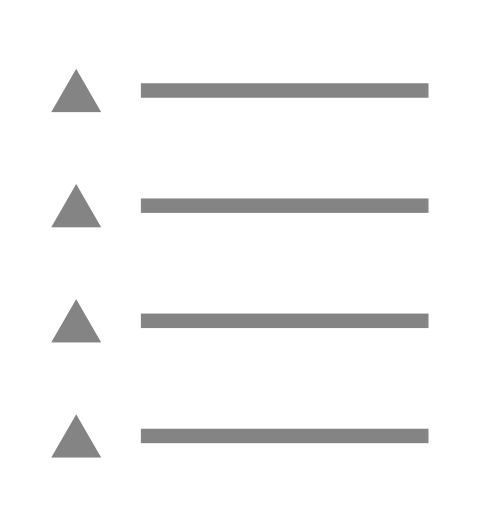

# Menu


This page is a work in progress and may undergo further revisions, updates, or amendments. The information contained herein is subject to change without notice.


## Menu

<figure><figcaption><p>Menu</p></figcaption></figure>

```typescript
{
 "type": "menu",
 "alias": "My.Menu",
 "name": "My Menu"
}
```

### Menu Item <a href="#menu-item" id="menu-item"></a>

<figure><figcaption><p>Menu Item</p></figcaption></figure>

```typescript
{
 "type": "menuItem",
 "alias": "My.MenuItem",
 "name": "My Menu Item",
 "meta": {
  "label": "My Menu Item",
  "menus": ["My.Menu"]
 }
}
```

### **Tree Menu Item**

#### **Manifest**

```typescript
// it will be something like this
{
 "type": "menuItem",
 "kind": "tree",
 "alias": "My.TreeMenuItem",
 "name": "My Tree Menu Item",
 "meta": {
  "label": "My Tree Menu Item",
  "menus": ["My.Menu"]
 }
}
```

#### **Default Element**

```typescript
// get interface
interface UmbTreeMenuItemElement {}
```

### **Adding menu items to an existing menu**

The backoffice comes with a couple of menus.

* Content, Media, Settings, Templating, Dictionary, etc.

To add a menu item to an existing menu, you can use the `meta.menus` property.

```typescript
{
 "type": "menuItem",
 "alias": "My.MenuItem",
 "name": "My Menu Item",
 "meta": {
  "label": "My Menu Item",
  "menus": ["Umb.Menu.Content"]
 }
}
```
