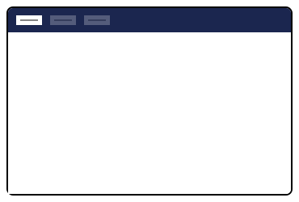

# Section


This page is a work in progress. It will be updated as the software evolves.


The Umbraco backoffice consists of Sections, also referred to as Applications, which contain Trees.

Each section is shown in the top navigation ribbon of the Umbraco Backoffice.

For example, when you load the backoffice, you'll see that the 'Content' section contains one tree: the content tree. Meanwhile, the 'Settings' section contains several trees such as Stylesheets, Document Types, Media Types, and so on.

You can create your own sections and trees to extend Umbraco.\\

<figure><figcaption><p>Section</p></figcaption></figure>

## **Creating a section**

### **Manifests**

When creating a new section it's recommended to use a [Entry Point](../../extension-registry/entry-point.md)-extension in your [Umbraco Package Manifest](../../development-flow/package-manifest.md). This is to get better control over all the additional extensions required for the new section.

1. In the manifest file add the following:

```typescript
{
  "$schema": "../../umbraco-package-schema.json",
  "name": "My Custom Section",
  "extensions": [
    {
      "name": "My Custom Section",
      "type": "backofficeEntryPoint",
      "alias": "My.Custom.Section",
      "js": "/App_Plugins/section/dist/section.js"
    }
  ]
}
```

2. Then in the element typescript file add the following:

```typescript
import { ManifestSection, umbExtensionsRegistry } from '@umbraco-cms/backoffice/extension-registry';

const sectionManifest: ManifestSection = {
    type: 'section',
    alias: 'My.Section',
    name: 'My Section',
    meta: {
        label: 'My Section',
        pathname: 'my-section'
    }
}

umbExtensionsRegistry.register(sectionManifest);
```

Then you will see your section:

<figure><figcaption><p>Section</p></figcaption></figure>

#### **Manifest with empty element**

If you prefer a clean section you can use an element with a default export, and load the element like this:

```typescript
const section : ManifestSection = {
    type: "section",
    alias: "Empty.Section",
    name : 'Empty Section',
    element : () => import('./empty-section.element.js'),
    meta : {
        label : 'Empty Section',
        pathname : 'empty-section'
    }
}
```


If you pass an element like this, the default behavior of loading dashboards and sectionViews will be disabled.


#### **Default Element**

```typescript
// TODO: get interface
interface UmbSectionElement {}
```

### The Section Context <a href="#the-section-context" id="the-section-context"></a>

#### **Interface**

```typescript
// TODO: get interface
interface UmbSectionContext {}
```

## Examples of sections: <a href="#examples-of-sections" id="examples-of-sections"></a>

TODO: link to all [sections](https://apidocs.umbraco.com/v14/ui/?path=/docs/umb-section-main--docs) in storybook. Can we somehow auto-generate this list?
