
This page is a work in progress. It will be updated as the software evolves.


# Document Blueprints

Document Blueprints allows a content editor to create a blueprint for new content nodes based on an existing node.


Learn how to use the Document Blueprints in Umbraco


## Create - Method 1


Before following this method you should have some [content](../data/defining-content/#3.-creating-the-content) created beforehand.


Select a **Content node** from the **Content** menu:

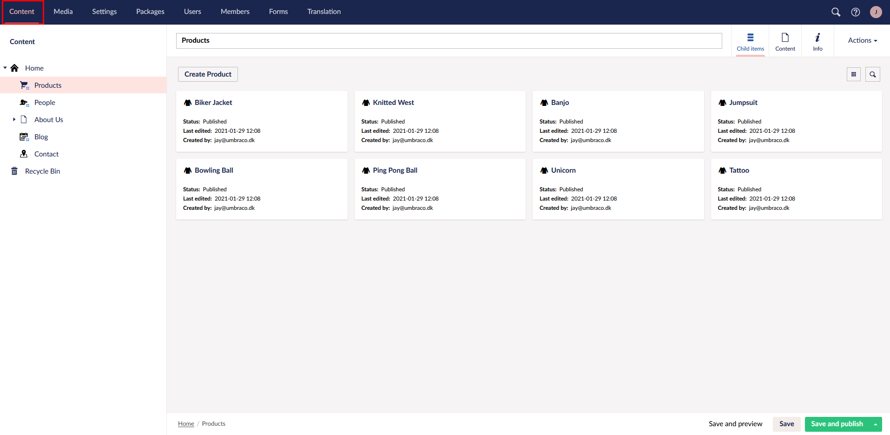

Right-click the Content node and select the **Create Document Blueprint** option. Alternatively, select the **Actions** dropdown of the content node and select the **Create Document Blueprint** option:

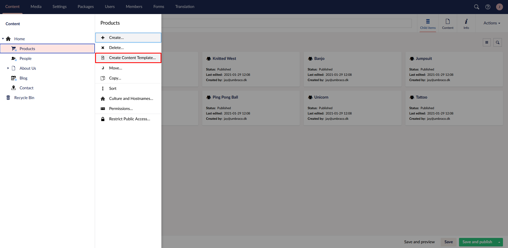

Give your document blueprint a **Name**:

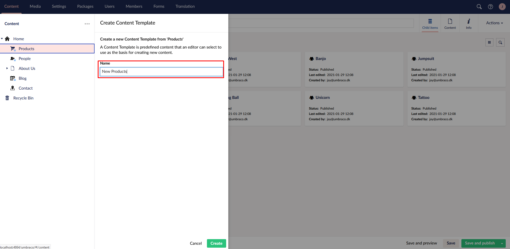

Click the **Create** button and if the creation was successful, you will see a success notification:

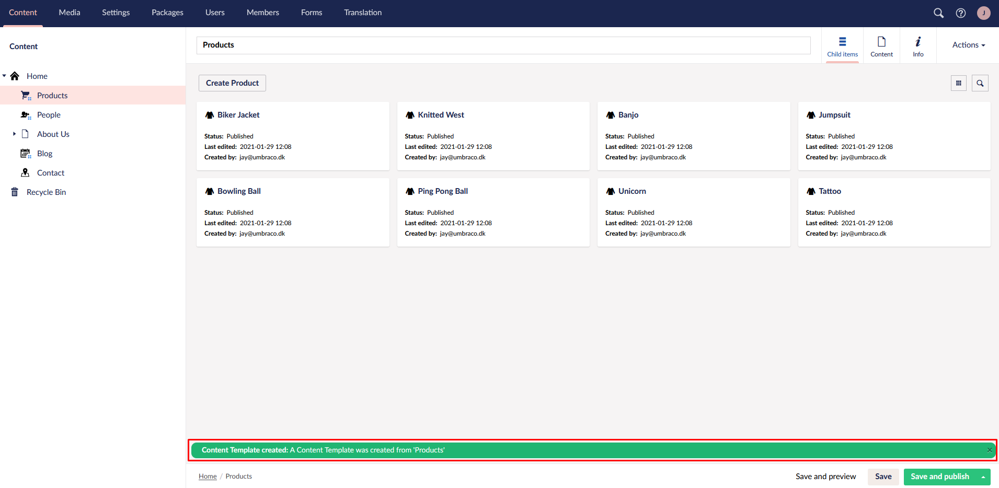

The new document blueprint will be created in **Document Blueprints** node of the **Settings** tree:

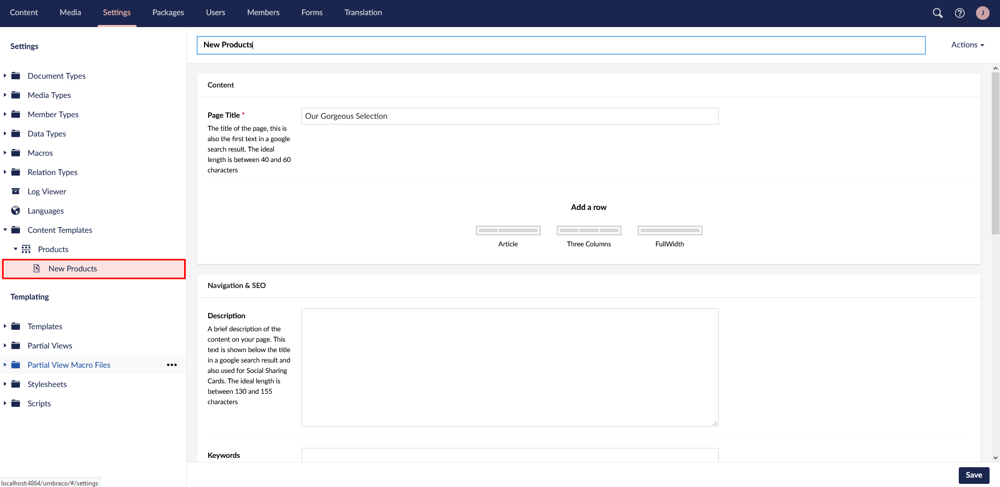


Refresh your browser, if you do not see the new document blueprint in the **Document Blueprints** folder.


## Create - Method 2

Click on the **Settings** menu:

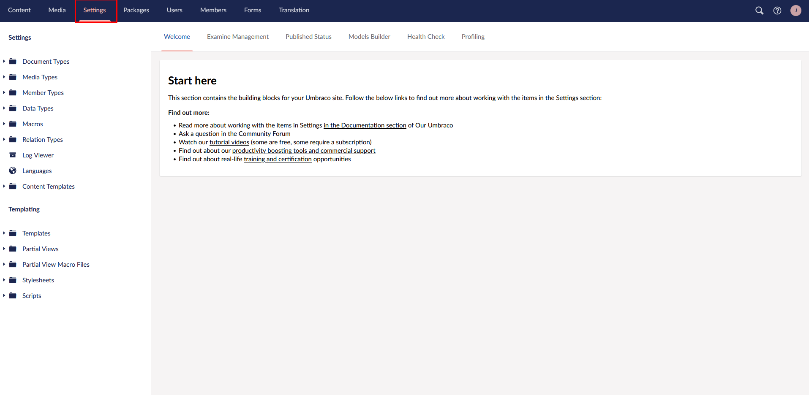

Right-click on the **Document Blueprints** tree and select the **Create** menu item:

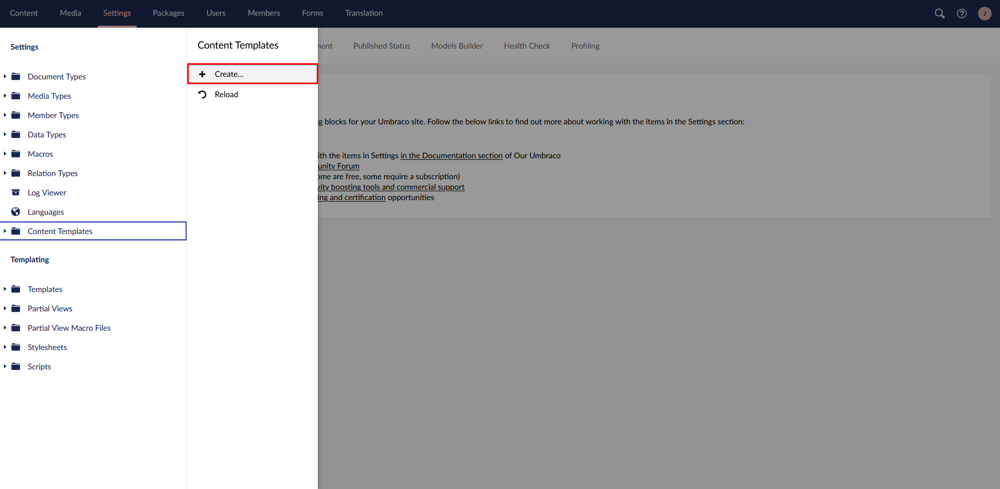

Select the Document Type you want to create a document blueprint for:

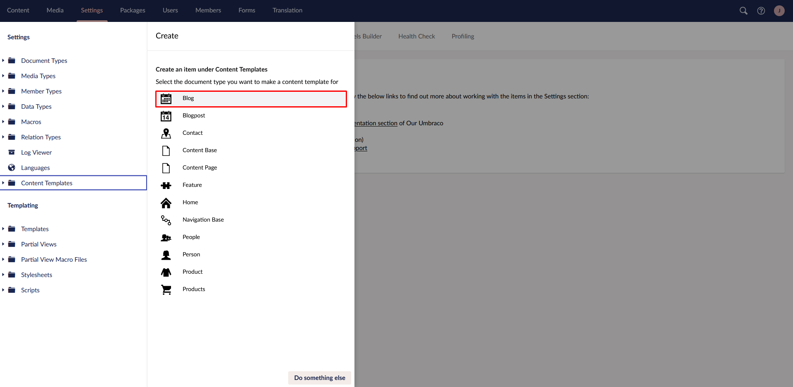


You can create document blueprints only from **Document Types** or **Document Types with Templates**


Give your document blueprint a **Name** and click the **Save** button:

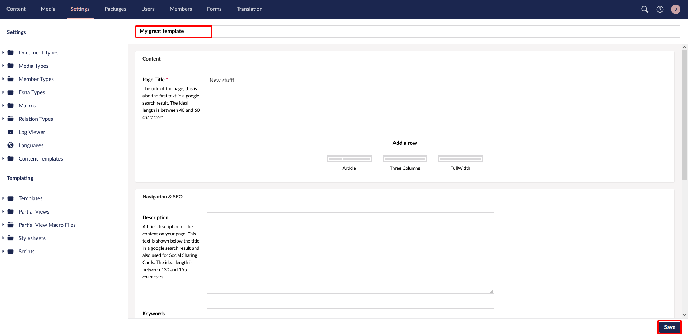

The new document blueprint will be created in **Document Blueprints** folder of the **Settings** tree:

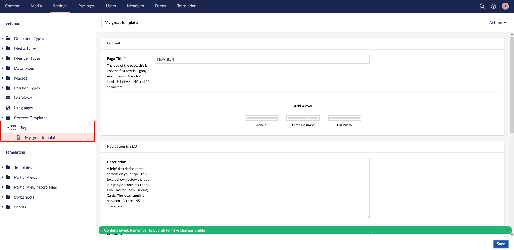

## Edit

To edit an existing document blueprint, select a document blueprint from the **Document Blueprints** folder of the **Settings** tree. When you have finished editing click the **Save** button:

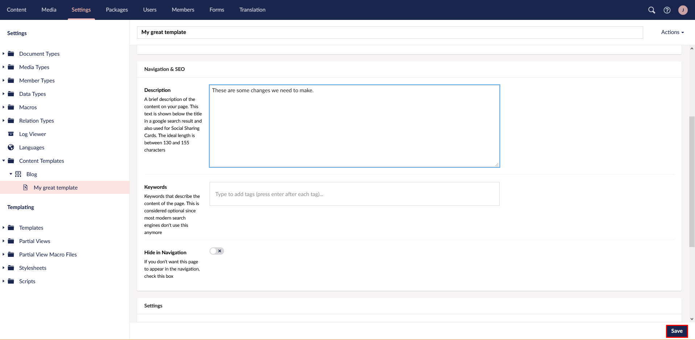

## Use

Once you have created a document blueprint, you can use the template to create new content nodes. To use a document blueprint, right-click the **Content** tree and select **Create**:

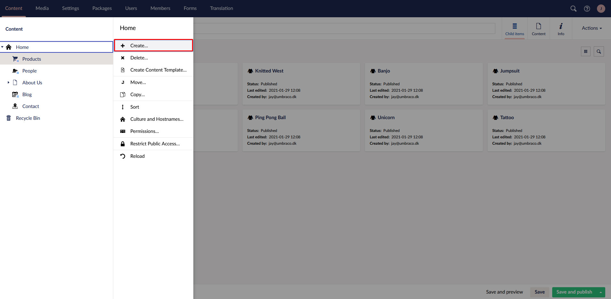

When you click on a Document Type that has a document blueprint you will see to options:

* Create a new node based on a document blueprint
* Create a blank one

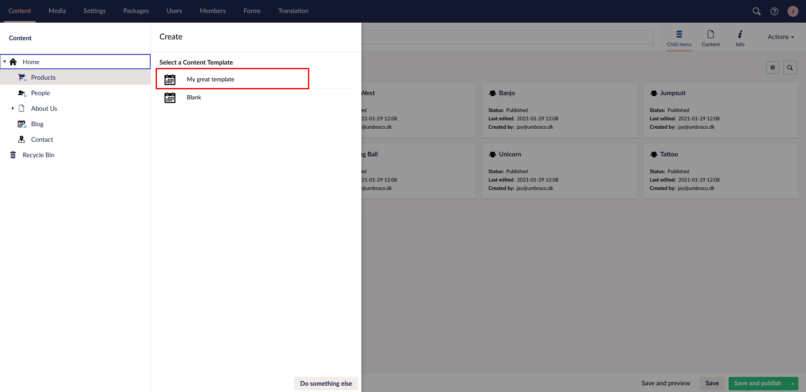
