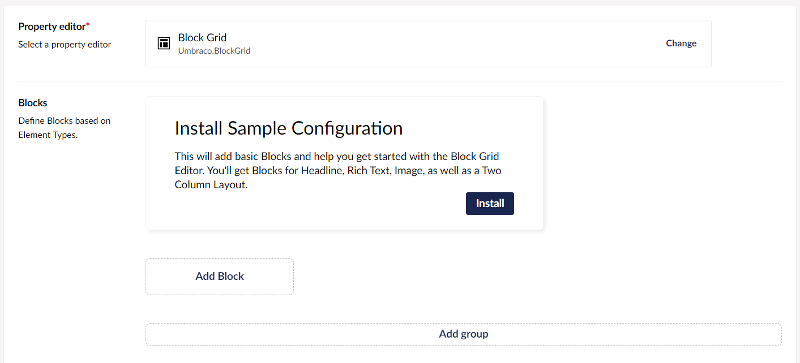
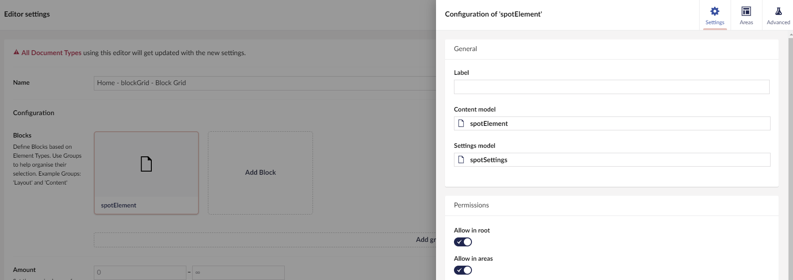

# Block Grid

`Schema Alias: Umbraco.BlockGrid`

`UI Alias: Umb.PropertyEditorUi.BlockGrid`

`Returns: BlockGridModel`

The **Block Grid** property editor enables editors to layout their content in the Umbraco backoffice. The content is made of Blocks that can contain different types of data.


This article is a work in progress and may undergo further revisions, updates, or amendments. The information contained herein is subject to change without notice.


## Sample configuration

When testing out the property editor, you can use a set of predefined Blocks. The option will only be possible when there are no other Data Types using the Block Grid property editor.

<figure><figcaption></figcaption></figure>

* Create a new **Data Type**.
* Select the **Block Grid** as the **Property editor**.
* **Install** the "Sample Configuration".

4 Blocks will be added to the property, ready for testing.

## Configuring the Block Grid

The Block Grid property editor is configured via the **Data Types** backoffice interface.

To set up the Block Grid property editor, follow these steps:

1. Navigate to the **Settings** section in the Umbraco backoffice.
2. Click **...** next to the **Data Types** folder.
3. Select **Create** -> **New Data Type**.
4. Select **Block Grid** from the list of available property editors.

You will see the configuration options for a Block Grid property editor as shown below:


The Data Type editor allows you to configure the following properties:

* **Blocks** - Defines the Block Types available for use in the property. For more information, see [Setup Block Types](block-grid-editor.md#setup-block-types).
* **Amount** - Sets the minimum and/or the maximum number of Blocks that should be allowed at the root of the layout.
* **Live editing mode** - Enabling this option will allow you to see the changes as you are editing them.
* **Editor width** - Overwrites the width of the property editor. This field takes any valid CSS value for "max-width". For example: 100% or 800px.
* **Grid Columns** - Define the number of columns in your Block Grid. The default is 12 columns.
* **Layout Stylesheet** - Replaces the built-in Layout Stylesheet. Additionally, you can retrieve the default layout stylesheet to use as a base for your own inspiration or for writing your own stylesheet.
* **Create Button Label** - Overwrites the label on the Create button.

## Setup Block Types

Block Types are based on [**Element Types**](../../../../data/defining-content/#element-types). These can be created beforehand or while setting up your Block Types.

Once you have added an Element Type as a Block Type on your Block Grid Data Type you have the option to configure it.


### Groups

Blocks can also be grouped. This is visible in the Block Catalogue and can also be used to allow a group of Blocks in an Area.

## Block Configuration Settings

Each Block has a set of properties that are optional to configure. These are described below.

### General

Customize the user experience for your content editors when they work with the Blocks in the Content section.

* **Label** - Defines a label for the appearance of the Block in the editor. The label can use AngularJS template-string-syntax to display values of properties.


Label example: "My Block \{=myPropertyAlias\}" will be shown as: "My Block FooBar".


* **Content model** - Presents the Element Type used as model for the Content section of this Block. This cannot be changed but you can open the Element Type to perform edits or view the properties available. Useful when writing your Label.
* **Settings model** - Adds a Settings section to your Block based on a given Element Type. When selected you can open the Element Type or choose to remove the Settings section again.

### Size options

Customize the Blocks size in the Grid. If you define multiple options, the Block becomes scalable.

By default, a Block takes up the available width.

A Block can be resized in two ways:

1. When a Block is placed in an Area, it will fit to the Areas width. Learn more about [Areas](block-grid-editor.md#areas).
2. A Block can have one or more Column Span options defined.

A Column Span option is used to define the width of a Block. With multiple Column Span options defined, the Content Editor can scale the Block to fit specific needs.

Additionally, Blocks can be configured to span rows, this enables one Block to be placed next to a few rows containing other Blocks.

* **Available column spans** - Defines one or more columns, the Block spans across. For example: in a 12 columns grid, 6 columns is equivalent to half width. By enabling 6 columns and 12 columns, the Block can be scaled to either half width or full width.
* **Available row spans** - Defines the amount of rows the Block spans across.

See the [scaling blocks](block-grid-editor.md#scaling-blocks) section of this article for an example of how scaling works.

### Catalogue appearance

These properties refer to how the Block is presented in the Block catalogue when editors choose which Blocks to use for their content.

* **Background color** - Defines a background color to be displayed beneath the icon or thumbnail. Example: `#424242`.
* **Icon color** - Changes the color of the Element Type icon. Example: `#242424`.
* **Thumbnail** - Pick an image or Scalable Vector Graphics (SVG) file to replace the icon of the Block in the catalogue.

The thumbnails for the catalogue are presented in the format of 16:10. We recommend a resolution of 400px width and 250px height.

### Permissions

* **Allow in root** - Determines whether the Block can be created at the root of your layout. Turn this off if you only want a Block to appear within Block Areas.
* **Allow in areas** - Determines whether the Block can be created inside Areas of other Blocks. If this is turned off it can still be allowed in Block Areas by defining specific allowed Blocks.

## Areas

Blocks can nest other Blocks to support specific compositions. These compositions can be used as a layout for other Blocks.

To achieve nesting, a Block must have one or more Areas defined. Each Area can contain one or more Blocks.

Each Area has a size, defined by column and rows spans. The grid for the Areas are based on the same amount of columns as your root grid, unless you choose to change it.

To scale an Area, click and drag the scale-button in the bottom-right corner of an Area.

* **Grid Columns for Areas** - Overwrites the amount of columns used for the Area grid.
* **Areas** - Determines whether the Block can be created inside Areas of other Blocks.


### Area configuration


* **Alias** - The alias is used to identify this Area. It is being printed by `GetBlockGridHTML()` and used as name for the Area slot in Custom Views. The alias is also available for CSS Selectors to target the HTML-Element representing an Area.
* **Create Button Label** - Overwrites the Create Button Label of the Area.
* **Number of blocks** - Determines the total number of Blocks in an Area.
* **Allowed block types** - When this is empty, all Blocks with Permissions for creation in Areas, will be available. This can be overwritten by specifying the allowed Blocks. Define the types of Blocks or Groups of Blocks that are allowed. Additionally, you can also set how many Blocks of each type/group should be present.

When allowing a Group of Blocks, you might want to require a specific amount for a certain Block of that Group. This can be done by adding that Block Type to the list as well and set the requirements.

## Advanced

These properties are relevant when working with custom views or complex projects.

* **Custom view** - Overwrites the AngularJS view for the block presentation in the Content editor. Use this view to make a more visual presentation of the Block or make your own editing experience by adding your own AngularJS controller to the view.


Notice that any styling of a Block is scoped. This means that the default backoffice styles are not present for the view of this Block.


* **Custom stylesheet** - Pick your own stylesheet to be used by the Block in the Content editor.
* **Overlay editor size** - Sets the size for the Content editor overlay for editing this block.
* **Hide content editor** - Hides the UI for editing the content in a Block Editor. This is only relevant if you made a custom view that provides the UI for editing of content.

## Editing Blocks

When viewing a **Block Grid** property editor in the **Content** section for the first time, you will be presented with the option to **Add content**.


Clicking the **Add content** button opens up the **Block Catalogue**.


The Block Catalogue looks different depending on the amount of available Blocks and their catalogue appearance.


Click the Block Type you wish to create and a new Block will appear in the layout.

More Blocks can be added to the layout by clicking the Add content button. Alternatively, use the Add content button that appears on hover to add new Blocks between, besides, or above the existing Blocks.


To delete a Block, click the trash icon which appears on the mouse hover.


## Sorting Blocks

Blocks can be rearranged using the click and drag feature. Move them up or down to place them in the desired order.

Moving a Block from one Area to another is done in the same way. If a Block is not allowed in the given position, the area will display a red color and not allow the new position.


## Scaling Blocks

If a Block has multiple size options it can be scaled via the UI. This appears in the bottom left corner of the Block.

The Block is resized using a click-and-drag feature. Moving the mouse will change the size to the size options closest to the mouse pointer.

<figure><figcaption><p>Scale blocks in the grid by dragging from the bottom-right corner.</p></figcaption></figure>

## Rendering Block Grid Content

Rendering the stored value of your **Block Grid** property editor can be done in two ways:

1. [Default rendering](block-grid-editor.md#1-default-rendering)
2. [Build your own rendering](block-grid-editor.md#2-build-your-own-rendering)

### 1. Default rendering

You can choose to use the built-in rendering mechanism for rendering Blocks using a Partial View for each block.

The default rendering method is named `GetBlockGridHtmlAsync()` and comes with a few options - for example:

```csharp
@await Html.GetBlockGridHtmlAsync(Model, "myGrid")
```

In the sample above `"myGrid"` is the alias of the Block Grid editor.

If you are using ModelsBuilder, the example will look like this:

```csharp
@await Html.GetBlockGridHtmlAsync(Model.MyGrid)
```

To use the `GetBlockGridHtmlAsync()` method, you will need to create a Partial View for each Block Type. The Partial View must be named using the alias of the Element Type that is being used as Content Model for the Block Type.

These Partial View files need to go into the `Views/Partials/blockgrid/Components/` folder.

Example: `Views/Partials/blockgrid/Components/MyElementTypeAliasOfContent.cshtml`.

The Partial Views will receive a model of type `Umbraco.Cms.Core.Models.Blocks.BlockGridItem`. This model contains `Content` and `Settings` from your block, as well as the configured `RowSpan`, `ColumnSpan`, and `Areas` of the Block.

#### Rendering the Block Areas

The Partial View for the Block is responsible for rendering its own Block Areas. This is done using another built-in rendering mechanism:

```csharp
@await Html.GetBlockGridItemAreasHtmlAsync(Model)
```

Here you will need to create a Partial View for each Block Type within the Block Area. For the name, use the alias of the Element Type that is being used as Content Model for the Block Type.

These Partial Views must be placed in the same folder as before, (`Views/Partials/blockgrid/Components/`), and will receive a model of type `Umbraco.Cms.Core.Models.Blocks.BlockGridItem`.

#### Putting it all together

The following is an example of a Partial View for a Block Type of type `MyElementTypeAliasOfContent`.


```csharp
@inherits Umbraco.Cms.Web.Common.Views.UmbracoViewPage<Umbraco.Cms.Core.Models.Blocks.BlockGridItem>;

@* Render the value of field with alias 'heading' from the Element Type selected as Content section *@
<h1>@Model.Content.Value("heading")</h1>

@* Render the block areas *@
@await Html.GetBlockGridItemAreasHtmlAsync(Model)
```


If you are using ModelsBuilder, you can make the property rendering strongly typed by letting your view accept a model of type `BlockGridItem<T>`. For example:


```csharp
@inherits Umbraco.Cms.Web.Common.Views.UmbracoViewPage<Umbraco.Cms.Core.Models.Blocks.BlockGridItem<ContentModels.MyElementTypeAliasOfContent>>;
@using ContentModels = Umbraco.Cms.Web.Common.PublishedModels;

@* Render the Heading property from the Element Type selected as Content section *@
<h1>@Model.Content.Heading</h1>

@* Render the block areas *@
@await Html.GetBlockGridItemAreasHtmlAsync(Model)
```


#### Stylesheet

Using the default rendering together with your layout stylesheet will provide what you need for rendering the layout.

If you like to use the Default Layout Stylesheet, you must copy the stylesheet to your frontend. You can download the default layout stylesheet from the link within the DataType, we recommend putting the file in the `css` folder, example: `wwwroot/css/umbraco-blockgridlayout.css`.

```csharp
<link rel="stylesheet" href="@Url.Content("~/css/blockgridlayout.css")" />
```


A set of built-in Partial Views are responsible for rendering the Blocks and Areas in a Block Grid. If you want to tweak or change the way the Block Grid is rendered, you can use the built-in Partial Views as a template:

1. Clone the views from `<a href="https://github.com/umbraco/Umbraco-CMS/">GitHub</a>`. They can be found in `/src/Umbraco.Cms.StaticAssets/Views/Partials/blockgrid/`
2. Copy the cloned views to the local folder `Views/Partials/blockgrid/`
3. Make changes to your copied views. The entry point for `GetBlockGridHtmlAsync()` is the view `default.cshtml`


### 2. Build your own rendering

The built-in value converter for the Block Grid property editor lets you use the block data as you like. Call the `Value<T>` method with a type of `BlockGridModel` to have the stored value returned as a `BlockGridModel` instance.

`BlockGridModel` contains the Block Grid configuration (like the number of columns as `GridColumns`) whilst also being an implementation of `IEnumerable<BlockGridItem>` (see details for `BlockGridItem` above).

The following example mimics the built-in rendering mechanism for rendering Blocks using Partial Views:


```csharp
@inherits Umbraco.Cms.Web.Common.Views.UmbracoViewPage
@using Umbraco.Cms.Core.Models.Blocks
@{
    var grid = Model.Value<BlockGridModel>("myGrid");

    // get the number of columns defined for the grid
    var gridColumns = grid.GridColumns;

    // iterate the block items
    foreach (var item in grid)
    {
        var content = item.Content;

        @await Html.PartialAsync("PathToMyFolderOfPartialViews/" + content.ContentType.Alias, item);
    }
}
```


If you do not want to use Partial Views, you can access the block item data directly within your rendering:


```csharp
@inherits Umbraco.Cms.Web.Common.Views.UmbracoViewPage
@using Umbraco.Cms.Core.Models.Blocks
@{
    var grid = Model.Value<BlockGridModel>("myGrid");

    // get the number of columns defined for the grid
    var gridColumns = grid.GridColumns;

    // iterate the block items
    foreach (var item in grid)
    {
        // get the content and settings of the block
        var content = item.Content;
        var settings = item.Settings;
        // get the areas of the block
        var areas = item.Areas;
        // get the dimensions of the block
        var rowSpan = item.RowSpan;
        var columnSpan = item.ColumnSpan;

        // render the block data
        <div style="background-color: #@(settings.Value<string>("color"))">
            <h2>@(content.Value<string>("title"))</h2>
            <span>This block is supposed to span <b>@rowSpan rows</b> and <b>@columnSpan columns</b></span>
        </div>
    }
}
```


## Write a Custom Layout Stylesheet

The default layout stylesheet is using CSS Grid. This can be modified to fit your implementation and your project.

### Adjusting the Default Layout Stylesheet

To make additions or overwrite parts of the default layout stylesheet, import the default stylesheet at the top of your own file.

```css
@import 'css/umbblockgridlayout.css';
```

You need to copy the Default Layout Stylesheet to your frontend. You can download the default layout stylesheet from the link within the DataType, we recommend putting the file in the `css` folder, example: `wwwroot/css/umbraco-blockgridlayout.css`.

### Write a new Layout Stylesheet

In this case, you would have to write the layout from scratch.

You are free to pick any style, meaning there is no requirement to use CSS Grid. It is, however, recommended to use CSS Grid to ensure complete compatibility with the Umbraco backoffice.

### CSS Class structure and available data

When extending or writing your own layout, you need to know the structure and what data is available.

For example: You can use the below HTML structure:

```html
<div class="umb-block-grid"
     style="--umb-block-grid--grid-columns: 12;"
>

    <!-- Notice this is the same markup used every time we will be printing a list of blocks: -->
    <div class="umb-block-grid__layout-container">

        <!-- repeated for each layout entry -->
        <div
            class="umb-block-grid__layout-item"
            data-content-element-type-alias="MyElementTypeAlias"
            data-content-element-type-key="00000000-0000-0000-0000-000000000000"
            data-element-udi="00000000-0000-0000-0000-000000000000"
            data-col-span="6"
            data-row-span="1"
            style="
            --umb-block-grid--item-column-span: 6;
            --umb-block-grid--item-row-span: 1;
            "
        >

            <!-- Here the Razor View or Custom View for this block will be rendered. -->

            <!-- Each razor view must render the 'area-container' them self.
            This can be done by the Razor helper method:

            @await Html.GetBlockGridItemAreasHtmlAsync(Model)

            The structure will be as printed below,
            Do notice targeting the 'area-container' needs a double selector as markup will be different in Backoffice.
            Here is an example of the CSS selector:
                .umb-block-grid__area-container, .umb-block-grid__block--view::part(area-container) {
                    position: relative;
                }
            -->
            <div
                class="umb-block-grid__area-container"
                style="--umb-block-grid--area-grid-columns: 9;"
            >

                <!-- repeated for each area for this block type. -->
                <div
                    class="umb-block-grid__area"
                    data-area-col-span="3"
                    data-area-row-span="1"
                    data-area-alias="MyAreaAlias"
                    style="
                    --umb-block-grid--grid-columns: 3;
                    --umb-block-grid--area-column-span: 3;
                    --umb-block-grid--area-row-span: 1;
                    ">

                        <!-- Notice here we print the same markup as when we print a list of blocks(same as the one in the root of this structure..):
                        <div class="umb-block-grid__layout-container">
                            ...
                        </div>
                        End of notice.  -->
                </div>
                <!-- end of repeat -->

            </div>


        </div>
        <!-- end of repeat -->

    </div>

</div>
```

## Build a Custom Backoffice View

Building Custom Views for Block representations in Backoffice is based on the same API for all Block Editors.

[Read about building a Custom View for Blocks here](build-custom-view-for-blocks.md)

## Creating a Block Grid programmatically

In this example, we will be creating content programmatically for a "spot" Blocks in a Block Grid.

1. On a Document Type add a property called **blockGrid**.
2. Then add as editor **Block Grid**.
3. In the Block Grid add a new block and click to **Create new Element Type**
4. Name this element type **spotElement** with the following properties:

* A property called **title** with the editor of **Textstring**
* A property called **text** with the editor of **Textstring**

5. Then on the **Settings model** click to add a new Setting.
6. Then click to **Create new Element Type**.
7. Name this element type **spotSettings** with the following properties:

* A property called **featured** with the editor of **True/false**.



The raw input data for the spots looks like this:

```csharp
new[]
{
    new { Title = "Item one", Text = "This is item one", Featured = false, ColumnSpan = 12, RowSpan = 1 },
    new { Title = "Item two", Text = "This is item two", Featured = true, ColumnSpan = 6, RowSpan = 2 }
}
```

The resulting JSON object stored for the Block Grid will look like this:

```json
{
    "layout": {
        "Umbraco.BlockGrid": [{
                "contentUdi": "umb://element/bb23fe28160941efa506da7aa314172d",
                "settingsUdi": "umb://element/9b832ee528464456a8e9a658b47a9801",
                "areas": [],
                "columnSpan": 12,
                "rowSpan": 1
            }, {
                "contentUdi": "umb://element/a11e06ca155d40b78189be0bdaf11c6d",
                "settingsUdi": "umb://element/d182a0d807fc4518b741b77c18aa73a1",
                "areas": [],
                "columnSpan": 6,
                "rowSpan": 2
            }
        ]
    },
    "contentData": [{
            "contentTypeKey": "0e9f8609-1904-4fd1-9801-ad1880825ff3",
            "udi": "umb://element/bb23fe28160941efa506da7aa314172d",
            "title": "Item one",
            "text": "This is item one"
        }, {
            "contentTypeKey": "0e9f8609-1904-4fd1-9801-ad1880825ff3",
            "udi": "umb://element/a11e06ca155d40b78189be0bdaf11c6d",
            "title": "Item two",
            "text": "This is item two"
        }
    ],
    "settingsData": [{
            "contentTypeKey": "22be457c-8249-42b8-8685-d33262f7ce2a",
            "udi": "umb://element/9b832ee528464456a8e9a658b47a9801",
            "featured": "0"
        }, {
            "contentTypeKey": "22be457c-8249-42b8-8685-d33262f7ce2a",
            "udi": "umb://element/d182a0d807fc4518b741b77c18aa73a1",
            "featured": "1"
        }
    ]
}
```

For each item in the raw data, we need to create:

* One `contentData` entry with the _title_ and _text_.
* One `settingsData` entry with the _featured_ value (the checkbox expects `"0"` or `"1"` as data value).
* One `layout` entry with the desired column and row spans.

All `contentData` and `layoutData` entries need their own unique `Udi` as well as the ID (key) of their corresponding Element Types. In this sample, we only have one Element Type for content (`spotElement`) and one for settings (`spotSettings`). In a real life scenario, there could be any number of Element Type combinations.

8. First and foremost, we need models to transform the raw data into Block Grid compatible JSON. Create a class called **Model.cs** containing the following:


```csharp
using Umbraco.Cms.Core;
using System.Text.Json.Serialization;
namespace My.Site.Models;

// this is the "root" of the block grid data
public class BlockGridData
{
    public BlockGridData(BlockGridLayout layout, BlockGridElementData[] contentData, BlockGridElementData[] settingsData)
    {
        Layout = layout;
        ContentData = contentData;
        SettingsData = settingsData;
    }

    [JsonPropertyName("layout")]
    public BlockGridLayout Layout { get; }

    [JsonPropertyName("contentData")]
    public BlockGridElementData[] ContentData { get; }

    [JsonPropertyName("settingsData")]
    public BlockGridElementData[] SettingsData { get; }
}

// this is a wrapper for the block grid layout, purely required for correct serialization
public class BlockGridLayout
{
    public BlockGridLayout(BlockGridLayoutItem[] layoutItems) => LayoutItems = layoutItems;

    [JsonPropertyName("Umbraco.BlockGrid")]
    public BlockGridLayoutItem[] LayoutItems { get; }
}

// this represents an item in the block grid layout collection
public class BlockGridLayoutItem
{
    public BlockGridLayoutItem(Udi contentUdi, Udi settingsUdi, int columnSpan, int rowSpan)
    {
        ContentUdi = contentUdi;
        SettingsUdi = settingsUdi;
        ColumnSpan = columnSpan;
        RowSpan = rowSpan;
    }

    [JsonPropertyName("contentUdi")]
    public Udi ContentUdi { get; }

    [JsonPropertyName("settingsUdi")]
    public Udi SettingsUdi { get; }

    [JsonPropertyName("areas")]
    // areas are omitted from this sample for abbreviation
    public object[] Areas { get; } = { };

    [JsonPropertyName("columnSpan")]
    public int ColumnSpan { get; }

    [JsonPropertyName("rowSpan")]
    public int RowSpan { get; }

}

// this represents an item in the block grid content or settings data collection
public class BlockGridElementData
{
    public BlockGridElementData(Guid contentTypeKey, Udi udi)
    {
        ContentTypeKey = contentTypeKey;
        Udi = udi;
    }

    [JsonPropertyName("contentTypeKey")]
    public Guid ContentTypeKey { get; }

    [JsonPropertyName("udi")]
    public Udi Udi { get; }

    [JsonExtensionData]
    public Dictionary<string, object>? Data { get; set;}
}
```


9. By injecting [ContentService](https://apidocs.umbraco.com/v14/csharp/api/Umbraco.Cms.Core.Services.ContentService.html) and [ContentTypeService](https://apidocs.umbraco.com/v14/csharp/api/Umbraco.Cms.Core.Services.ContentTypeService.html) into an API controller, we can transform the raw data into Block Grid JSON. It can then be saved to the target content item. Create a class called **BlockGridTestController.cs** containing the following:


```csharp
using Microsoft.AspNetCore.Mvc;
using My.Site.Models;
using Umbraco.Cms.Core;
using Umbraco.Cms.Core.Models;
using Umbraco.Cms.Core.Serialization;
using Umbraco.Cms.Core.Services;

namespace My.Site.Controllers;

[ApiController]
[Route("/umbraco/api/blockgridtest")]
public class BlockGridTestController : Controller
{
    private readonly IContentService _contentService;
    private readonly IContentTypeService _contentTypeService;
    private readonly IJsonSerializer _serializer;

    public BlockGridTestController(IContentService contentService, IContentTypeService contentTypeService, IJsonSerializer serializer)
    {
        _contentService = contentService;
        _contentTypeService = contentTypeService;
        _serializer = serializer;
    }

    // POST: /umbraco/api/blockgridtest/create
    [HttpPost("create")]
    public ActionResult Create()
    {
        // get the item content to modify
        IContent? content = _contentService.GetById(Guid.Parse("efba7b97-91b6-4ddf-b2cc-eef89ff48c3b"));
        if (content == null)
        {
            return NotFound("Could not find the content item to modify");
        }

        // get the element types for spot blocks (content and settings)
        IContentType? spotContentType = _contentTypeService.Get("spotElement");
        IContentType? spotSettingsType = _contentTypeService.Get("spotSettings");
        if (spotContentType == null || spotSettingsType == null)
        {
            return NotFound("Could not find one or more content types for block data");
        }

        // this is the raw data to insert into the block grid
        var rawData = new[]
        {
            new { Title = "Item one", Text = "This is item one", Featured = false, ColumnSpan = 12, RowSpan = 1 },
            new { Title = "Item two", Text = "This is item two", Featured = true, ColumnSpan = 6, RowSpan = 2 }
        };

        // build the individual parts of the block grid data from the raw data
        var layoutItems = new List<BlockGridLayoutItem>();
        var spotContentData = new List<BlockGridElementData>();
        var spotSettingsData = new List<BlockGridElementData>();
        foreach (var data in rawData)
        {
            // generate new UDIs for block content and settings
            var contentUdi = Udi.Create(Constants.UdiEntityType.Element, Guid.NewGuid());
            var settingsUdi = Udi.Create(Constants.UdiEntityType.Element, Guid.NewGuid());

            // create a new layout item
            layoutItems.Add(new BlockGridLayoutItem(contentUdi, settingsUdi, data.ColumnSpan, data.RowSpan));

            // create new content data
            spotContentData.Add(new BlockGridElementData(spotContentType.Key, contentUdi)
            {
                Data = new Dictionary<string, object>
                {
                    { "title", data.Title },
                    { "text", data.Text },
                }
            });

            // create new settings data
            spotSettingsData.Add(new BlockGridElementData(spotSettingsType.Key, settingsUdi)
            {
                Data = new Dictionary<string, object>
                {
                    { "featured", data.Featured ? "1" : "0" },
                }
            });
        }

        // construct the block grid data from layout, content and settings
        var blockGridData = new BlockGridData(
            new BlockGridLayout(layoutItems.ToArray()),
            spotContentData.ToArray(),
            spotSettingsData.ToArray());

        // serialize the block grid data as JSON and save it to the "blockGrid" property on the content item
        var propertyValue = _serializer.Serialize(blockGridData);
        content.SetValue("blockGrid", propertyValue);
        _contentService.Save(content);

        return Ok("Saved");
    }
}
```


For the above code `IContent? content = _contentService.GetById(1203);` change the id with your content node that is using the Block Grid.

10. In order to test this implementation, run the project and add `/umbraco/api/blockgridtest/create` after your domain name. If the result shows as **Saved** then check your content node and you will see the 2 spotElement contents.


_This can also be tested via Postman as well if preffered._
