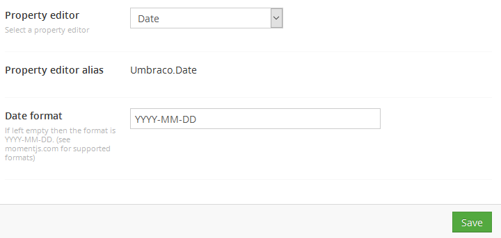
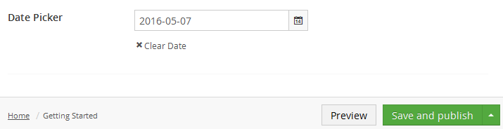

# Date


`Schema alias: Umbraco.DateTime`

`UI Alias: Umb.PropertyEditorUi.DatePicker`

`Returns: Date`

Displays a calendar UI for selecting dates which are saved as a DateTime value.

## Data Type Definition Example



The only setting that is available for manipulating the Date property is to set a format. By default the format of the date in the Umbraco backoffice will be `YYYY-MM-DD`, but you can change this to something else. See [MomentJS.com](https://momentjs.com/) for the supported formats.

## Content Example



## MVC View Example - displays a datetime

### Typed

```csharp
@(Model.Content.GetPropertyValue<DateTime>("datePicker").ToString("dd MM yyyy"))
```

### Dynamic (Obsolete)


See [Common pitfalls](../../../../reference/common-pitfalls.md) for more information about why the dynamic approach is obsolete.


```csharp
@{
    @CurrentPage.datePicker.ToString("dd-MM-yyyy")
}
```
