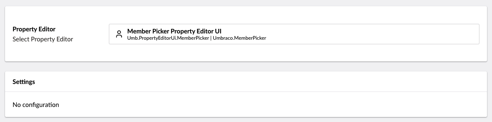
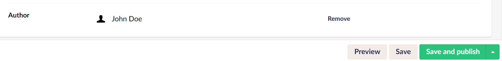

# Member Picker

`Schema alias: Umbraco.MemberPicker`

`UI Alias: Umb.PropertyEditorUi.MemberPicker`

`Returns: IPublishedContent`

The member picker opens a panel to pick a specific member from the member section. The value saved is of type IPublishedContent.

## Data Type Definition Example



## Content Example



## MVC View Example

### Without Modelsbuilder

```csharp
@{
    if (Model.HasValue("author"))
    {
        var member = Model.Value<IPublishedContent>("author");
        @member.Name
    }
}
```

### With Modelsbuilder

```csharp
@{
    if (Model.Author != null)
    {
        var member = Model.Author;
        @member.Name
    }
}
```

## Add values programmatically

See the example below to see how a value can be added or changed programmatically. To update a value of a property editor you need the [Content Service](https://apidocs.umbraco.com/v14/csharp/api/Umbraco.Cms.Core.Services.ContentService.html).


The example below demonstrates how to add values programmatically using a Razor view. However, this is used for illustrative purposes only and is not the recommended method for production environments.


```csharp
@using Umbraco.Cms.Core.Services;

@inject IContentService Services;
@{
    // Get access to ContentService
    var contentService = Services;

    // Create a variable for the GUID of the page you want to update
    var guid = Guid.Parse("32e60db4-1283-4caa-9645-f2153f9888ef");

    // Get the page using the GUID you've defined
    var content = contentService.GetById(guid); // ID of your page

    // Create a variable for the GUID of the member ID
    var authorId = Guid.Parse("ed944097281e4492bcdf783355219450");

    // Set the value of the property with alias 'author'. 
    content.SetValue("author", authorId);

    // Save the change
    contentService.Save(content);
}
```

Although the use of a GUID is preferable, you can also use the numeric ID to get the page:

```csharp
@{
    // Get the page using it's id
    var content = contentService.GetById(1234); 
}
```

If Modelsbuilder is enabled you can get the alias of the desired property without using a magic string:

```csharp
@using Umbraco.Cms.Core.PublishedCache;
@using Umbraco.Cms.Core;

@inject IPublishedSnapshotAccessor _publishedSnapshotAccessor;
@{
    var udi = Udi.Create(Constants.UdiEntityType.Member, authorId);
    
    // Set the value of the property with alias 'author'
    content.SetValue(Home.GetModelPropertyType(_publishedSnapshotAccessor, x => x.Author).Alias, udi);
}
```
