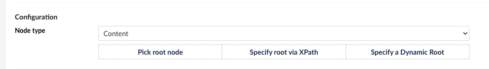
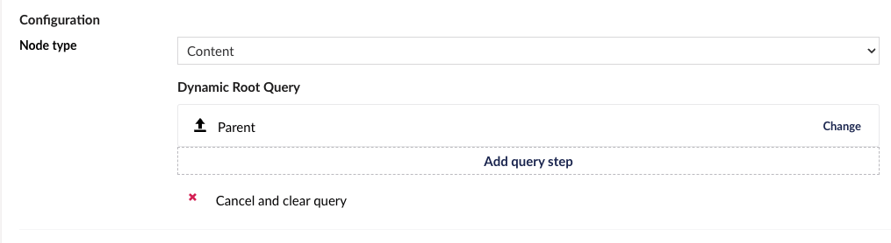
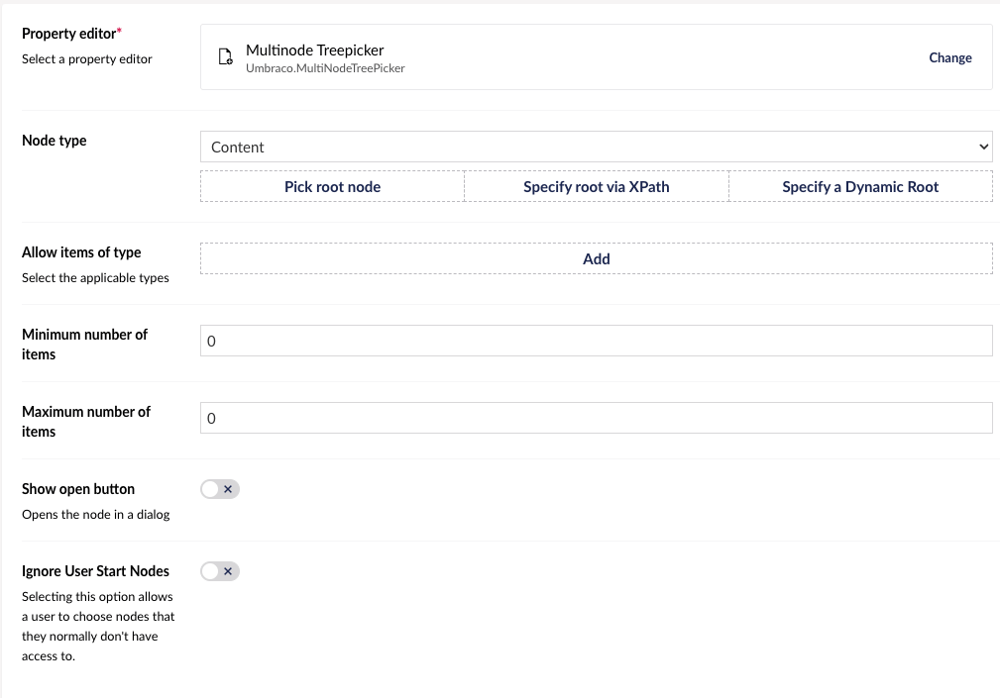

# Multinode Treepicker

`Alias: Umbraco.MultiNodeTreePicker`

`Returns: IEnumerable<IPublishedContent>`

## Settings

The Multinode Treepicker allows you to configure the type of tree to render and what part of the tree that should be rendered. For content it allows you to select a dynamic root node based on the current document using the multinode tree picker.

### Node type

Set the type of node, the root node of the tree, or query for the root node.

For querying content you can specify a dynamic root:

<figure><figcaption></figcaption></figure>

When you specify the dynamic root, you are able to navigate the tree relative to a node.

<figure><figcaption></figcaption></figure>

First you have to specify a origin, from where the query will start.


You have the following options:

* Root
  * The root is the first level item of the current nodes subtree.
* Parent
  * The parent is the nearest ancestor of the current node.
* Current
  * The current node. Be aware a picker that uses the current node, cannot pick anything when the current node is created, because it do not have any children.
* Site
  * The nearest ancestor of the current node that has a domain assigned.
* Specific node
  * A specific node that you have to choose in the tree

Often an origin is a good dynamic root. It is also possible to execute multiple steps from the origin to navigate the tree to find another root.


You have the following options:

* Nearest Ancestor or Self
  * Finds the nearest ancestor or the item itself, that fits with one of the configured document types.
* Furthest Ancestor or Self
  * Finds the furthest ancestor or the item itself, that fits with one of the configured document types.
* Nearest Descendant or Self
  * Finds the nearest descendant or the item itself, that fits with one of the configured document types.
* Furthest Descendant or Self
  * Finds the furthest descendant or the item itself, that fits with one of the configured document types.
* Custom
  * Execute a custom query step by specifying the name. This requires custom code to add the new query step.

Each query step takes the output from the last step (or the origin) as input.


#### Adding a custom query step

Custom query steps can be used to solve some specific use cases.

To add a custom query step you need to append it to the existing query steps. This can be done from a composer:

```csharp
public class CustomQueryStepComposer : IComposer
{
    public void Compose(IUmbracoBuilder builder)
    {
        builder.DynamicRootSteps().Append<MyCustomDynamicRootQueryStep>();
    }
}
```

The implementation of a query step takes in a collection of origins and information about the query step. The collection is taken from where the name specified in the UI can be found.

```csharp
public class CustomQueryStepComposer : IComposer
{
    public void Compose(IUmbracoBuilder builder)
    {
        builder.DynamicRootSteps().Append<MyCustomDynamicRootQueryStep>();
    }
}
```

The code required to create a custom query step is like in the below example.

You can inject dependencies into the constructor. Some interesting dependencies could be custom repositories, or the `IVariationContextAccessor`, if you wanna use the current culture.

The `ExecuteAsync` method gets a collection of content keys from the last executed query step or the origin. It has to return a new collection of content keys.

```csharp
public class MyCustomDynamicRootQueryStep : IDynamicRootQueryStep
{
    private readonly IMyCustomRepository _myCustomRepository;

    public MyCustomDynamicRootQueryStep(IMyCustomRepository myCustomRepository)
    {
        _myCustomRepository = myCustomRepository;
    }

    public async Task<Attempt<ICollection<Guid>>> ExecuteAsync(ICollection<Guid> origins, DynamicRootQueryStep filter)
    {
        if (filter.Alias != "MyCustom") // This is the string you will have to write in the UI
        {
            return Attempt<ICollection<Guid>>.Fail();
        }

        if (origins.Any() is false)
        {
            return Attempt<ICollection<Guid>>.Succeed(Array.Empty<Guid>());
        }

        // TODO replace with your own logic
        var result = await _myCustomRepository.GetWhateverIWantAsync(origins);

        return Attempt<ICollection<Guid>>.Succeed(result);
    }
}
```

### Filter out items with type

Allow or disallow tree nodes with a certain content type alias.

Enter `typeAlias,altTypeAlias` to only allow selecting nodes with those alias'. Enter `!typeAlias,altTypeAlias` to only allow selecting nodes **not** with those alias'.

### Minimum/maximum number of items

Set a limit on the number of items allowed to be selected.

## Data Type Definition Example



## Content Example

Consider the following tree structure where Document Type alias is presented in square brackets.

* Codegarden
  * 2023 \[_year_]
    * Talks \[_talks_]
      * ...
      * Umbraco anno MMXXIII \[_talk_]
    * Stages \[_stages_]
      * Social Space \[_stage_]
      * No 10 \[_stage_]
      * No 16 \[_stage_]
      * The Theatre \[_stage_]
  * 2022 \[_year_]
    * Talks \[_talks_]
      * ...
    * Stages \[_stages_]
      * Main Stage \[_stage_]
      * The Barn \[_stage_]
      * The Theatre \[_stage_]

Consider configuring a picker on the _talk_ Document Type to choose a stage of the talk. Here you only want to present the stages for the actual year. To do this, you need to choose the parent as origin.

Imagine being on the `Umbraco anno MMXXIII` node. This means the collection of content keys passed into the first query step will only contain the `Talks` content node.

* First you can then query for the nearest ancestors of type `year`. This means the `2023` will be returned.
* Next, you can query for the nearest descendants of type `stages`.

When opening the picker on the `Umbraco anno MMXXIII` node, it will now show the children of the node on path `Codegarden => 2023 => Stages`.

## MVC View Example

### Without Modelsbuilder

```csharp
@{
    var typedMultiNodeTreePicker = Model.Value<IEnumerable<IPublishedContent>>("featuredArticles");
    if (typedMultiNodeTreePicker != null) {
        foreach (var item in typedMultiNodeTreePicker)
        {
            <p>@item.Name</p>
        }
}
```

### With Modelsbuilder

```csharp
@{
    var typedMultiNodeTreePicker = Model.FeaturedArticles;
    foreach (var item in typedMultiNodeTreePicker)
    {
        <p>@item.Name</p>
    }
}
```

## Add values programmatically

See the example below to see how a value can be added or changed programmatically. To update a value of a property editor you need the [Content Service](https://apidocs.umbraco.com/v14/csharp/api/Umbraco.Cms.Core.Services.ContentService.html).

```csharp
@inject IContentService Services;
@using Umbraco.Cms.Core;
@using Umbraco.Cms.Core.Services

@{
    // Get access to ContentService
    var contentService = Services;

    // Create a variable for the GUID of the page you want to update
    var guid = Guid.Parse("32e60db4-1283-4caa-9645-f2153f9888ef");

    // Get the page using the GUID you've defined
    var content = contentService.GetById(guid); // ID of your page

    // Get the pages you want to assign to the Multinode Treepicker
    var page = Umbraco.Content("665d7368-e43e-4a83-b1d4-43853860dc45");
    var anotherPage = Umbraco.Content("1f8cabd5-2b06-4ca1-9ed5-fbf14d300d59");

    // Create Udi's of the pages
    var pageUdi = Udi.Create(Constants.UdiEntityType.Document, page.Key);
    var anotherPageUdi = Udi.Create(Constants.UdiEntityType.Document, anotherPage.Key);

    // Create a list of the page udi's
    var udis = new List<string>{pageUdi.ToString(), anotherPageUdi.ToString()};

    // Set the value of the property with alias 'featuredArticles'.
    content.SetValue("featuredArticles", string.Join(",", udis));

    // Save the change
    contentService.Save(content);
}
```

Although the use of a GUID is preferable, you can also use the numeric ID to get the page:

```csharp
@{
    // Get the page using it's id
    var content = contentService.GetById(1234);
}
```

If Modelsbuilder is enabled you can get the alias of the desired property without using a magic string:

```csharp
@inject IPublishedSnapshotAccessor _publishedSnapshotAccessor;
@using Umbraco.Cms.Core.PublishedCache;

@{
    // Set the value of the property with alias 'featuredArticles'
    content.SetValue(Home.GetModelPropertyType(_publishedSnapshotAccessor ,x => x.FeaturedArticles).Alias, string.Join(",", udis));
}
```
