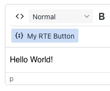
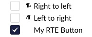

# Rich Text Editor Plugins


This page is a work in progress. The global configuration of TinyMCE has been removed in order to support more rich text editors in the future. Instead, a new extension type called “tinyMcePlugin” has been added.


## Overview

The Rich Text Editor (RTE) in Umbraco is based on the open source editor [TinyMCE](https://www.tiny.cloud/). TinyMCE is a highly customizable editor, and it is possible to extend the functionality of the editor by adding plugins.

TinyMCE comes with a lot of plugins out of the box, but it is also possible to create your own plugins. This article will show you how to add a custom plugin to the rich text editor.

### Open-Source Plugins

TinyMCE has a lot of open-source plugins available. You can find a list of these plugins on the [TinyMCE website](https://www.tiny.cloud/docs/tinymce/6/plugins/#open-source-plugins).

### Premium Plugins

TinyMCE also has a number of [premium plugins](https://www.tiny.cloud/docs/tinymce/6/plugins/#premium-plugins) available. These plugins are only available for [paid TinyMCE subscriptions](https://www.tiny.cloud/pricing/).

## Adding a Plugin

To enable plugins in the rich text editor, you need to add an extension type called `tinyMcePlugin` in a manifest file. The manifest file is a JSON file that describes the plugin and how it should be loaded. You can add a plugin such as the open source [Word Count Plugin](https://www.tiny.cloud/docs/tinymce/6/wordcount/) to the rich text editor. You can also define your own custom plugin to extend the functionality of the editor. This way you can add custom buttons, dialogs, or other features to the editor.


The manifest file should be placed in a folder in `App_Plugins/{YourPackageName}`, with the name `umbraco-package.json`. Read more about [package manifests](../../../../../extending/property-editors/package-manifest.md).




```json
{
    "name": "My TinyMCE Plugin",
    "version": "1.0.0",
    "extensions": [
        {
            "type": "tinyMcePlugin",
            "alias": "mytinymceplugin",
            "name": "My TinyMCE Plugin",
            "js": "/App_Plugins/MyTinyMCEPlugin/plugin.js"
        }
    ]
}
```



The manifest file above describes a plugin called `My TinyMCE Plugin`. The plugin is loaded from the file `plugin.js` located in the folder `App_Plugins/MyTinyMCEPlugin`.

The `plugin.js` file should contain the JavaScript code for the plugin. The file is loaded as a JavaScript module and must export a default class that extends the `UmbTinyMcePluginBase` class.


The `UmbTinyMcePluginBase` class is a class provided by Umbraco that you can use to create your own plugins. The class is a wrapper around the TinyMCE plugin API. We can use the `args` object on the constructor to access the TinyMCE editor instance and other useful properties.




```javascript

import { UmbTinyMcePluginBase, type TinyMcePluginArguments } from '@umbraco-cms/backoffice/tinymce';

export default class UmbTinyMceMediaPickerPlugin extends UmbTinyMcePluginBase {
    constructor(args: TinyMcePluginArguments) {
        super(args);

        // Add your plugin code here
        args.editor.plugins.push('wordcount');
        args.editor.options.set('statusbar', true);
    }
}

```

The example above shows how to add the open-source [Word Count Plugin](https://www.tiny.cloud/docs/tinymce/6/wordcount/) to the rich text editor. The plugin is added to the `Plugins` array in the configuration. The plugin itself will be shown in the statusbar of the rich text editor, so the `statusbar` option is also added to the `configuration` object.


Rich Text Editor: Adding Plugins


## Adding a premium plugin

To add a premium plugin, you need to add the plugin name to the `Plugins` array in the [configuration](../../../../../reference/configuration/richtexteditorsettings.md) of the rich text editor. You also need to add the "[CloudApiKey](../../../../../reference/configuration/richtexteditorsettings.md#cloud-api-key)" to the configuration.

```json
{
  "Umbraco": {
    "CMS": {
      "RichTextEditor": {
        "CloudApiKey": "q8j4e5{...}w8c270p",
        "Plugins": ["powerpaste"],
        "CustomConfig": {
          "powerpaste_allow_local_images": "true",
          "powerpaste_word_import": "clean"
        }
      }
    }
  }
}
```

We have enabled the `powerpaste` plugin, and configured it to allow local images. It will prompt when pasting Word documents, but for HTML documents it will clean the HTML without prompting.

See all the [available premium plugins](https://www.tiny.cloud/docs/tinymce/6/plugins/#premium-plugins).


You can go to [TinyMCE Cloud](https://www.tiny.cloud/) and sign up for a free trial. You will get a Cloud API key that you can use to try out the premium plugins.


## Creating a Custom Plugin

If you want to create your own plugin, you should in general follow the [TinyMCE documentation](https://www.tiny.cloud/docs/tinymce/latest/creating-a-plugin/). However, there are a few things you need to be aware of to load the plugin in Umbraco. See the example below.

### Examples

Load a custom plugin that gives you the ability to interact with the global `tinymce` editor object.

Here we are loading a custom plugin called `myrteplugin` and adding a button to the editor called `myrtebutton`. When the button is clicked, it will insert the text `Hello World!` into the editor.

<figure><figcaption><p>The text "Hello World!" shows up after clicking the button</p></figcaption></figure>




```json
  "Umbraco": {
    "CMS": {
      "RichTextEditor": {
        "CustomConfig": {
          "external_plugins": "{\"myrteplugin\":\"/App_Plugins/MyRtePlugin/plugin.js\"}"
        },
        "Commands": [
          {
            "Alias": "myrtebutton",
            "Name": "My RTE Button",
            "Mode": "Insert"
          }
        ]
      }
    }
  }
```





```js
'use strict'
;(function () {
    /**
     * @param {import('tinymce').TinyMCE} tinymce
     */
    function plugin(tinymce) {

        // Register a new plugin on the PluginManager
        tinymce.PluginManager.add('myrteplugin', function (editor) {

            // Register a new button
            editor.ui.registry.addButton('myrtebutton', {
                text: 'My RTE Button',
                icon: 'code-sample',

                // When the button is clicked, insert 'Hello World!' into the editor
                onAction: function () {
                    editor.insertContent('Hello World!')
                }
            })
        })
    }

    // Initialize the plugin only if the global `tinymce` object exists
    if (window && 'tinymce' in window) {
        plugin(window.tinymce)
    }
})();
```




The button must be added to the toolbar in the rich text editor configuration.

<figure><figcaption><p>Enable the button in the rich text editor configuration</p></figcaption></figure>

You can go to any Document Type that uses the rich text editor and click the button to insert the text `Hello World!` after.

### Learn more

* [TinyMCE documentation](https://www.tiny.cloud/docs/)
* [TinyMCE tutorial: Creating a plugin](https://www.tiny.cloud/docs/tinymce/latest/creating-a-plugin/)
