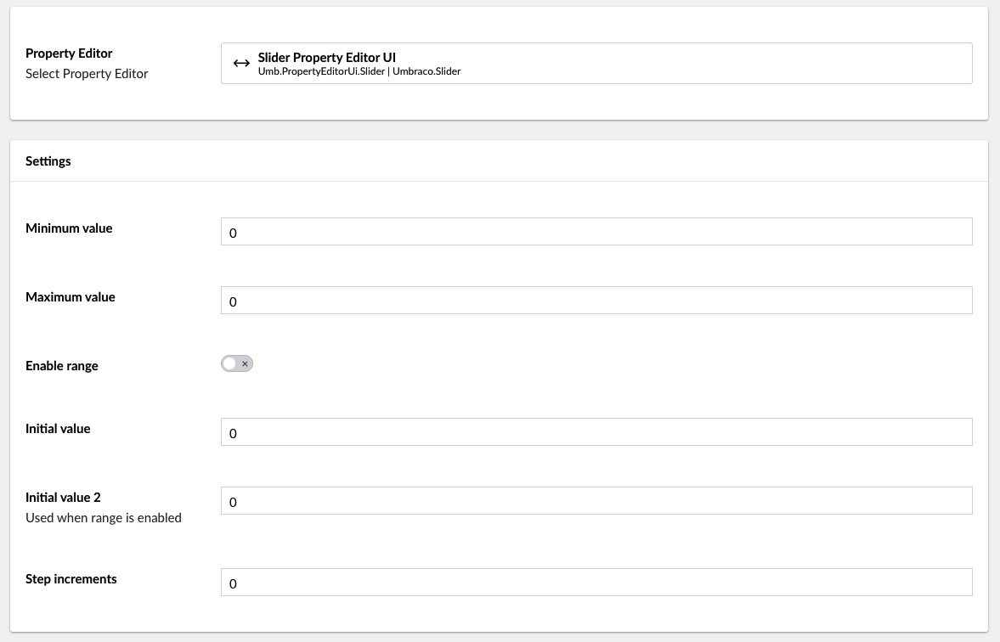

# Slider

`Schema alias: Umbraco.Slider`

`UI Alias: Umb.PropertyEditorUi.Slider`

`Returns: decimal` or `Umbraco.Core.Models.Range<decimal>`

Pretty much like the name indicates this Data type enables editors to choose a value with a range using a slider.

There are two flavors of the slider. One with a single value picker. One with a minimum and maximum value.

## Data Type Definition Example



## Content Example

<figure><figcaption></figcaption></figure>

<figure><figcaption></figcaption></figure>

## MVC View Example

### Without Modelsbuilder

```csharp
@if (Model.HasValue("singleValueSlider"))
{
    var value = Model.Value<decimal>("singleValueSlider");
    <p>@value</p>
}

@if (Model.HasValue("multiValueSlider"))
{
    var value = Model.Value<Umbraco.Cms.Core.Models.Range<decimal>>("multiValueSlider");
    <p>@(value.Minimum) and @(value.Maximum)</p>
}
```

### With Modelsbuilder

```csharp
// with a range off
@if (Model.SingleValueSlider != null)
{
    var value = Model.SingleValueSlider;
    <p>@value</p>
}

// with a range on
@if (Model.MultiValueSlider != null)
{
    var minValue = Model.MultiValueSlider.Minimum;
    var maxValue = Model.MultiValueSlider.Maximum;
    <p>@minValue and @maxValue</p>
}
```

## Add values programmatically

See the example below to see how a value can be added or changed programmatically. To update a value of a property editor you need the [Content Service](https://apidocs.umbraco.com/v14/csharp/api/Umbraco.Cms.Core.Services.ContentService.html).


The example below demonstrates how to add values programmatically using a Razor view. However, this is used for illustrative purposes only and is not the recommended method for production environments.


### With a range off

```csharp
@using Umbraco.Cms.Core.Services;
@inject IContentService Services;
@{
    // Get access to ContentService
    var contentService = Services;

    // Create a variable for the GUID of the page you want to update
    var guid = Guid.Parse("32e60db4-1283-4caa-9645-f2153f9888ef");

    // Get the page using the GUID you've defined
    var content = contentService.GetById(guid); // ID of your page

    // Set the value of the property with alias 'singleValueSlider'. 
    content.SetValue("singleValueSlider", 10);

    // Save the change
    contentService.Save(content);
}
```

### With a range on

```csharp
@using Umbraco.Cms.Core.Services;
@inject IContentService Services;
@{
    // Get access to ContentService
    var contentService = Services;

    // Create a variable for the GUID of the page you want to update
    var guid = Guid.Parse("32e60db4-1283-4caa-9645-f2153f9888ef");

    // Get the page using the GUID you've defined
    var content = contentService.GetById(guid); // ID of your page

    // Create a variable for the desired value of the 'multiValueSlider' property
    var range = new Range<decimal> {Minimum = 10, Maximum = 12};

    // Set the value of the property with alias 'multiValueSlider'. 
    content.SetValue("multiValueSlider", range);

    // Save the change
    contentService.Save(content);
}
```

Although the use of a GUID is preferable, you can also use the numeric ID to get the page:

```csharp
@{
    // Get the page using it's id
    var content = contentService.GetById(1234); 
}
```

If Modelsbuilder is enabled you can get the alias of the desired property without using a magic string:

```csharp
@using Umbraco.Cms.Core.PublishedCache;
@inject IPublishedSnapshotAccessor _publishedSnapshotAccessor;
@{
    // Set the value of the property with alias 'singleValueSlider'
    content.SetValue(Home.GetModelPropertyType(_publishedSnapshotAccessor, x => x.SingleValueSlider).Alias, 10);

    // Set the value of the property with alias 'multiValueSlider'
    content.SetValue(Home.GetModelPropertyType(_publishedSnapshotAccessor, x => x.MultiValueSlider).Alias, new Range<decimal> {Minimum = 10, Maximum = 12});
}
```
