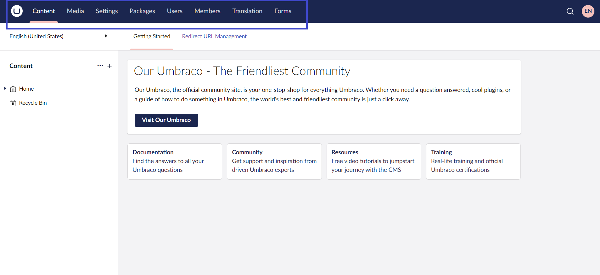

# Sections

A section in Umbraco is where you perform specific tasks related to a particular area of Umbraco. For example, Content, Settings, and Users are all sections. You can navigate between the different sections by clicking the corresponding icon in the section menu positioned at the top of the Backoffice.

Below is a short overview of the default sections in Umbraco CMS:

## Content

The Content section contains the content nodes that make up the website. Content is displayed as nodes in the Content tree.

Nodes in Umbraco can display the following content states:

* Grayed-out nodes are not published yet.
*   Nodes that are currently locked using the Public Access feature.
*  Content nodes that contain a collection of nodes.

To create content, you must define it using Document Types.

For more information, see the [Defining Content](../data/defining-content/) article.

## Media

The Media section contains the media for the website. You can create folders and upload media files, such as images and PDFs. Additionally, you can customize the existing Media Types or define your own from the Settings section.

For more information, see the [Creating Media](../data/creating-media/) article.

## Settings

The Settings section allows you to manage website layout files, languages, media, and content types. It also gives you access to more advanced features such as the Log Viewer and extension insights.

The Settings section consists of:

**Structure**

* Document Types
* Media Types
* Member Types
* Data Types
* Languages
* Document Blueprints

**Templating**

* Templates (`.cshtml` files)
* Partial views (`.cshtml` files)
* Stylesheets (`.css` files)
* Scripts (`.js` files)

**Advanced**

* Relations
* Log Viewer
* Extension Insights
* Webhooks

The **Settings** section in the Umbraco backoffice has its own set of default dashboards.

For more information, see the [Settings Dashboards](settings-dashboards.md) article.

## Packages

In this section, you can browse the different packages available for your Umbraco solution. You can also get an overview of all the packages you have installed or created.

For more information, see the [Packages](../../extending/packages/) article.

## Users

The Users section allows administrators to manage user accounts, assign permissions, set user roles, and monitor user activity within the backoffice. It provides control over who can access and modify content, media, and settings in the CMS.

For more information, see the [Users](../data/users.md) article.

## Members

The Members section allows to create and manage member profiles, set up member groups, and control Member's access to restricted content on the website.

For more information, see the [Members](../data/members.md) article.

## Dictionary

The Dictionary section is where you create and manage Dictionary Items. By managing these dictionary items, you can ensure consistent and efficient content translation and maintenance across different languages.

For more information, see the [Dictionary Items](../data/dictionary-items.md) article.

## Add-Ons

To enhance Umbraco's functionality, you can integrate plugins and extensions tailored to specific needs. These add-ons expand Umbraco's capabilities, allowing for a more customized and powerful content management experience.

For example, you can start with core Umbraco features and later decide to integrate additional products. Currently, Umbraco supports add-on products like:

* **Forms:** Simplifies the creation and management of Forms.
* **Deploy:** Facilitates smooth deployment processes.
* **Workflow:** Enhances content workflows and approval processes.
* **Commerce:** Adds e-commerce capabilities to your site.
* **UI Builder:** Helps in designing and customizing the user interface.

When you add an add-on product to Umbraco, it appears in the Backoffice as a new section, seamlessly extending your content management capabilities.

If you wish to explore the unique features and use cases of Umbraco products, see the [Exploring the Umbraco Products](https://docs.umbraco.com/welcome/getting-started/exploring-the-umbraco-products) article.

For more information about extending the Umbraco platform through packages and integrations, see the [Umbraco DXP](https://docs.umbraco.com/umbraco-dxp) documentation.

## Help Section

The Help section in Umbraco provides documentation and resources to assist in understanding and effectively using the Umbraco CMS. It typically includes the following in the _Getting Started_ Dashboard:

* **Documentation**: Comprehensive guides, tutorials, and references covering different aspects of Umbraco.
* **Community Forums**: Access to forums where you can ask questions, share knowledge, and seek assistance from other Umbraco community members.
* **Resources**: Stay updated with the latest news, access documentation, watch free video tutorials, and register for live demos.
* **Training**: Learn how to effectively use Umbraco through structured courses, webinars, and hands-on tutorials designed to enhance your proficiency with the CMS.

The Help section serves as a valuable resource hub in navigating and leveraging the capabilities of the Umbraco CMS effectively.

## Custom Sections

Along with the default sections that come with Umbraco, you can create your own [Custom Sections](../../customizing/section-trees.md).

## Access based on User Group

A User can access a particular section based on the User Group permissions.

Learn more about how to configure the permissions in the article about [backoffice users](../data/users.md).
