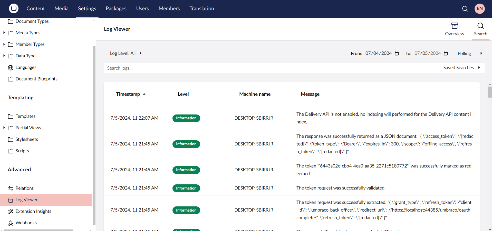

# Subscribing To Notifications

Subscribing to notifications allows you to run custom code in response to specific events, such as when the content is created, updated, or deleted. This feature enables you to automate tasks, validate data, log actions, and implement other custom functionalities to enhance your content management system.

To follow this guide, ensure you have an Umbraco installation with content, such as the Umbraco starter kit. In this article, we will walk you through the process of logging a message every time a document is published in Umbraco.

## Create a Notification Handler

We will add a string of text to the log whenever a document is published. This log is useful for debugging, as different parts of the Umbraco codebase log key events, warnings, and errors.

1. Add a new C# class file to your project. For example: **~/App_Plugins/Notifications/LogWhenPublishedHandler.cs**.
2. Implement the `INotificationHandler<ContentPublishedNotification>` interface to identify this class as a handler for content publication events.
3. Add the following `using` statements at the top of your file:

    ```csharp
    using Umbraco.Cms.Core.Events;
    using Umbraco.Cms.Core.Notifications;
    ```

Your class should now look like this:



```csharp
using Umbraco.Cms.Core.Events;
using Umbraco.Cms.Core.Notifications;

namespace MyProject;

public class LogWhenPublishedHandler : INotificationHandler<ContentPublishedNotification>
{
    // Here we will handle a notification.
}
```



## Implement the Handle Method

The `INotificationHandler` interface requires a `Handle` method to be implemented.

Use the code snippet below to implement the `Handle` method, which takes a `ContentPublishedNotification` parameter. This method will contain the custom logic that runs after content is published.



```csharp
using Umbraco.Cms.Core.Events;
using Umbraco.Cms.Core.Notifications;

namespace MyProject;

public class LogWhenPublishedHandler : INotificationHandler<ContentPublishedNotification>
{
    public void Handle(ContentPublishedNotification notification)
    {
        // The custom code to fire every time content is published goes here!
        throw new System.NotImplementedException();
    }
}
```



## Inject a Logger for Logging

To log messages, we need to inject a `Microsoft ILogger` into the handler.

1. Add a `using` statement for the `Microsoft.Extensions.Logging` namespace to your file.
2. Add a constructor to the handler class that accepts an `ILogger` instance.

Your updated class should look like this:



```csharp
using Microsoft.Extensions.Logging;
using Umbraco.Cms.Core.Events;
using Umbraco.Cms.Core.Notifications;

namespace MyProject;

public class LogWhenPublishedHandler : INotificationHandler<ContentPublishedNotification>
{
    private readonly ILogger<LogWhenPublishedHandler> _logger;

        public LogWhenPublishedHandler(ILogger<LogWhenPublishedHandler> logger)
        {
            _logger = logger;
        }

        public void Handle(ContentPublishedNotification notification)
        {
            // The custom code to fire every time content is published goes here!
            throw new System.NotImplementedException();
        }
}
```



## Log the Content Publication

Now that we have a logger, let us use it to log a message every time content is published.

Use the code snippet below to replace the `NotImplementedException` with the code that logs the publication event.



```csharp
public void Handle(ContentPublishedNotification notification)
{
    // The custom code to fire every time content is published goes here!
    _logger.LogInformation("Something has been published.");
    foreach (var publishedItem in notification.PublishedEntities)
    {
        _logger.LogInformation("{ContentName} was published", publishedItem.Name);
    }
}
```



<details>

<summary>See the entire handler class: LogWhenPublishedHandler.cs</summary>



```csharp
using Microsoft.Extensions.Logging;
using Umbraco.Cms.Core.Events;
using Umbraco.Cms.Core.Notifications;

namespace MyProject;

public class LogWhenPublishedHandler : INotificationHandler<ContentPublishedNotification>
{
    private readonly ILogger<LogWhenPublishedHandler> _logger;
            
        public LogWhenPublishedHandler(ILogger<LogWhenPublishedHandler> logger)
        {
            _logger = logger;
        }

        public void Handle(ContentPublishedNotification notification)
        {
            _logger.LogInformation("{ContentName} was published", publishedItem.Name);
        }
}
```



</details>

## Register the Notification Handler

Umbraco needs to know that our handler exists and that it handles `ContentPublishedNotification`. We need to register it in the **Program.cs** file.


Registering dependencies and extensions like this can be done using different methods. Which method to use in each situation depends on whether the extension is added to the Umbraco site or a package.

Learn more about registering dependencies in the [Dependency Injection](../../reference/using-ioc.md) article.


1. Open the **Program.cs** file at the root of the project.
2. Add the `using Umbraco.Cms.Core.Notifications;` statement.

    ```csharp
    using Umbraco.Cms.Core.Notifications;
    ```

3. Register the handler in the builder configuration by adding the `.AddNotificationHandler<ContentPublishedNotification, LogWhenPublishedHandler>()` method call.

    The registration should look like this:

    ```csharp
    builder.CreateUmbracoBuilder()
        .AddBackOffice()
        .AddWebsite()
        .AddDeliveryApi()
        .AddComposers()
        .AddNotificationHandler<ContentPublishedNotification, LogWhenPublishedHandler>()
        .Build();
    ```

## Publishing Content and Verifying Custom Log Messages

1. Access the Umbraco backoffice and publish a piece of content.
2. Check the log messages in the **Log Viewer** under the **Settings** section.

    

3. Search **All Logs**.

If everything is set up correctly you will see your custom log messages.



## Additional Notes

* The code in this article logs a message after content is published because we subscribed to  `ContentPublishedNotification`.
* If you need to run code before content is published, you can subscribe to `ContentPublishingNotification` instead.
* This pattern applies to other events as well, such as **Saving**, **Saved**, **Copying**, **Copied** and so on.

## More Information

* For further details on Notifications in Umbraco, see the [Using Notifications](../../reference/notifications/README.md) article.
