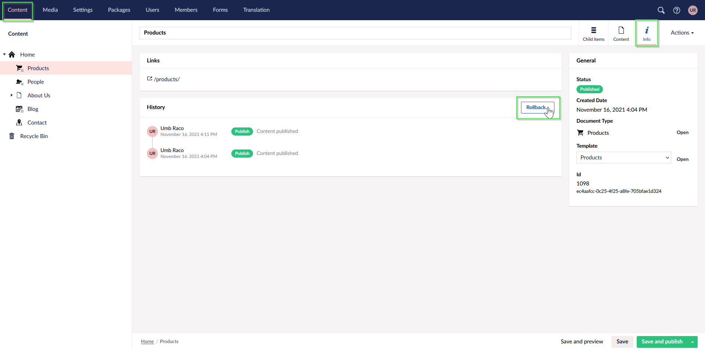
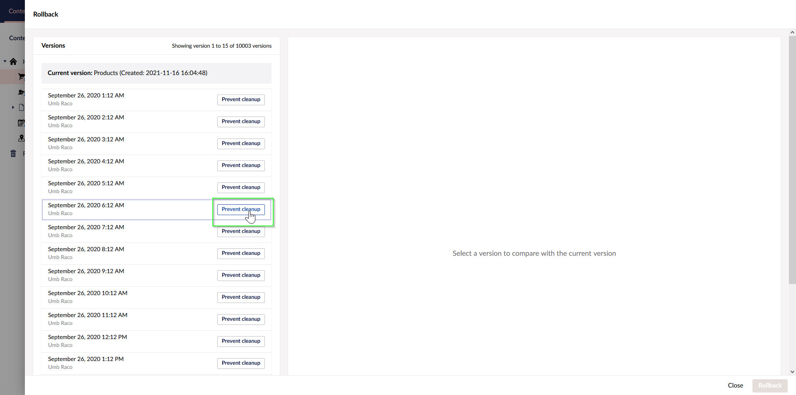

# Content Version Cleanup

A new version is created whenever you save and publish a content item in Umbraco. This is how you can roll back to a previous version. Every saved version stores a record in the database, not only for the version but also for each content item property for that version. In a multi-lingual site, further rows are added for every culture variation. Over time, this amount of data can build and swallow up your SQL Server's capacity and slow the Umbraco backoffice's performance.

## How it works

A scheduled job will delete content versions regularly when the Content Version Cleanup Policy is enabled. For more information on how often content is deleted, read the [ContentSettings article](../../reference/configuration/contentsettings.md#enablecleanup).

The default cleanup policy will:

* Not delete any versions created over the previous 4 days. The recent version history is preserved. See the `KeepAllVersionsNewerThanDays` setting.
* 'Prune' versions 4 days after they are created. The last version of a content item saved on a particular day will be kept but earlier versions from that day will be deleted.
* Delete all versions older than 90 days. See the `KeepLatestVersionPerDayForDays` setting.
* Never delete any versions that are currently 'published'.
* Never delete any specific versions marked as 'Prevent Cleanup' in the Backoffice version history.



Based on the default cleanup policy, you can roll back content to the latest version saved on a particular day as long as it was

* Created within the last 90 days, or
* Marked as "Prevent Cleanup" in the Backoffice version history.

The **History** section, which acts as an audit log, is not cleared out and will continue to show logs for versions older than 90 days.


The feature can be configured in the `appSettings.json`:

```json
{
  "Umbraco": {
    "CMS": {
      "Content": {
        "ContentVersionCleanupPolicy": {
          "EnableCleanup": true,
          "KeepLatestVersionPerDayForDays": 90,
          "KeepAllVersionsNewerThanDays": 4
        }
      }
    }
  }
}
```

For sites with stricter requirements, it is possible to opt out of both options globally, see [ContentSettings](../../reference/configuration/contentsettings.md#contentversioncleanuppolicy) and by Document Type.

Additionally, it is possible to keep the feature enabled but mark specific versions to keep forever.

It is worth noting that whilst we delete rows, we do not shrink database files or rebuild indexes. For upgraded sites with a lot of history, you may wish to perform these tasks. If they are not part of your regular database maintenance plan already.

## Overriding global settings

It is possible to override the global settings per Document Type in the backoffice to prevent unwanted cleanup. This can be managed in the "permissions" Content App for each Document Type.

<figure><figcaption><p>Content Version Cleanup - Document Type overrides</p></figcaption></figure>

## Prevent cleanup of important versions

It is possible to mark important content versions as "prevent cleanup" to ensure they are never removed. This happens via the new and improved rollback modal which can be found on the "info" content app for each document.

1.  Open the rollback modal.

    <figure><figcaption></figcaption></figure>
2.  Click **Prevent cleanup** button for each important version.

    <figure><figcaption></figcaption></figure>
