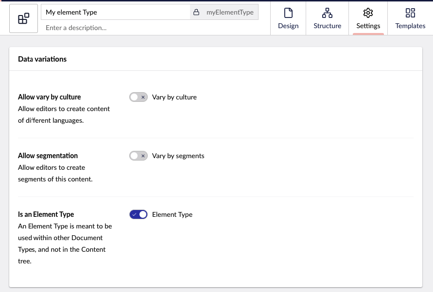

# Default Document Types

On this page, you will find the default Document Types in Umbraco. If you want to use these Document Types, you can create them in the Settings section.

## Document Type

A Document Type defines the content structure and fields that can be used across different content items.  When creating a Document Type without a template, you focus solely on structured content without tying it to a specific design or layout. This is ideal for content that doesn’t require direct front-end rendering, such as reusable blocks or items managed within a headless CMS setup.

Use a Document Type without a template for structured, reusable content like metadata schemas, settings, or components such as product details and author profiles.

## Document Type with Template

A Document Type with a Template combines the content structure with a predefined visual presentation. This approach links your structured content with a specific page design, ensuring a consistent and cohesive look and feel across your site. It allows you to manage content and its appearance separately, which makes updates more efficient.

Use a Document Type with a template for pages like blog posts, landing pages, or services that appear directly on the website.

## Element Type

An Element Type is a Document Type *without a template* designed for reusabale and repeatable set of properties. These are primarily used in editors like the Block List Editor or Block Grid Editor to create structured, nested content.

Element Types are not part of the Content tree and cannot render directly on the front end. When created, the **Is an Element Type** flag in the **Permissions** tab is automatically set to **True**.

Use an Element Type when defining building blocks for complex page layouts, such as grid blocks or call-to-action sections. They are an essential part of modular content design.

## Folder

A Folder is a special type of Document Type used solely for organizing content within the Content tree. Folders can contain other content items, such as other folders or content nodes.

Use a Folder to logically group related content in your Content tree, such as organizing articles by category or grouping assets for better management. This enhances navigation and keeps your content structure clean.
