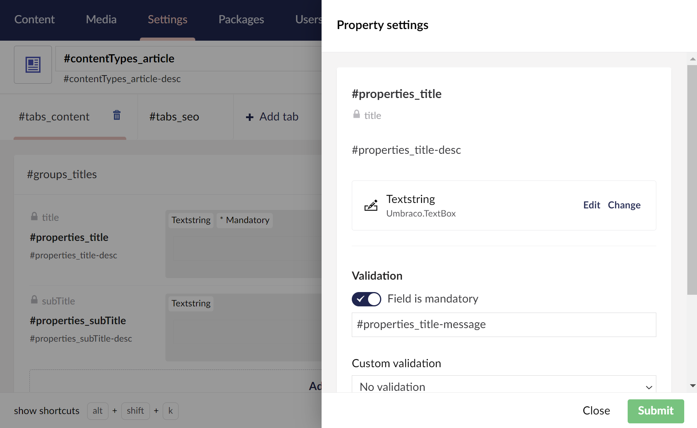
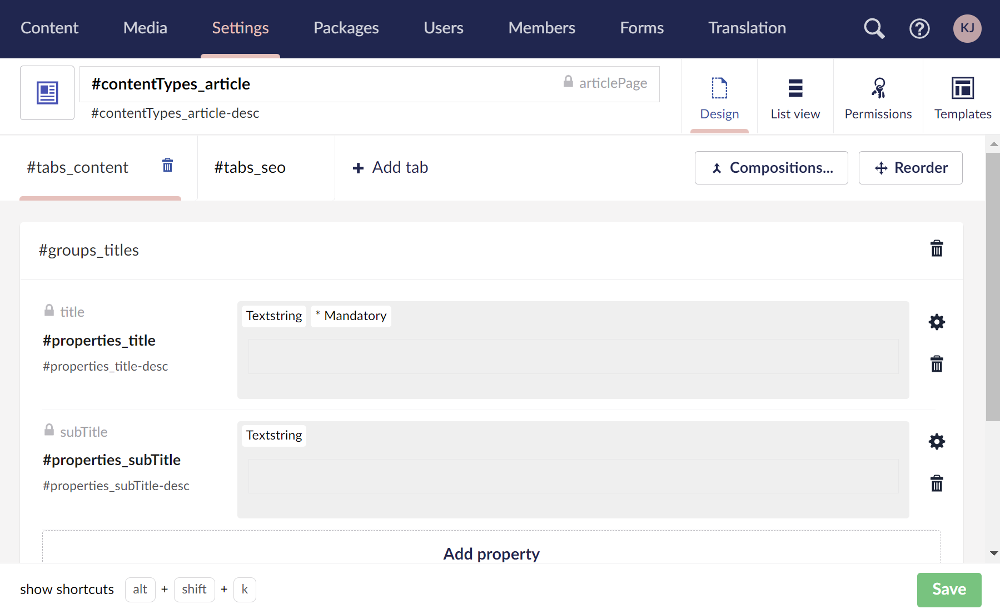
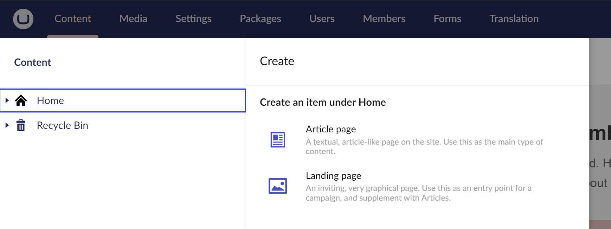
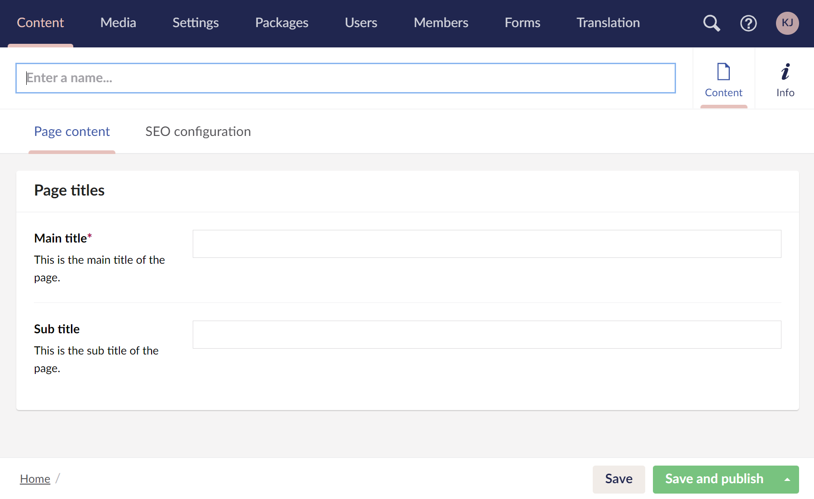
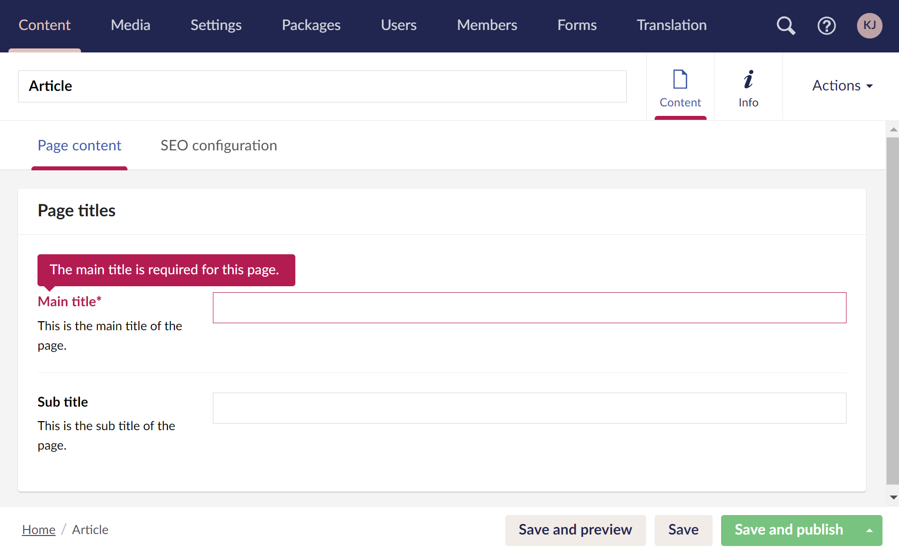

# Document Type Localization


This article is a work in progress and may undergo further revisions, updates, or amendments. The information contained herein is subject to change without notice.


The Umbraco backoffice is fully localized to match the user's [configured language](../users.md). When defining Document Types, you can apply localization to:

* Document Type names and descriptions.
* Property names and descriptions.
* Custom property validation messages.
* Tab and group names.

Setting up localization for Document Types is a two-step process:

* Create the localizations in [user defined language files](../../../extending/language-files/README.md).
* Apply the localizations to the Document Types.


Everything in this article also applies to defining [Media Types](../creating-media/).


## Creating localizations

User defined language files are created in `/config/lang` and must be named `{language}.user.xml`. For example:  `en-us.user.xml`.

There are no specific requirements as to how localizations should be structured for use in Document Types. The following localizations have been used for the samples in this article:



```xml
<?xml version="1.0" encoding="utf-8" standalone="yes"?>
<language>
    <area alias="contentTypes">
        <key alias="article">Article page</key>
        <key alias="article-desc">A textual, article-like page on the site. Use this as the main type of content.</key>
        <key alias="landing">Landing page</key>
        <key alias="landing-desc">An inviting, very graphical page. Use this as an entry point for a campaign, and supplement with Articles.</key>
    </area>
    <area alias="tabs">
        <key alias="content">Page content</key>
        <key alias="seo">SEO configuration</key>
    </area>
    <area alias="groups">
        <key alias="titles">Page titles</key>
    </area>
    <area alias="properties">
        <key alias="title">Main title</key>
        <key alias="title-desc">This is the main title of the page.</key>
        <key alias="title-message">The main title is required for this page.</key>
        <key alias="subTitle">Sub title</key>
        <key alias="subTitle-desc">This is the sub title of the page.</key>
    </area>
</language>
```




Umbraco must be restarted to pick up on changes to language files.


## Applying localizations

The localizations are applied by using the syntax `#{area alias}_{key alias}`.

1. Create a **Document Type with template** called `#contentTypes_article` with **alias**: `articlePage`.
2. Under the newly created Document Type follow these steps:

* Name the **description** to `#contentTypes_article-desc`.
* Create a new **tab** called `#tabs_content`.
* Add a new **group** called `#groups_titles`.
* Add a **property** called `#properties_title` with **alias** `title`.
  * Set description to `#properties_title-desc`.
  * Use a `TextString` editor.
  * Enable to `Set this field as mandatory`.
  * Under validation add `#properties_title-message`.



* Add a **property** called `#properties_subTitle` with **alias** `subTitle`.
  * Set description to `#properties_subTitle-desc`.
  * Use a `TextString` editor.
* Enable to `Allow as root` in the **Permissions** tab.



3. When creating and editing the content, you will see that the backoffice now uses the configured localizations.&#x20;



4. Create a new "Article" content:



4. When trying to save the content without adding the mandatory content, you will see a warning as expected:


