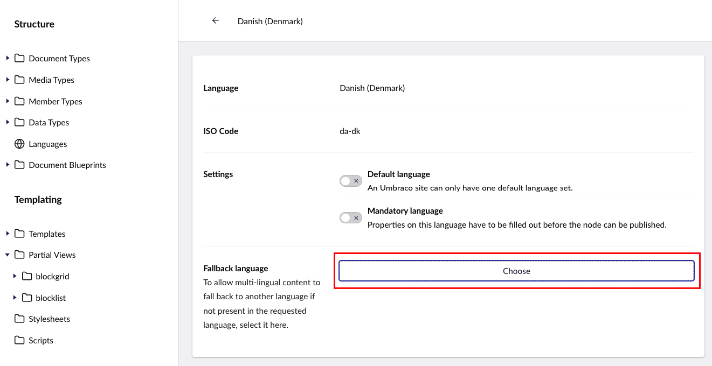
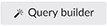
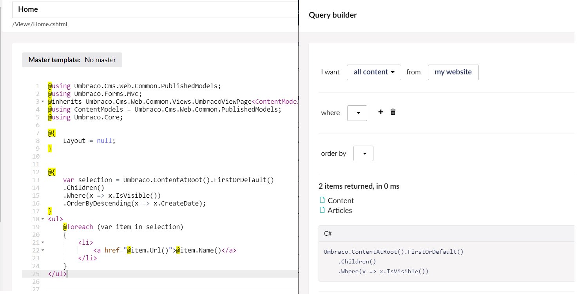

# Rendering Content

_The primary task of any template is to render the values of the current page or the result of a query against the content cache._

## Display a value in your template view

Each property in your [Document Type](../data/defining-content/#what-is-a-document-type) has an alias, this is used to specify where in the template view to display the value.

```html
<h1>@Model.Value("pageTitle")</h1>
<div>@Model.Value("bodyContent")</div>
<time>@Model.Value("articleDate")</time>
```

### Specifying types of data

You can specify the type of data being returned to help you format the value for display.

In our example, we have a string, a date and some rich text:

```html
<h1>@(Model.Value<string>("pageTitle"))</h1>
<div>@(Model.Value<IHtmlEncodedString>("bodyContent"))</div>
<p>Article date: <time>@(Model.Value<DateTime>("articleDate").ToString("dd/MM/yyyy"))</time></p>
```


To use `IHtmlEncodedString` as the typed value, add the `@using Umbraco.Cms.Core.Strings;` directive.


### Using ModelsBuilder

```html
<h1>@Model.PageTitle</h1>
<div>@Model.BodyContent</div>
<time>@Model.ArticleDate.ToString("dd/MM/yyyy")</time>
```

### Using fall-back methods

The `.Value()` method has a number of optional parameters that support scenarios where we want to "fall-back" to some other content.

To use the `fallback` type, add the `@using Umbraco.Cms.Core.Models.PublishedContent;` directive.

*   To display a static, default value when a property value is not populated on the current content item:

    ```csharp
    @Model.Value("pageTitle", fallback: Fallback.ToDefaultValue, defaultValue: new HtmlString("Default page title"))
    ```
*   A second supported method is to traverse up the tree ancestors to try to find a value. If the current content item isn't populated for a property, we can retrieve the value from the parent, grand-parent, or a higher ancestor in the tree. The first ancestor encountered that has a value will be the one returned.

    ```csharp
    @Model.Value("pageTitle", fallback: Fallback.ToAncestors)
    ```
*   If developing a multi-lingual site and fall-back languages\* have been configured, the third method available is to retrieve a value for a different language, if the language we are requesting does not have content populated. In this way, we could render a field containing French content for a property if it's populated in that language, and if not, default to English.

    ```csharp
    @Model.Value("pageTitle", "fr", fallback: Fallback.ToLanguage)
    ```
*   We can also combine these options to create some more sophisticated scenarios. For example, we might want to fall-back via language first, and if that doesn't find any populated content, then try to find a value by traversing through the ancestors of the tree. We can do that using the following syntax, with the order of the fall-back options provided determining the order that content will be attempted to be retrieved:

    ```csharp
    @Model.Value("pageTitle", "fr", fallback: Fallback.To(Fallback.Language, Fallback.Ancestors))
    ```
*   In this example, we are looking for content firstly on the current node for the default language, and if not found we'll search through the ancestors. If failing to find any populated value from them, we'll use the provided default:

    ```csharp
    @Model.Value("pageTitle", fallback: Fallback.To(Fallback.Ancestors, Fallback.DefaultValue), defaultValue: new HtmlString("Default page title"))
    ```
*   We can use similar overloads when working with ModelsBuilder, for example:

    ```csharp
    // For projects created before January 2020
    @Model.Value(x => x.PageTitle, "fr", fallback: Fallback.ToLanguage)
    @Model.Value(x => x.PageTitle, fallback: Fallback.To(Fallback.Ancestors, Fallback.DefaultValue), defaultValue: new HtmlString("Default page title"))

    // For projects created after January 2020
    @Model.ValueFor(x => x.PageTitle, "fr", fallback: Fallback.ToLanguage)
    @Model.ValueFor(x => x.PageTitle, fallback: Fallback.To(Fallback.Ancestors, Fallback.DefaultValue), defaultValue: new HtmlString("Default page title"))
    ```

    * Fall-back languages can be configured via the **Languages** tree within the **Settings** section.
    * Each language can optionally be provided with a fall-back language, that will be used when content is not populated for the language requested and the appropriate overload parameters are provided.
    *   It is possible to chain these language fall-backs, so requesting content for Portuguese, could fall-back to Spanish and then on to English.

        

## Query content

In many cases, you want to do more than display values from the current page, like creating a list of pages in the navigation. You can access content relative to the current page using methods such as `Children()`, `Descendants()` & `Ancestors()`. Explore the [full list of methods](../../reference/templating/mvc/querying.md#traversing).

You can do this by querying content relative to your current page in template views:

```csharp
<ul>
    @foreach (var child in Model.Children())
    {
        <li><a href="@child.Url()">@child.Name()</a></li>
    }
</ul>
```

You can use the Query Builder in the template editor to build more advanced queries. 



### More information

* [Razor examples](../../reference/templating/mvc/examples.md)
* [Querying](../../reference/templating/mvc/querying.md)
