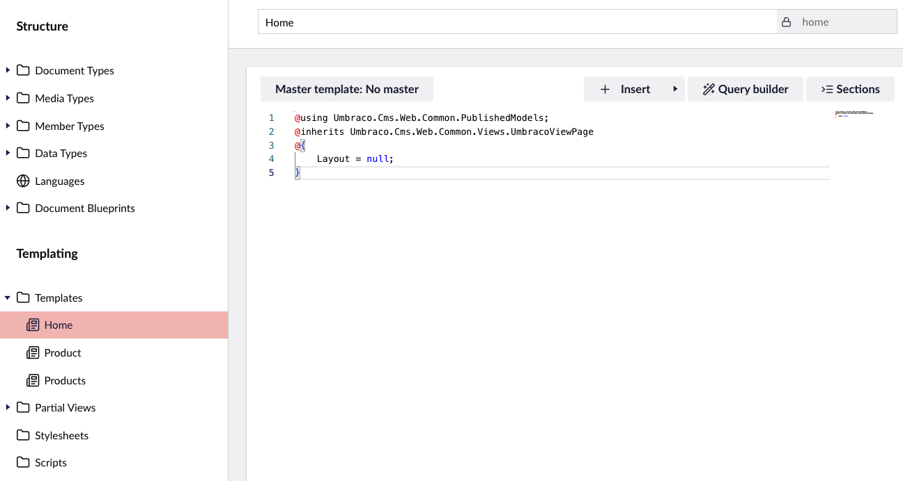
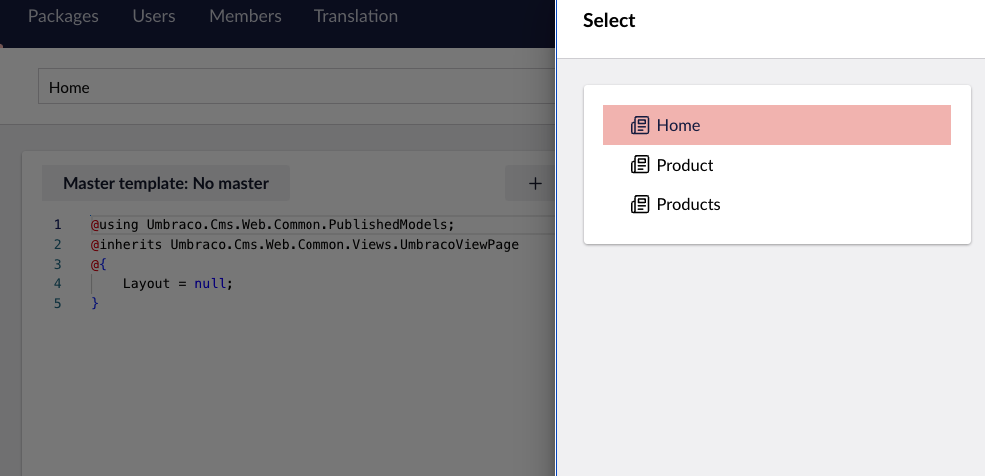
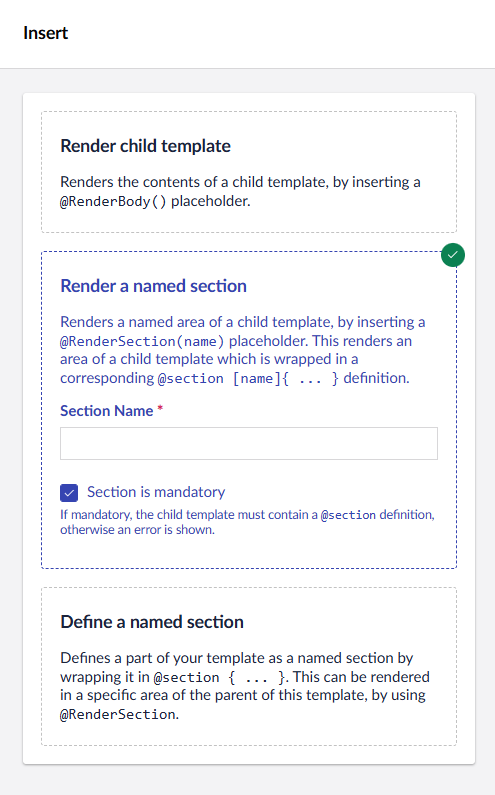
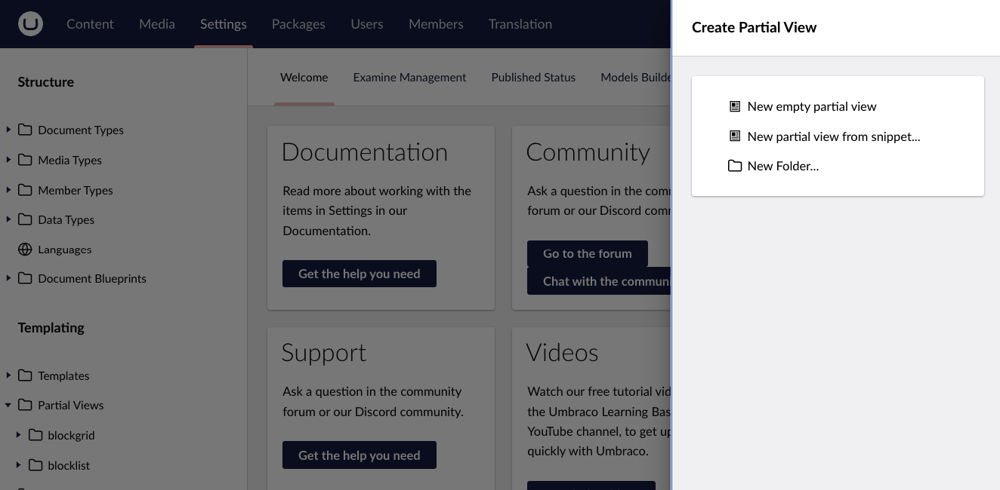

# Templates

Templates are the files that control the look and feel of the frontend of your Umbraco websites. Building on the concept of MVC Razor Views, template files enable you to structure your websites using HTML, CSS, and JavaScript. When tied to a Document Type, templates are used to render your Umbraco content on the frontend.

You can manage and work with your templates directly from the Settings section in the Umbraco backoffice. Each Template can also be found as a `cshtml` file in the `Views` folder in your project directory.

## Creating Templates

When building an Umbraco website you can automatically generate Templates when you create a new Document Type. This will ensure the connection between the two and you can jump straight from defining the content to structuring it.

Choose the option called **[Document Type with Template](../../data/defining-content/README.md)** when you create a new Document Type to automatically create a Template as well.

In some cases, you might want to create independent Templates that don't have a direct connection to a Document Type. You can follow the steps below to create a new blank Template:

1. Go to the **Settings** section inside the Umbraco backoffice.
2. Click **...** next to the **Templates** folder.
3. Choose **Create**.
4. Enter a template name.
5. Click the **Save** button.

You will now see the default template markup in the backoffice template editor.



## Allowing a Template on a Document Type

To use a Template on your content, you must first allow it on the content Document Type.

1. Open the Document Type you want to use the template.
2. Open the **Templates** Workspace View.
3. Select your Template under the **Allowed Templates** section.


## Inheriting a Template

A Template can inherit content from a "Master Template". This is done by using the ASP.NET views Layout feature.

Let's say you have a Template called **MainView**, containing the following HTML:

```csharp
@inherits Umbraco.Cms.Web.Common.Views.UmbracoViewPage
@{
    Layout = null;
}
<!DOCTYPE html>
<html lang="en">
    <body>
        <h1>Hello world</h1>
        @RenderBody()
    </body>
</html>
```

This file contains the structural HTML tags for your website.

By using the Template as the "Master Template" on your other Templates, you can ensure that they inherit the same structural HTML.

Follow these steps to use a Template file as a Master Template:

1. Open one of your Template files.
2. Select the **Master template: No master** button above the editor.
3. Select the Template that should be defined as the Master Template.
4. Click **Choose**.



Alternatively, you can manually change the value of the `Layout` variable in the Template using the name of the Template file.

The updated markup will look something like the snippet below and the Template is now referred to as a *Child Template*:

```csharp
@inherits Umbraco.Web.Mvc.UmbracoViewPage
@{
    Layout = "MainView.cshtml";
}
<p>My content</p>
```

When a page that uses a Template with a Master Template defined is rendered, the HTML of the two templates is merged.

The code from the Template replaces the `@RenderBody()` tag in the Master Template. Following the examples above, the final HTML will look like the code in the snippet below:

```csharp
@inherits Umbraco.Web.Mvc.UmbracoViewPage
@{
    Layout = null;
}
<!DOCTYPE html>
<html lang="en">
    <body>
        <h1>Hello world</h1>
        <p>My content</p>
    </body>
</html>
```

## Named Sections

Template Sections give you added flexibility when building your templates. Use the Template Section together with a Master Template setup, to decide where sections of content are placed.

If a Child Template needs to add code to the `<head>` tag a Section must be defined and then used in the Master Template. This is made possible by [Named Sections](https://www.youtube.com/watch?v=lrnJwglbGUA).

The following steps will guide you through defining and using a Named Section:

1. Open your Template.
2. Select the **Sections** option.
3. Choose **Define a named section**.
4. Give the section a name and click **Submit**.


The following code will be added to your Template:

```csharp
@section SectionName {
    
}
```

5. Add your code between the curly brackets.
6. Save the changes.
7. Open the Master Template.
8. Choose a spot for the section and set the cursor there.
9. Select the **Sections** option.
10. Choose **Render a named section**.
11. Enter the name of the section you want to add.
12. Click **Submit**.

For instance, if you want to be able to add HTML to your `<head>` tags, you would add the tag there:

```csharp
@inherits Umbraco.Web.Mvc.UmbracoViewPage
@{
    Layout = null;
}

<html>
    <head>
        <title>Title</title>
        @RenderSection("SectionName", false)
    </head>

    <body>
    </body>
</html>
```

You can decide whether a section should be mandatory or not. Making a section mandatory means that any template using the Master Template is required to have the section defined.


Keep in mind that whenever a mandatory named section is missing, it will result in errors on your website.


To make the section mandatory, you have two options:

* Add `true` to the code tag: `@RenderSection("SectionName", true)`.
* Check the **Section is mandatory** field when using the **Sections** dialog in the backoffice.



## Injecting Partial Views

Another way to reuse HTML is to use partial views - which are small reusable views that can be injected into another view.

Like templates, you can create a partial view, by clicking **...** next to the **Partial Views** folder and selecting **Create**. You can then either create an empty partial view or a partial view from a snippet.



The created partial view can now be injected into any template by using the `@Html.Partial()` method like so:

```csharp
@inherits Umbraco.Web.Mvc.UmbracoViewPage
@{
    Layout = "MasterView.cshtml";
}

<h1>My new page</h1>
@Html.Partial("a-new-view")
```

### Related Articles

* [Basic Razor syntax](basic-razor-syntax.md)
* [Rendering content](../rendering-content.md)

### Tutorials

* [Creating a basic website with Umbraco](../../../tutorials/creating-a-basic-website/)
