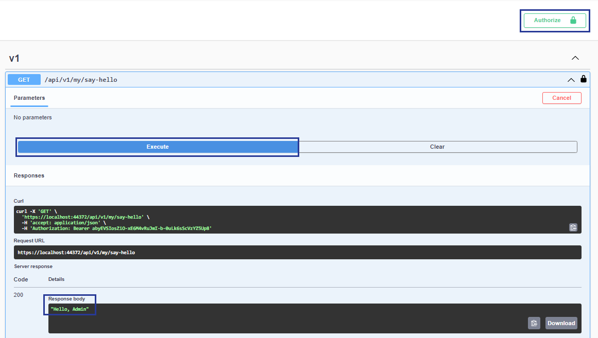

# Custom API with Authorization and Swagger

This article covers how to create a Custom API controller that is protected by the backoffice authorization policy. It also advertises itself in Swagger docs with authorization UI enabled.

This example can be a starting point for creating a secure custom API in the Swagger documentation or using the API Controller. You can find other examples in the [API versioning and OpenAPI](./api-versioning-and-openapi.md) article.



Before  proceeding, make sure to read the [Management API](./management-api/README.md) article. It provides information about the Swagger documentation and Authorization used in this article.



1. Create a new `.cs` file called `MyBackOfficeSecurityRequirementsOperationFilter` at the root of the project in an Umbraco v14+ installation.

2. Add the following code so that the new API shows in the Swagger documentation and Swagger UI:


```csharp
{
using Asp.Versioning;
using Microsoft.AspNetCore.Authorization;
using Microsoft.AspNetCore.Mvc;
using Microsoft.Extensions.Options;
using Microsoft.OpenApi.Models;
using Swashbuckle.AspNetCore.SwaggerGen;
using Umbraco.Cms.Api.Common.Attributes;
using Umbraco.Cms.Api.Common.Filters;
using Umbraco.Cms.Api.Management.OpenApi;
using Umbraco.Cms.Core;
using Umbraco.Cms.Core.Composing;
using Umbraco.Cms.Core.Models.Membership;
using Umbraco.Cms.Core.Security;
using Umbraco.Cms.Web.Common.Authorization;

namespace Umbraco.Cms.Web.UI.New.Custom;

//Necessary code for the new API to show in the Swagger documentation and Swagger UI
public class MyBackOfficeSecurityRequirementsOperationFilter : BackOfficeSecurityRequirementsOperationFilterBase
{
    protected override string ApiName => "my-api-v1";
}

public class MyConfigureSwaggerGenOptions : IConfigureOptions<SwaggerGenOptions>
{
    public void Configure(SwaggerGenOptions options)
    {
        options.SwaggerDoc("my-api-v1", new OpenApiInfo { Title = "My API v1", Version = "1.0" });
        options.OperationFilter<MyBackOfficeSecurityRequirementsOperationFilter>();
    }
}

public class MyComposer : IComposer
{
    public void Compose(IUmbracoBuilder builder)
        => builder.Services.ConfigureOptions<MyConfigureSwaggerGenOptions>();
}

//Creating the Controller
[ApiController]
[ApiVersion("1.0")] 
[MapToApi("my-api-v1")] 
[Authorize(Policy = AuthorizationPolicies.BackOfficeAccess)] 
[JsonOptionsName(Constants.JsonOptionsNames.BackOffice)]
[Route("api/v{version:apiVersion}/my")]
public class MyApiController : Controller
{
    private readonly IBackOfficeSecurityAccessor _backOfficeSecurityAccessor;

    public MyApiController(IBackOfficeSecurityAccessor backOfficeSecurityAccessor)
        => _backOfficeSecurityAccessor = backOfficeSecurityAccessor;

    [HttpGet("say-hello")]
    [MapToApiVersion("1.0")]
    [ProducesResponseType(typeof(string), StatusCodes.Status200OK)]
    public IActionResult SayHello()
    {
        IUser currentUser = _backOfficeSecurityAccessor.BackOfficeSecurity?.CurrentUser
                            ?? throw new InvalidOperationException("No backoffice user found");
        return Ok($"Hello, {currentUser.Name}");
    }
}
}
```


- The `BackOfficeSecurityRequirementsOperationFilter` enables backoffice authentication for Swagger UI.
- `BackOfficeSecurityRequirementsOperationFilterBase` is an abstract base class that can be reused for custom APIs.

2. Add the ApiController to setup the logic behind the endpoint:


```csharp
{
...

//Creating the Controller
[ApiController]
[ApiVersion("1.0")] 
[MapToApi("my-api-v1")] 
[Authorize(Policy = "New" + AuthorizationPolicies.BackOfficeAccess)] 
[JsonOptionsName(Constants.JsonOptionsNames.BackOffice)]
[Route("api/v{version:apiVersion}/my")]
public class MyApiController : Controller
{
    private readonly IBackOfficeSecurityAccessor _backOfficeSecurityAccessor;

    public MyApiController(IBackOfficeSecurityAccessor backOfficeSecurityAccessor)
        => _backOfficeSecurityAccessor = backOfficeSecurityAccessor;

    [HttpGet("say-hello")]
    [MapToApiVersion("1.0")]
    [ProducesResponseType(typeof(string), StatusCodes.Status200OK)]
    public IActionResult SayHello()
    {
        IUser currentUser = _backOfficeSecurityAccessor.BackOfficeSecurity?.CurrentUser
                            ?? throw new InvalidOperationException("No backoffice user found");
        return Ok($"Hello, {currentUser.Name}");
    }
}
}
```


<details>

<summary>See the entire file: MyBackOfficeSecurityRequirementsOperationFilter.cs</summary>


```csharp
using Asp.Versioning;
using Microsoft.AspNetCore.Authorization;
using Microsoft.AspNetCore.Mvc;
using Microsoft.Extensions.Options;
using Microsoft.OpenApi.Models;
using Swashbuckle.AspNetCore.SwaggerGen;
using Umbraco.Cms.Api.Common.Attributes;
using Umbraco.Cms.Api.Common.Filters;
using Umbraco.Cms.Api.Management.OpenApi;
using Umbraco.Cms.Core;
using Umbraco.Cms.Core.Composing;
using Umbraco.Cms.Core.Models.Membership;
using Umbraco.Cms.Core.Security;
using Umbraco.Cms.Web.Common.Authorization;

namespace Umbraco.Cms.Web.UI.New.Custom;

//Necessary code for the new API to show in the Swagger documentation and Swagger UI
public class MyBackOfficeSecurityRequirementsOperationFilter : BackOfficeSecurityRequirementsOperationFilterBase
{
    protected override string ApiName => "my-api-v1";
}

public class MyConfigureSwaggerGenOptions : IConfigureOptions<SwaggerGenOptions>
{
    public void Configure(SwaggerGenOptions options)
    {
        options.SwaggerDoc("my-api-v1", new OpenApiInfo { Title = "My API v1", Version = "1.0" });
        options.OperationFilter<MyBackOfficeSecurityRequirementsOperationFilter>();
    }
}

public class MyComposer : IComposer
{
    public void Compose(IUmbracoBuilder builder)
        => builder.Services.ConfigureOptions<MyConfigureSwaggerGenOptions>();
}

//Creating the Controller
[ApiController]
[ApiVersion("1.0")] 
[MapToApi("my-api-v1")] 
[Authorize(Policy = AuthorizationPolicies.BackOfficeAccess)] 
[JsonOptionsName(Constants.JsonOptionsNames.BackOffice)]
[Route("api/v{version:apiVersion}/my")]
public class MyApiController : Controller
{
    private readonly IBackOfficeSecurityAccessor _backOfficeSecurityAccessor;

    public MyApiController(IBackOfficeSecurityAccessor backOfficeSecurityAccessor)
        => _backOfficeSecurityAccessor = backOfficeSecurityAccessor;

    [HttpGet("say-hello")]
    [MapToApiVersion("1.0")]
    [ProducesResponseType(typeof(string), StatusCodes.Status200OK)]
    public IActionResult SayHello()
    {
        IUser currentUser = _backOfficeSecurityAccessor.BackOfficeSecurity?.CurrentUser
                            ?? throw new InvalidOperationException("No backoffice user found");
        return Ok($"Hello, {currentUser.Name}");
    }
}
```


</details>

3. Run the project and navigate to `{yourdomain}/umbraco/swagger`.
4. From **Select a definition** choose the swagger documentation we have created with the above code, called **My API v1**.


Here, we can find the endpoint that we created:

```http
GET /api/v1/my/say-hello
```

5. Authenticate via the **Authorize** button.

6. Once authenticated try out the endpoint via the **Try it out** button and then click on **Execute**:



We now get the response we have setup using the code: `"Hello, {{userName}}"`.
