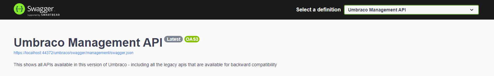
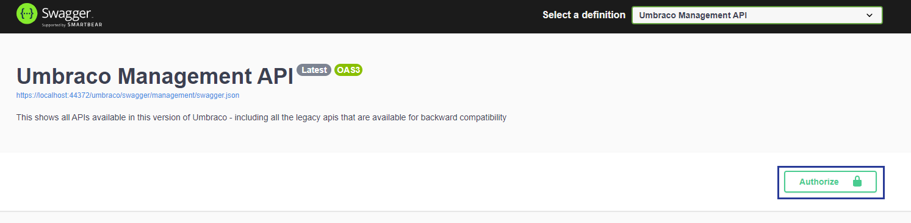
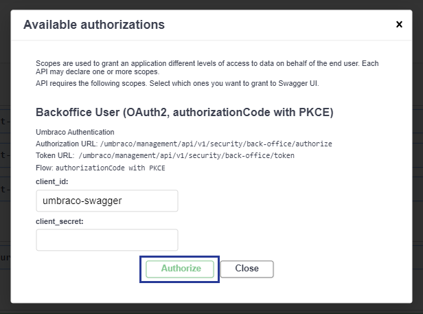
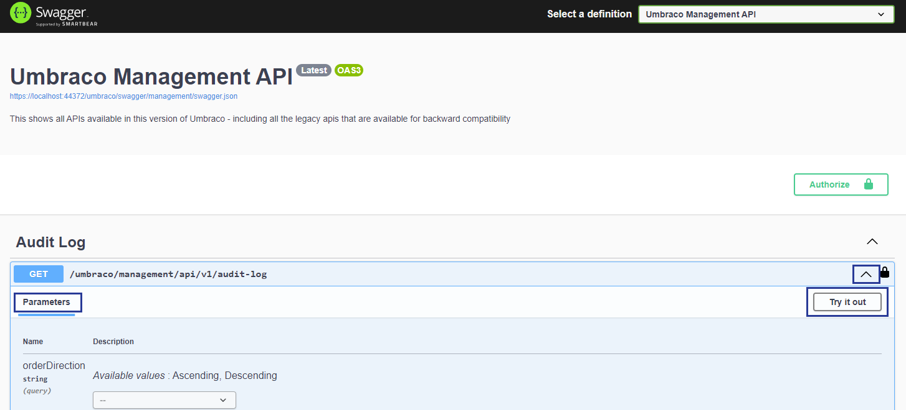
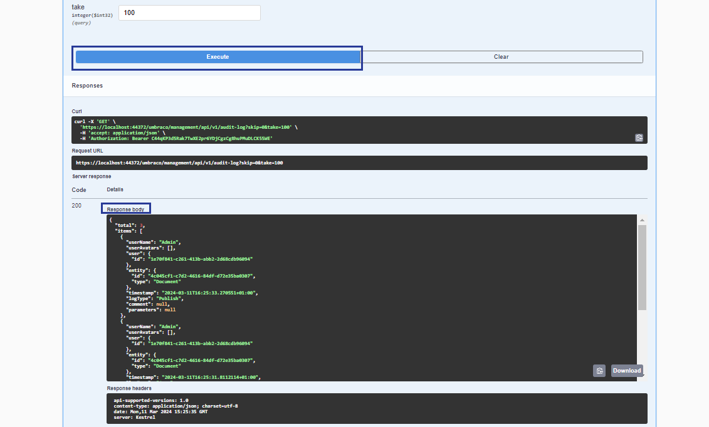

# Management API

The Management API delivers headless capabilities built directly into Umbraco. In comparison with the Content Delivery API, Management API allows interaction with everything else from the backoffice apart from the content and media items. You can then receive responses in a JSON format and lets you preset them in different channels, using your preferred technology stack. This feature preserves the friendly editing experience of Umbraco, while also ensuring a performant delivery of content in a headless fashion. And with its different extension points, you can tailor this API to fit a broad range of requirements.

The Management API can also be used for custom apps or workflows with OpenID Connect.


The Management API is a replacement for the backoffice controllers that were not restful.


## Swagger Documentation

Umbraco ships with Swagger to document the Management API. Swagger and the Swagger UI are based on [Swashbuckle.AspNetCore](https://github.com/domaindrivendev/Swashbuckle.AspNetCore/) and is available at `{yourdomain}/umbraco/swagger`. For security reasons, both are disabled in non-production environments.
Read more about Swagger in the [API versioning and OpenAPI](../api-versioning-and-openapi.md) article.

From the Swagger documentation you can select a definition to navigate to Umbraco Management API or the Content Delivery API. You can also create a custom documentation in the swagger which you can read more about in the [Custom Swagger API with Authorization](../../extending-cms/custom-swagger-api.md) article.



In the Swagger Umbraco Management API you can find a collection of the available endpoints in this version of Umbraco. It also includes all the legacy APIs that are available for backward compatibility.

## Authorization

The Management API endpoints are protected by the backoffice authorization policy and need an authentication token to interact with them.

To setup the authorization, click on **Authorize** button:



Then a popup will appear with some setup information and login form for authorization:



The available integration for the authorization is done via a backoffice user with the integration of **OAuth2, authorizationCode with PKCE**. If you are working on a production environment, you will need to setup an OAuth2 integration with the following Umbraco Authentication specifications:

**Authorization URL**

```http
{yourdomain}/umbraco/management/api/v1/security/back-office/authorize
```

**Token URL**

```http
{yourdomain}/umbraco/management/api/v1/security/back-office/token
```

**Flow**

```http
authorizationCode with PKCE
```

**client_id**

```http
umbraco-swagger
```

You can see an example of how to setup OAuth2 with Postman in the [Swagger Setup in Postman](./postman-setup-swagger) article.

## Test an Endpoint

In order to test a Management API endpoint, follow these steps: , authorize localhost then click on the first endpoint , execute check response 200- then click

1. Authenticate via the **Authorize** button. On a development environment you need only a `client_id` which has a default value of `umbraco-swagger` to login. Then click **Authorize** and you will be logged in:


2. Expand the first endpoint of **Audit Log** and click **Try it out**



3. Then you will have the option to change the values of the **parameters**, however in this case let´s leave the default values as they are. Now click on **Execute** so we can get some data for our **Audit Log** endpoint.



In the **Response Body** we get the details of the **Audit Log** that we have requested.

4. You can continue changing the default **parameters**, **clear** the query or **cancel** the trial of the endpoint.
