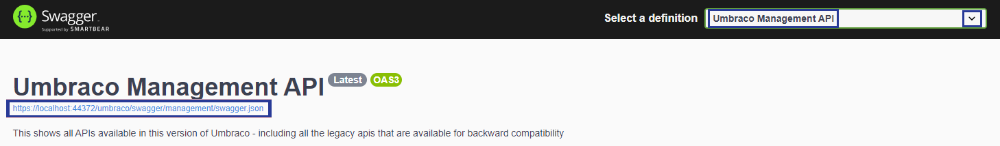
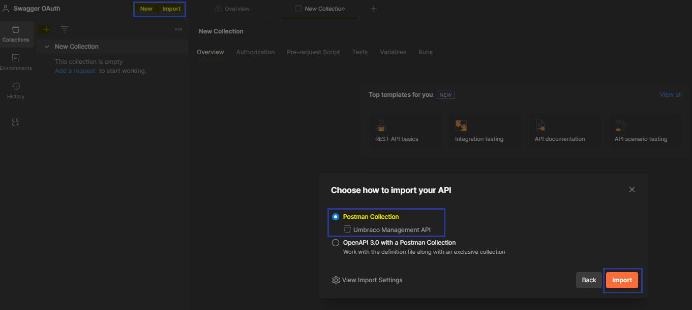
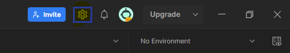

# Overview



This guide has been provided by a member of our community meaning that it is not managed by Umbraco HQ. As it relies on a third-party integration (Postman), some attributes will become subject to change in the future.



This guide covers how to setup OAuth authorization for swagger via Postman. It showcases a starting point on how to setup a basic OAuth authorization for those who are not that familiar with OAuth integration.

Before following this guide familiarize yourself with the [Management API](./README.md) article. There you can read more about Authorization and why it is needed in this case.

This guide covers the following:

1. [Importing the collection](#importing-the-collection)
2. [Setup authorization](#setup-authorization)
3. [Get a token for a new user](#get-a-token-for-a-new-user)
4. [Common pitfalls and errors](#common-pitfalls-and-errors)

# Importing the collection

1. Open the swagger UI at `{yourdomain}/umbraco/swagger`.
2. From **Select a definition** choose **Umbraco Management API**.
3. Open the JSON file, which you can find right underneath the **Title**:



4. Save the JSON file to disk. The name of the file will be saved by default with the name of `swagger.json`.
5. In Postman, click to [create a new collection](https://learning.postman.com/docs/collections/using-collections/#creating-collections). Then import the `swagger.json` file and choose **Postman Collection** when prompted.



Once imported you will see a new collection called **Umbraco Management API**.

# Setup Authorization

## Setup Variables Values

1. In the **Umbraco Management API** collection click on **Variables** tab.
2. Add a new variable called `baseUrl` and in the **Initial** and **Current** values add your URL, which in this example we use the `localhost URL` (without trailing slashes):

```http
https://localhost:44331
```



The localhost URL might vary from this example. Make sure to change the URL to the current localhost URL your project is running on.



3. Save the changes.

## Setup Authorization Values

In the **Umbraco Management API** collection click on **Authorization** tab and follow these steps:

1. On **Type** choose `OAuth 2.0`
2. Check if those attributes are setup:

* **Add auth data** to is set to `Request Headers`
* **Auto-refresh token** is `Disabled`

### Configure Token

Now let's setup a new token:

1. Under **Configure New Token** add a **Token name** called `BackofficeSwagger` (Can be anything).
2. On **Grant Type** choose `Authorization Code (With PKCE)`.
3. On **Callback URL** click to enable `Authorize using browser`.
4. On **Auth URL** add:

```http
{{baseUrl}}/umbraco/management/api/v1/security/back-office/authorize
```

5. On **Access Token URL** add:

```http
{{baseUrl}}/umbraco/management/api/v1/security/back-office/token
```

6. On **Client ID** add `umbraco-postman`.
7. On **Code Challenge Method** choose `SHA-256`.
8. On **Client Authentication** choose `Send Client credentials in body`.
9. Any other field should be empty or auto-filled by default. **Save** and then:

* Click on **Get New Access Token**. Then a window will popup to authenticate into the Backoffice. Follow the given instructuction to **Open in Postman**.
* Then in Postman you will see a new **Manage access tokens** window. Click **Use Token**.

# Get a token for a new user

1. In the **Umbraco Management API** collection click on **Authorization** tab.
2. At the bottom of the page, above the **Get New Access Token**, click on `Clear Cookies`.
3. Open your localhost instance of Umbraco in the browser. Example: `https://localhost:44331`.
4. Inspect the page, go to **Application** tab and clear the `UmbracoBackOffice` cookie.
5. Go to Postman and click on **Get New Access Token** and once authenticated click on **Use Token**.

# Common pitfalls and errors

## Missing agent

When trying to obtain a token you might run into an error when trying to obtain a token. When looking in the postman console and see the following `Error: localhost request not supported`. This means you are missing the postman agent. You can get this from the [Postmant website](https://www.postman.com/downloads/postman-agent/) and try again.

## SSL Certificate verification

When requesting a token, you might get an error that reads `Error: unable to verify the first certificate` in the console.
To resolve this, next to **Invite** button, click on the **Settings** cog wheel in top right corner:



Click on **Settings** and disable `SSL certificate verification`.

## Making a request

When making a request for the first time, follow these steps:

* In the **Umbraco Management API** collection click on **Authorization** tab. On **Type** choose `Inherit auth from parent`.
* Disable any parameters you are not using as Postman sets their value to default sometimes.
