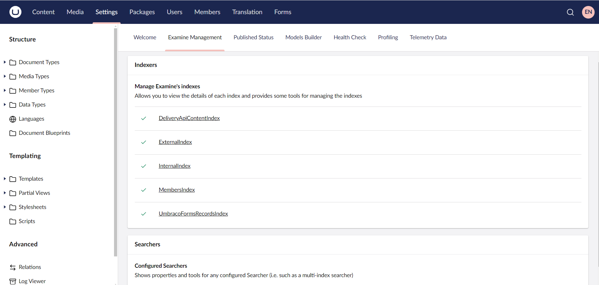
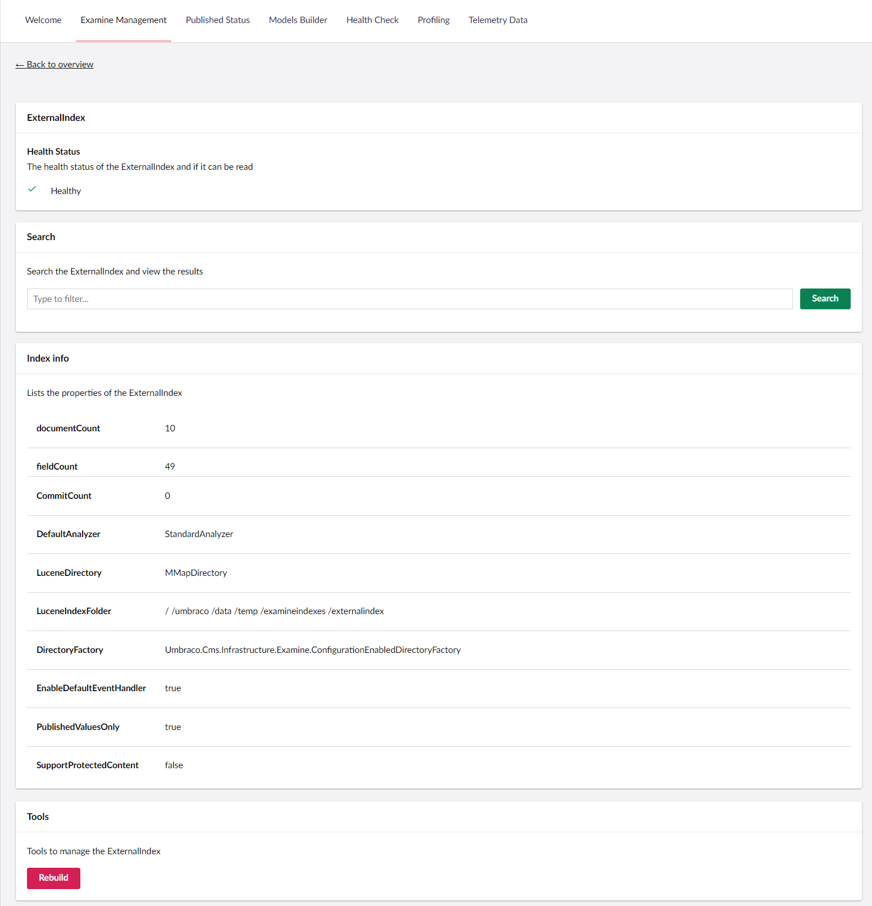
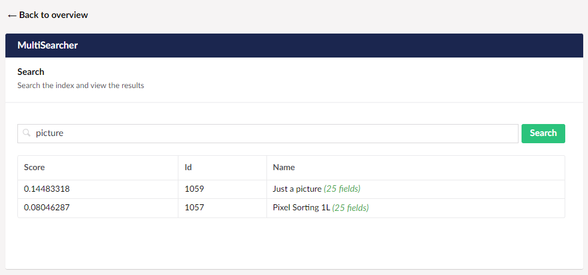

# Examine Management

_Provides an overview of the available Examine functionality available directly within the Umbraco backoffice_

## Overview

The Umbraco backoffice allows you to view details about your Examine indexes and searchers - all in one place. You can see which fields are being indexed, rebuild the indexes if there's a problem, and test keywords to see what results would be returned.

The Examine Management dashboard, accessible from within the Settings section, is split into two sections: Indexers and Searchers.

## Indexers

From the Indexers section, you can view details about each Examine index currently configured within your Umbraco installation. Clicking any of these indexes will show you additional options, each discussed below.

### Index info

This section displays properties of the selected index, including the number of stored documents and fields.

Within the Indexers it displays the details for the index provider as well.

This can be useful to confirm the configuration that Umbraco is using and to ensure it is working as expected. This section also displays the full file path of the index itself.

This section also provides the ability to rebuild the index, should this be required. Depending on how much content your website has, rebuilding the search indexes could take a while and affect the site performance temporarily. It is not recommended to do this while the website is under high load.

### Fields

From here, you can see the default system fields that are stored for each document within the search index. That includes the number of fields document, and the score which is calculated by Examine depending on how closely the individual results matched the search term.

## Searchers

From the Searchers section, you can view details about each Examine searcher currently configured within your Umbraco installation. Clicking any of these searchers will take you to a search page, where you can test out your search terms.

You can see an example here how to configure an Examine searcher in the [Examine Multisearcher documentation](pdfindex-multisearcher.md#multi-index-searchers).

### Search field

The search field allows you to enter a search term and receive results back from the searcher in question. You can confirm if your query is working as expected. Matching results are returned in their raw format, with the score, document ID and Name being returned. The score is calculated by Examine depending on how closely the individual results matched the search term.
