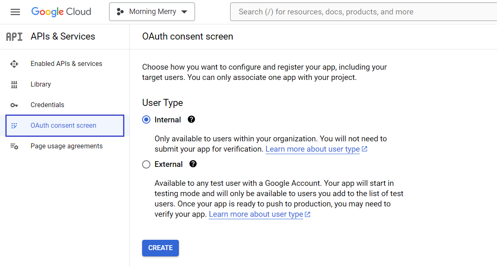
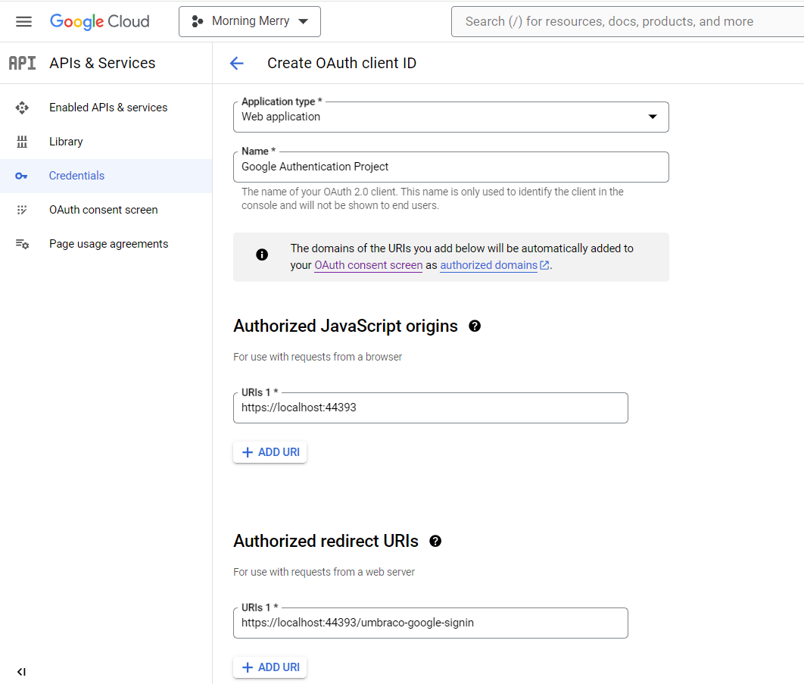

# Add Google Authentication (Users)

The Umbraco Backoffice supports external login providers (OAuth) for performing authentication of your users. This could be any OpenIDConnect provider such as Entra ID/Azure Active Directory, Identity Server, Google, or Facebook.

In this tutorial, we will take you through the steps of setting up a Google login for the Umbraco CMS backoffice.

## What is a Google Login?

When you log in to the Umbraco Backoffice, you need to enter your username and password. Integrating your website with Google authentication adds a button that you can click to log in with your Google account.


## Why?

We are sure a lot of content editors and implementors of your Umbraco sites would love to have one less password to remember. Click **Sign in with Google** and if you are already logged in with your Google account, it will log you in directly.

### What the tutorial covers

1. [Setting up a Google OAuth API](add-google-authentication.md#id-1.-setting-up-a-google-oauth-api)
2. [Integrating Google Auth in your project](add-google-authentication.md#id-2.-integrating-google-auth-in-your-project)
3. [Configuring the solution to allow Google logins](add-google-authentication.md#id-3.-configuring-the-solution-to-allow-google-logins)

### Prerequisites

For this tutorial, you need:

* [Visual Studio](https://visualstudio.microsoft.com/) installed.
* A [Google](https://myaccount.google.com/) account.
* A working [Umbraco solution](https://umbraco.com/products/umbraco-cloud/).

## 1. Setting up a Google OAuth API

The first thing to do is set up a Google API. To do this, you need to go to [https://console.developers.google.com/](https://console.developers.google.com/) and log in with your Google account.

### Setup a Google Console Project

1.  Click the project dropdown and select **New Project**.

    
2. Enter a **Project name**, **Organization**, and **Location**.
3. Click **Create**.

### Enable the Google+ API

1. Open the newly created project from the project dropdown.
2.  Click **Enable APIs and Services**.

    
3. Type **Google+ API** in the **Search** field.
4.  Select it and then **Enable** it.

    

### Set up an OAuth Consent Screen

Before you can create the credentials, you need to configure your consent screen.

1. Click **OAuth consent screen** from the left-side navigation menu.
2. Choose the **User Type** that fits your setup.
3.  Click **Create**.

    
4. Fill in the required information:
   * App name
   * User support email
   * Developer contact information
5. Click **Save and Continue**.
6. Select the scopes your project needs.
7. Click **Save and Continue**.
8. Verify the details you have provided.
9. Click **Back to Dashboard** to complete creating the Consent screen.

### Create credentials

1. Click **Credentials** from the left-side navigation menu.
2. Click **Create Credentials**.
3.  Select **OAuth Client ID** from the dropdown.

    
4. Select **Web Application** from the **Application type** dropdown.
5.  Enter the following details:

    * Application **Name**
    * **Authorized JavaScript origins**
    * **Authorized redirect URIs**

    
6. Click **Create**.

A popup appears displaying the **Client Id** and **Client Secret**. You will need these values later while configuring your solution.


The **Client Id** and **Client Secret** can always be accessed from the **Credentials** tab in the **APIs & Services** menu.


## 2. Integrating Google Auth in your project

Once the Google API is set up it is time to install the Google Auth provider on the Umbraco project.

If you are working with a Cloud project, see the [Working locally](https://docs.umbraco.com/umbraco-cloud/set-up/working-locally) article to complete this step.

### Installing a Nuget Package

You can install and manage packages in a project.

1. Navigate to your project/solution folder.


If you have cloned down an Umbraco Project, you will need to navigate to the `src` folder where you can see a `.csproj` file.


2. Open a command-line of your choice such as "Command Prompt" at the mentioned location.
3.  Run the following command to install the `Microsoft.AspNetCore.Authentication.Google` package.

    ```cli
    dotnet add package Microsoft.AspNetCore.Authentication.Google
    ```
4.  Once the package is installed, open the **.csproj** file to ensure if the package reference is added:

    ```js
    <ItemGroup>
        <PackageReference Include="Microsoft.AspNetCore.Authentication.Google" Version="8.0.4" />
    </ItemGroup>
    ```


You can check the [latest version of the package](https://www.nuget.org/packages/Microsoft.AspNetCore.Authentication.Google) before installing it.


For more information on installing and using a package with the .Net CLI, see [Microsoft Documentation](https://learn.microsoft.com/en-us/nuget/quickstart/install-and-use-a-package-using-the-dotnet-cli).

## 3. Configuring the Solution to allow Google Logins

To use an external login provider such as Google on your Umbraco CMS project, you have to implement a couple of new classes:

* A custom-named `BackOfficeExternalLoginProviderOptions` configuration class.
* A custom-named `GoogleOptions` configuration class.
* A Composer to tie it all together.
* An Umbraco backoffice manifest declaration.

You can create these files in a location of your choice. In this tutorial, the files will be added to an `ExternalUserLogin/GoogleAuthentication` folder for the C# classes. You will also need an `\App_Plugins\my-auth-providers` folder location for the frontend registration.

1. Create a new class:`GoogleBackOfficeExternalLoginProviderOptions.cs`.
2. Add the following code to the file:


```csharp
using Microsoft.Extensions.Options;
using Umbraco.Cms.Api.Management.Security;
using Umbraco.Cms.Core;

namespace MyCustomUmbracoProject.ExternalUserLogin.GoogleAuthentication;

public class GoogleBackOfficeExternalLoginProviderOptions : IConfigureNamedOptions<BackOfficeExternalLoginProviderOptions>
{
    public const string SchemeName = "Google";

    public void Configure(string? name, BackOfficeExternalLoginProviderOptions options)
    {
        if (name != Constants.Security.BackOfficeExternalAuthenticationTypePrefix + SchemeName)
        {
            return;
        }

        Configure(options);
    }

    public void Configure(BackOfficeExternalLoginProviderOptions options)
    {
        options.AutoLinkOptions = new ExternalSignInAutoLinkOptions(
            // must be true for auto-linking to be enabled
            autoLinkExternalAccount: true,

            // Optionally specify default user group, else
            // assign in the OnAutoLinking callback
            // (default is editor)
            defaultUserGroups: new[] { Constants.Security.EditorGroupAlias },

            // Optionally specify the default culture to create
            // the user as. If null it will use the default
            // culture defined in the web.config, or it can
            // be dynamically assigned in the OnAutoLinking
            // callback.
            defaultCulture: null,
            // Optionally you can disable the ability to link/unlink
            // manually from within the back office. Set this to false
            // if you don't want the user to unlink from this external
            // provider.
            allowManualLinking: true
        )
        {
            // Optional callback
            OnAutoLinking = (autoLinkUser, loginInfo) =>
            {
                // You can customize the user before it's linked.
                // i.e. Modify the user's groups based on the Claims returned
                // in the externalLogin info

                // see https://github.com/umbraco/Umbraco-CMS/issues/12487
                autoLinkUser.IsApproved = true;
            },
            OnExternalLogin = (user, loginInfo) =>
            {
                // You can customize the user before it's saved whenever they have
                // logged in with the external provider.
                // That is to sync the user's name based on the Claims returned
                // in the externalLogin info

                return true; //returns a boolean indicating if sign-in should continue or not.
            },
        };
    }
}
```



The code used here, enables [auto-linking](../reference/security/external-login-providers.md#auto-linking) with the external login provider. This enables the option for users to login to the Umbraco backoffice prior to having a backoffice User.

Set the `autoLinkExternalAccount` to `false` in order to disable auto-linking in your implementation.


3. Create a new class: `GoogleBackOfficeAuthenticationOptions`.
4. Add the following code to the file:


```csharp
using Microsoft.AspNetCore.Authentication.Google;
using Microsoft.Extensions.Options;
using Umbraco.Cms.Api.Management.Security;
using Umbraco.Cms.Web.Common.Helpers;
using Umbraco.Cms.Web.UI.Custom;

namespace MyCustomUmbracoProject.ExternalUserLogin.GoogleAuthentication;

public class GoogleBackOfficeAuthenticationOptions : IConfigureNamedOptions<GoogleOptions>
{
    private readonly OAuthOptionsHelper _helper;

    public GoogleBackOfficeAuthenticationOptions(OAuthOptionsHelper helper)
    {
        _helper = helper;
    }

    public void Configure(GoogleOptions options)
    {
        // since we have access to dependency injection, these values can be read from the app settings using the IOptions pattern
        options.CallbackPath = "/umbraco-google-signin"; // can be anything as middleware will add this to the route table
        options.ClientId = "your client id for the google login provider";
        options.ClientSecret = "your client secret for the google login provider";
        options.Scope.Add("https://www.googleapis.com/auth/userinfo.email"); // email is needed for auto linking purposes

        // This will redirect error responses from the login provider towards the default umbraco oath login error page
        // which will try to display the error state in a meaningful way.
        // You can implement your own error handling by handling options.Events.OnAccessDenied & options.Events.OnRemoteFailure
        _helper.SetDefaultErrorEventHandling(options, GoogleBackOfficeExternalLoginProviderOptions.SchemeName);
    }

    public void Configure(string? name, GoogleOptions options)
    {
        // only configure the options if it is for the backend
        if (name == BackOfficeAuthenticationBuilder.SchemeForBackOffice(GoogleBackOfficeExternalLoginProviderOptions
                .SchemeName))
        {
            Configure(options);
        }
    }
}

```


5. Replace **YOURCLIENTID** and **YOURCLIENTSECRET** with the values from the **OAuth Client Ids Credentials** window. Or use the [IOptions pattern](https://learn.microsoft.com/en-us/aspnet/core/fundamentals/configuration/options) to read the values from app settings (or other sources).
6. Register both `ConfigureNameOptions` into a composer and add the provider to Umbraco


```csharp
using Umbraco.Cms.Api.Management.Security;
using Umbraco.Cms.Core.Composing;
using Umbraco.Cms.Web.UI.Custom;

namespace MyCustomUmbracoProject.ExternalUserLogin.GoogleAuthentication;

public class GoogleBackOfficeExternalLoginComposer : IComposer
{
    public void Compose(IUmbracoBuilder builder)
    {
        builder.Services.ConfigureOptions<GoogleBackOfficeExternalLoginProviderOptions>();
        builder.Services.ConfigureOptions<GoogleBackOfficeAuthenticationOptions>();

        builder.AddBackOfficeExternalLogins(logins =>
        {
            logins.AddBackOfficeLogin(
                backOfficeAuthenticationBuilder =>
                {
                    // this Add... method will be part of the OathProvider nuget package you install
                    backOfficeAuthenticationBuilder.AddGoogle(
                        BackOfficeAuthenticationBuilder.SchemeForBackOffice(
                            GoogleBackOfficeExternalLoginProviderOptions
                                .SchemeName)!,
                        options =>
                        {
                            // need to give an empty action here for the options pattern configuration to work
                            // if you do not wish to use the umbraco default error handling and hardcode all your values instead of injecting them,
                            // you can set the configuration right here instead. You can then remove the `GoogleBackOfficeAuthenticationOptions` class
                        });
                });
        });
    }
}
```


7. Register the provider with the backoffice client by adding the following file to the manifest file in `/App_Plugins/my-auth-providers/umbraco-package.json`:


```json
{
  "$schema": "../../umbraco-package-schema.json",
  "name": "My Auth Package",
  "allowPublicAccess": true,
  "extensions": [
    {
      "type": "authProvider",
      "alias": "My.AuthProvider.Google",
      "name": "My Google Auth Provider",
      "forProviderName": "Umbraco.Google",
      "meta": {
        "label": "Login with Google"
      }
    }
  ]
}

```


8. Build and run the website.
9. Log in to the backoffice using the Google Authentication option.


If auto-linking is disabled, the user will need to follow these steps in order to be able to use Google Authentication:

1. Login to the backoffice using Umbraco credentials.
2. Select your user profile in the top-right corner.
3. Click **Link your Google account** under External login providers.
4. Choose the account you wish to link.

For future backoffice logins, the user will be able to use Google Authentication.



## Related Links

* [External login providers](../reference/security/external-login-providers.md)
* [Linking External Login Provider accounts](../reference/security/external-login-providers.md#auto-linking)
