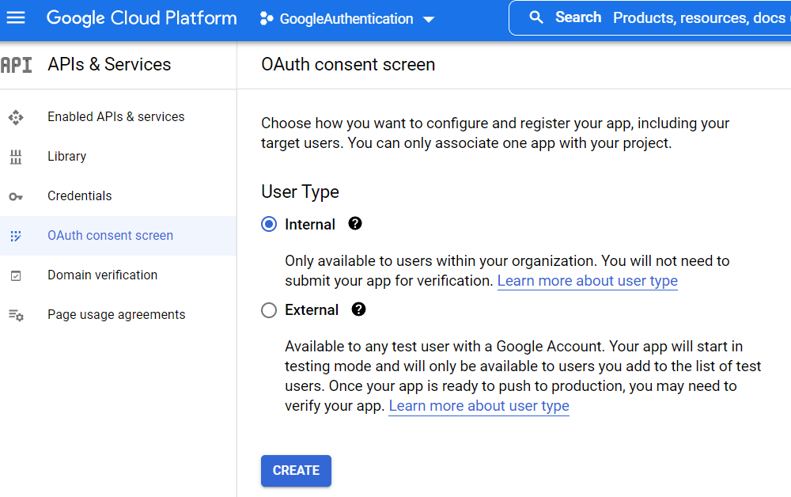

# Add Google Authentication (Users)

The Umbraco Backoffice supports external login providers (OAuth) for performing authentication of your users. This could be any OpenIDConnect provider such as Azure Active Directory, Identity Server, Google, or Facebook.

In this tutorial, we will take you through the steps of setting up a Google login for the Umbraco CMS backoffice.

## What is a Google Login?

When you log in to the Umbraco Backoffice, you need to enter your username and password. Integrating your website with Google authentication adds a button that you can click to log in with your Google account.


## Why?

We are sure a lot of content editors and implementors of your Umbraco sites would love to have one less password to remember. Click **Sign in with Google** and if you are already logged in with your Google account, it will log you in directly.

### What the tutorial covers

1. [Setting up a Google OAuth API](add-google-authentication.md#setting-up-a-google-oauth-api)
2. [Integrating Google Auth in Visual Studio](add-google-authentication.md#integrating-google-auth-in-visual-studio)
3. [Configuring the solution to allow Google logins](add-google-authentication.md#configuring-the-solution-to-allow-google-logins)

### Prerequisites

For this tutorial, you need:

* [Visual Studio](https://visualstudio.microsoft.com/) installed.
* A [Google](https://myaccount.google.com/) account.
* A working [Umbraco solution](https://umbraco.com/products/umbraco-cloud/).

## 1. Setting up a Google OAuth API

The first thing to do is set up a Google API. To do this, you need to go to [https://console.developers.google.com/](https://console.developers.google.com/) and log in with your Google account.

### Setup a Google Console Project

1. Click the project dropdown and select **New Project**.

<figure><figcaption></figcaption></figure>

2. Enter a **Project name**, **Organization**, and **Location**.
3. **Create** the project.

<figure><figcaption></figcaption></figure>

### Enable the Google+ API

1. Open the newly created project from the project dropdown.
2. Select **Enable APIs and Services**.

<figure><figcaption></figcaption></figure>

2. Use the search field to find the **Google+ API**.
3. **Enable** the product to enable the API.

<figure><figcaption></figcaption></figure>

### Set up an OAuth Consent Screen

Before you can create the credentials, you need to configure your consent screen.

1. Select **OAuth Consent Screen** from the left-side navigation menu.

<figure><figcaption></figcaption></figure>

2. Choose the **User Type** that fits your setup.
3. Select **Create** to move to the next step.

<figure><figcaption></figcaption></figure>

4. Fill in the required information:
   * App name
   * User support email
   * Developer contact information
5. Select **Save and continue**.
6. Select the scopes your project needs.
7. Move to the next step by selecting **Save and Continue**.
8. Verify the details provided.
9. Select **Back to Dashboard** to complete creating the Consent screen.

### Create credentials

1. Click on **Credentials** in the left-side navigation menu.
2. Select **Create Credentials** and choose **OAuth Client ID** from the dropdown.

<figure><figcaption></figcaption></figure>

3. Select **Web Application** from the **Application type** dropdown.
4. Enter the following details:
   * Application **Name**
   * **Authorized JavaScript origins**
   * **Authorized redirect URIs**
5. **Create** the OAuth Client ID.

<figure><figcaption></figcaption></figure>

A popup appears displaying the **ClientId** and **ClientSecret**. You will need these values later while configuring your solution.


The **ClientId** and **ClientSecret** can always be accessed from the **Credentials** tab in the **APIs & Services** menu.


## 2. Integrating Google Auth in Visual Studio

Once the Google API is set up it is time to install the Google Auth provider on the Umbraco project.

If you are working with a Cloud project, see the [Working locally](https://docs.umbraco.com/umbraco-cloud/set-up/working-locally) article to complete this step.

### Installing a Nuget Package

You can install and manage packages in Visual Studio either using the Package Manager Console (PowerShell) or the NuGet Package Manager.

#### Option 1: Package Manager Console (PowerShell)

The NuGet Package Manager Console lets you use NuGet PowerShell commands to manage NuGet packages on your project. You can use this option if you are comfortable using the Package Manager Console (PowerShell). The command listed below is specific to the Package Manager Console in Visual Studio:

1. Open your project/solution in Visual Studio.
2. Go to **Tools** > **NuGet Package Manager** > **Package Manager Console**.

A package manager console appears at the bottom where you can install packages with commands.

3. Type the following in the console:

```js
Install-Package Microsoft.AspNetCore.Authentication.Google -Version 7.0.13
```


Always check the latest version of the package before installing it.


#### Option 2: NuGet Package Manager

The NuGet Package Manager UI in Visual Studio allows you to manage NuGet packages in projects and solutions.

1. Open your project in Visual Studio.
2. Go to **Tools** -> **NuGet Package Manager** -> **Manage NuGet Packages for Solution**.
3. Select the **Browse** tab.
4. Type `Microsoft.AspNetCore.Authentication.Google` in the search field.
5. Ensure that your project is checked.
6. Select the **version** from the drop-down and click **Install**.

For more information on installing and managing packages in Visual Studio, see [Microsoft Documentation](https://docs.microsoft.com/en-us/nuget/consume-packages/install-use-packages-visual-studio).

## 3. Configuring the solution to allow Google logins

To use an external login provider such as Google on your Umbraco CMS project, you have to implement a couple of new classes:

* A custom-named configuration class.
* A static extension class.

You can create these files in a location of your choice. In this tutorial, the files will be added to an `ExternalUserLogin/GoogleAuthentication` folder.

1. Create a new class:`GoogleBackOfficeExternalLoginProviderOptions.cs`.
2. Add the following code to the file:


```csharp
using Microsoft.Extensions.Options;
using Umbraco.Cms.Core;
using Umbraco.Cms.Web.BackOffice.Security;

namespace MyCustomUmbracoProject.ExternalUserLogin.GoogleAuthentication;

public class GoogleBackOfficeExternalLoginProviderOptions : IConfigureNamedOptions<BackOfficeExternalLoginProviderOptions>
{
    public const string SchemeName = "Google";

    public void Configure(string? name, BackOfficeExternalLoginProviderOptions options)
    {
        ArgumentNullException.ThrowIfNull(name);

        if (name != Constants.Security.BackOfficeExternalAuthenticationTypePrefix + SchemeName)
        {
            return;
        }

        Configure(options);
    }

    public void Configure(BackOfficeExternalLoginProviderOptions options)
    {
        // Customize the login button
        options.Icon = "icon-google-fill";

        // The following options are only relevant if you
        // want to configure auto-linking on the authentication.
        options.AutoLinkOptions = new ExternalSignInAutoLinkOptions(
            // Set to true to enable auto-linking
            autoLinkExternalAccount: true,

            // [OPTIONAL]
            // Default: "Editor"
            // Specify User Group.
            defaultUserGroups: new[] { Constants.Security.EditorGroupAlias },

            // [OPTIONAL]
            // Default: The culture specified in appsettings.json.
            // Specify the default culture to create the User as.
            // It can be dynamically assigned in the OnAutoLinking callback.
            defaultCulture: null,

            // [OPTIONAL]
            // Enable the ability to link/unlink manually from within
            // the Umbraco backoffice.
            // Set this to false if you don't want the user to unlink
            // from this external login provider.
            allowManualLinking: true
        )
        {
            // [OPTIONAL] Callback
            OnAutoLinking = (autoLinkUser, loginInfo) =>
            {
                // Customize the user before it's linked.
                // Modify the User's groups based on the Claims returned
                // in the external ogin info.
            },
            OnExternalLogin = (user, loginInfo) =>
            {
                // Customize the User before it is saved whenever they have
                // logged in with the external provider.
                // Sync the Users name based on the Claims returned
                // in the external login info

                // Returns a boolean indicating if sign-in should continue or not.
                return true;
            },
        };

        // [OPTIONAL]
        // Disable the ability for users to login with a username/password.
        // If set to true, it will disable username/password login
        // even if there are other external login providers installed.
        options.DenyLocalLogin = false;

        // [OPTIONAL]
        // Choose to automatically redirect to the external login provider
        // effectively removing the login button.
        options.AutoRedirectLoginToExternalProvider = false;
    }
}
```



The code used here, enables [auto-linking](../reference/security/external-login-providers.md#auto-linking) with the external login provider. This enables the option for users to login to the Umbraco backoffice prior to having a backoffice User.

Set the `autoLinkExternalAccount` to `false` in order to disable auto-linking in your implementation.


3. Create a new class: `GoogleAuthenticationExtensions.cs`.
4. Add the following code to the file:


```csharp
namespace MyCustomUmbracoProject.ExternalUserLogin.GoogleAuthentication;

public static class GoogleAuthenticationExtensions
{
    public static IUmbracoBuilder AddGoogleAuthentication(this IUmbracoBuilder builder)
    {
        // Register ProviderBackOfficeExternalLoginProviderOptions here rather than require it in startup
        builder.Services.ConfigureOptions<GoogleBackOfficeExternalLoginProviderOptions>();

        builder.AddBackOfficeExternalLogins(logins =>
        {
            logins.AddBackOfficeLogin(
                backOfficeAuthenticationBuilder =>
                {
                    // The scheme must be set with this method to work for the back office
                    var schemeName =
                        backOfficeAuthenticationBuilder.SchemeForBackOffice(GoogleBackOfficeExternalLoginProviderOptions
                            .SchemeName);

                    ArgumentNullException.ThrowIfNull(schemeName);

                    backOfficeAuthenticationBuilder.AddGoogle(
                        schemeName,
                        options =>
                        {
                            // Callback path: Represents the URL to which the browser should be redirected to.
                            // The default value is '/signin-google'.
                            // The value here should match what you have configured in you external login provider.
                            // The value needs to be unique.
                            options.CallbackPath = "/umbraco-google-signin";
                            options.ClientId = "YOURCLIENTID"; // Replace with your client id generated while creating OAuth client ID
                            options.ClientSecret = "YOURCLIENTSECRET"; // Replace with your client secret generated while creating OAuth client ID
                        });
                });
        });
        return builder;
    }

}
```


5. Replace **YOURCLIENTID** and **YOURCLIENTSECRET** with the values from the **OAuth Client Ids Credentials** window.
6. Update `builder` in your `Program.cs` class to register your configuration with Umbraco.


```csharp
using MyCustomUmbracoProject.ExternalUserLogin.GoogleAuthentication;

builder.CreateUmbracoBuilder()
    .AddBackOffice()
    .AddWebsite()
    .AddDeliveryApi()
    .AddComposers()
    .AddGoogleAuthentication() // Add this line
    .Build();
```


7. Build and run the website.
8. Log in to the backoffice using the Google Auth option.



If auto-linking is disabled, the user will need to follow these steps in order to be able to use the Google Authentication:

1. Login to the backoffice using Umbraco credentials.
2. Select your user profile in the top-right corner.
3. **Link your Google account**.
4. Choose the account you which to link to the Umbraco login.

For future backoffice logins, the user will be able to use Google Authentication to login.



## Related Links

* [External login providers](../reference/security/external-login-providers.md)
* [Linking External Login Provider accounts](../reference/security/external-login-providers.md#auto-linking)
