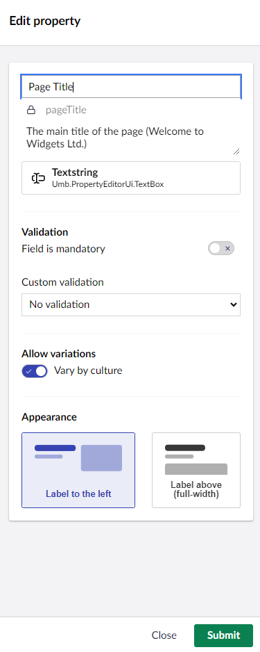

# Adding Language Variants

Now that we have a basic site setup, let us make it multilingual by creating content variations in another language. In this tutorial, we will create a Danish version of the `HomePage`.

## Adding a new language

To add a new language, follow these steps:

1. Go to the **Settings** section.
2. Go to **Languages**.
3. Click **Create**.
4. Select a **Language** from the dropdown list. In this tutorial, we will pick Danish.
5. In **Settings**, to set the new language as the:
   * Default language for your site, toggle **Default Language**.
   * Mandatory language for your site, toggle **Mandatory Language**.
6. Select a **Fallback Language** from the drop-down list.
7. Click **Submit**.
8. Click **Save**.

   

## Enabling Language Variants on Document Types and Properties

To enable language variants on Document Types, follow these steps:

1. Go to the **Settings** section.
2. Select **HomePage** from the **Document Types** folder.
3. Go to the **Settings** tab and toggle **Allow vary by culture**

    
4. Click **Save**.
5. Go to the **Design** tab.
6. Click on the Data Type of the **Page Title** and enable **Vary by culture**.
7. Click **Submit**.
8. Click **Save**.

    

## Adding Culture and Hostnames to the root node of the website

To add culture and hostnames, follow these steps:

1. Go to the **Content** section.
2. Click on the **...** dots next to the **Home Page** content node.
3. Select **Culture and Hostnames**.
4. Add a domain for each hostname, like it's done here:
5. Click **Save**.

    

## Adding Language Variants to the Content

You will find a language dropdown above your content tree. If it's not there, you might need to refresh the page:

In the language dropdown, you will find all the languages that you have installed for your site. You can switch between them to update the content variations for each language.

To add language variants to the content, follow these steps:

1. Go to the **Home Page** node. You will find a language dropdown next to the title at the top.

    
2. Click on the dropdown. You will see a **Split view** option next to the new language.

    
3. Click **Split view**. We can now see the content node with each language side by side.

    You may notice that the bodytext is greyed out - this is because we haven't checked the **Vary by culture** checkbox.

    
4. Enter the **Name** for your content node and the **Page Title** in the new language.
5. Click **Save and Publish**.
6. The **Ready to Publish** window opens providing the option to publish in one or more languages.

    
7. You can select either one or multiple languages and click **Save and Publish**.

## Viewing the Language Variant on the Browser

To view the language variant on the browser, follow these steps:

1. Go to the **Content** section.
2. Select your new language from the language dropdown above your content tree.
3. Select the **Home Page** node and go to the **Info** tab.
4. You will notice the links with the new language domain added to it. If it's not there, you might need to refresh the page.

    
5. Click on the link to view the new language node in the browser.
6. Alternatively, you can add the domain name to your localhost in the browser. For example: [http://localhost:xxxx/da/](http:/localhost:xxxx/da/)

## More Information

Further information on multi-language setups can be found in the [Multilanguage Setup tutorial](../multilanguage-setup.md).
