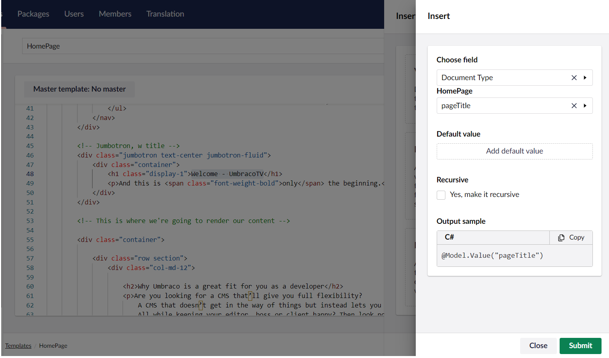
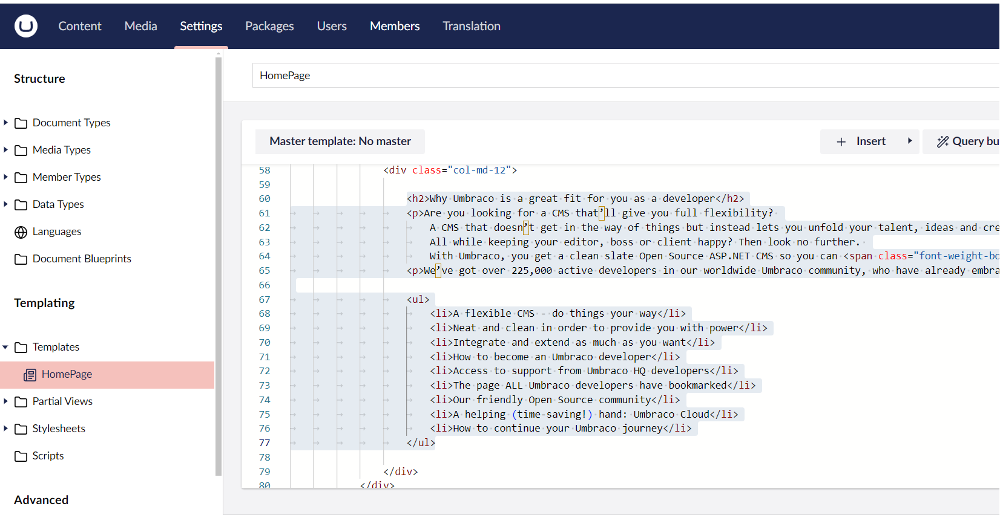
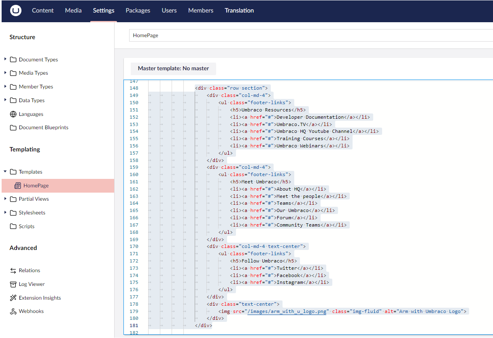

# Displaying the Document Type Properties

You might have noticed that the content we've added to the homepage is not being displayed. We need to wire up the Data Type properties to the template.

Let’s look at our template and identify where the content should be displayed.

The top arrow in this image is the _Page Title_ and the bottom arrow is the _Body Text_. The Footer is all the way at the bottom of the page.

## Setting the Document Type Properties

To set the Document Type properties:

1. Go to **Settings**.
2. Select **Templates** in the **Templating** section.
3. Open the **Homepage** template.
4. Scroll down to the `<!-- Jumbotron, w title -->` section (around line 45) and highlight the text `“Welcome - UmbracoTV”` (around line 48).

    
5. Click **Insert** and select **Value**.
6. Select **Document Type** from the **Choose field** drop-down list.
7. Select **HomePage**.
8. Click **Choose**.
9. Select **pageTitle** field from the **HomePage** drop-down list.

    
10. Click **Submit**.
11. Go to the content between the `
` tags (around line 60 to 77):
   *   Highlight the content as shown in the figure.

       
   * Click **Insert** and select **Value**.
   * Select **Document Type** from the **Choose field** drop-down list.
   * Select **HomePage**.
   * Click **Choose**.
   * Select **bodyText** field from the **HomePage** drop-down list.
   * Click **Submit**.
12. Go to the content between the `
` tag (around line 147 to 180):
   *   Highlight the content between the `
` tags.

       
   * Click **Insert** and select **Value**.
   * Select **Document Type** from the **Choose field** drop-down list.
   * Select **HomePage**.
   * Click **Choose**.
   * Select **footerText** field from the **HomePage** drop-down list.
   * Click **Submit**.
13. Click **Save**.

Reload your homepage to view the content. You should see something similar like the image below:

Now, you can go back and add additional fields or update existing fields in the Document Type. Fill them out in the content node and then add them in the template to display the data in the website.
